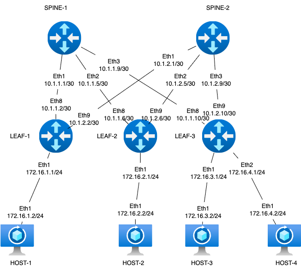

### Задание

1.Соберете топологию CLOS, как на схеме: 
2.Распределите адресное пространство для Underlay сети
3.Зафиксируете в документации план работ, адресное пространство, схему сети, настройки (если перенесли на оборудование)

### Схема стенда

### Распределение адресного пространства для Underlay

План составлен с учетом 10.x.y.z, где x - номер DC, y - номер spine, z - по очереди для подключения leaf
Адреса для хостов - 172.16.x.z/24, где x - номер leaf, z - по порядку адрес хоста, на leaf ip .1

| Device A  | Interface A | IP A          | Device B  | Interface B | IP B          |
|-----------|-------------|---------------|-----------|-------------|---------------|
| Spine-1  | Eth1      | 10.1.1.1/30    | Leaf-1  | Eth8      	| 10.1.1.2/30    |
| Spine-1  | Eth2      | 10.1.1.5/30    | Leaf-2  | Eth8        | 10.1.1.6/30    |
| Spine-1  | Eth3      | 10.1.1.9/30    | Leaf-3  | Eth8        | 10.1.1.10/30   |
| Spine-2  | Eth2      | 10.1.2.1/30    | Leaf-1  | Eth8        | 10.1.2.2/30    |
| Spine-2  | Eth2      | 10.1.2.5/30    | Leaf-2  | Eth8        | 10.1.2.6/30    |
| Spine-2  | Eth3      | 10.1.2.9/30    | Leaf-3  | Eth8        | 10.1.2.10/30   |
| Host-1  | Eth0       | 172.16.1.2/24   | Leaf-1  | Eth1       | 172.16.1.1/24  |
| Host-2  | Eth0       | 172.16.2.2/24   | Leaf-2  | Eth1      	| 172.16.2.1/24  |
| Host-3  | Eth0       | 172.16.3.2/24   | Leaf-3  | Eth1       | 172.16.3.1/24  |
| Host-4  | Eth0       | 172.16.3.3/24   | Leaf-3  | Eth1      	| 172.16.3.1/24  |
