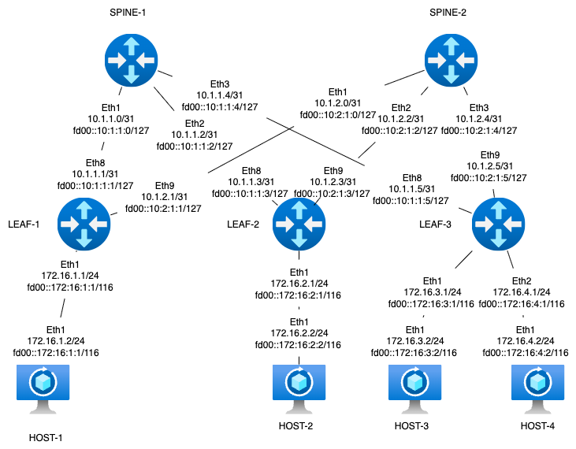

# lab02-OSPF-CLOS

#### Задание Underlay. OSPF

Цель: Настроить OSPF для Underlay сети.

Задачи: Настроите OSPF в Underlay сети, для IP связанности между всеми сетевыми устройствами. Зафиксируете в документации - план работы, адресное пространство, схему сети, конфигурацию устройств Убедитесь в наличии IP связанности между устройствами в OSFP домене

#### Схема стенда



Стенд делаем по принципу - хосты linux, leaf - frr, spine - arista

#### Распределение адресного пространства для Underlay

План составлен с учетом 10.x.y.z, где x - номер DC, y - номер spine, z - по очереди для подключения leaf Адреса для хостов - 172.16.x.z/24, где x - номер leaf, z - по порядку адрес хоста, на leaf ip .1 Адреса loopback 192.168.a.b/32, где a - 1 для spine, 2 - для leaf, b - номер spine, leaf по порядку Адресацию ipv6 делаем по прицнипу из fd00::\[IPv4]

Interconnect ipv4 ipv6

| Device A | Interface A | IPv4 A        | IPv6 A               | Device B | Interface B | IPv4 B        | IPv6 B               |
| -------- | ----------- | ------------- | -------------------- | -------- | ----------- | ------------- | -------------------- |
| Spine-1  | Eth1        | 10.1.1.0/31   | fd00::10:1:1:0/127   | Leaf-1   | Eth8        | 10.1.1.1/31   | fd00::10:1:1:1/127   |
| Spine-1  | Eth2        | 10.1.1.2/31   | fd00::10:1:1:2/127   | Leaf-2   | Eth8        | 10.1.1.3/31   | fd00::10:1:1:3/127   |
| Spine-1  | Eth3        | 10.1.1.4/31   | fd00::10:1:1:4/127   | Leaf-3   | Eth8        | 10.1.1.5/31   | fd00::10:1:1:5/127   |
| Spine-2  | Eth2        | 10.1.2.0/31   | fd00::10:2:1:0/127   | Leaf-1   | Eth9        | 10.1.2.1/31   | fd00::10:2:1:1/127   |
| Spine-2  | Eth2        | 10.1.2.2/31   | fd00::10:2:1:2/127   | Leaf-2   | Eth9        | 10.1.2.3/31   | fd00::10:2:1:3/127   |
| Spine-2  | Eth3        | 10.1.2.4/31   | fd00::10:2:1:4/127   | Leaf-3   | Eth9        | 10.1.2.5/31   | fd00::10:2:1:5/127   |
| Host-1   | Eth1        | 172.16.1.2/24 | fd00::172:16:1:2/116 | Leaf-1   | Eth1        | 172.16.1.1/24 | fd00::172:16:1:1/116 |
| Host-2   | Eth1        | 172.16.2.2/24 | fd00::172:16:2:2/116 | Leaf-2   | Eth1        | 172.16.2.1/24 | fd00::172:16:2:1/116 |
| Host-3   | Eth1        | 172.16.3.2/24 | fd00::172:16:3:2/116 | Leaf-3   | Eth1        | 172.16.3.1/24 | fd00::172:16:3:1/116 |
| Host-4   | Eth1        | 172.16.4.2/24 | fd00::172:16:4:2/116 | Leaf-3   | Eth2        | 172.16.4.1/24 | fd00::172:16:4:1/116 |

loopback

| Device  | Loopback ipv4 | loopback ipv6     |
| ------- | ------------- | ----------------- |
| Spine-1 | 192.168.1.1   | fd00::192:168:1:1 |
| Spine-2 | 192.168.1.2   | fd00::192:168:1:2 |
| Leaf-1  | 192.168.2.1   | fd00::192:168:2:1 |
| Leaf-2  | 192.168.2.2   | fd00::192:168:2:2 |
| Leaf-3  | 192.168.2.2   | fd00::192:168:2:3 |

#### Примечание - так как в явном виде не указано что делать с адресацией на хостовых машинах, а в качестве leaf и spine выступают роутеры, до настройки overlay адреса на хостах распределены из разных подсетей.

Когда поднимем overlay засунем все в одну подсеть чтобы эмулировать l2.

#### Запуск лабараторной в среде netlab

Так как у самурая только путь, делаем все в netlab-tools.\
Заметки по использованию netlab:\
Для работы bfd в frr нужно включить его принудительно в образе по умолчанию, т.к. в netlab не заявлено поддержки bfd на оборудовании frr.\
Правим файл /usr/local/lib/python3.10/dist-packages/netsim/templates/provider/clab/frr/daemons.j2 включая демона - bfdd=yes.\
Так же если хотим использовать другие протоколы в frr, без подключения модулей в netlab в этом же файле нужно включить желаемых демонов.\
Заметки по лабе:\
Для ospf включаем шифрование для подключений leaf-spine, пароли spine1, spine2 соответсвенно. Clear-text password используем т.к. netlab не может работать с md5 для frr, но так как аутентификация нам нужна для подстраховки от ошибки, не критично использование открытого пароля. Также включаем bfd для интерфейсов, таймеры явно получатся завышенными, но моя практика показывает что для виртуальных устройств лучше не использовать значения меньше 500 мс, поэтому не критично.

 или под катом

<details>

<summary>topology.yml</summary>

```yml
---
provider: clab
module: [ ospf ]

nodes:
s1:
device: eos
id: 1
loopback:
  ipv4: 192.168.1.1/32
  ipv6: fd00::192:168:1:1/128
s2:
device: eos
id: 2
loopback:
  ipv4: 192.168.1.2/32
  ipv6: fd00::192:168:1:2/128
l1:
device: frr
id: 3
loopback:
  ipv4: 192.168.2.1/32
  ipv6: fd00::192:168:2:1/128
l2:
device: frr
id: 4
loopback:
  ipv4: 192.168.2.2/32
  ipv6: fd00::192:168:2:2/128
l3:
device: frr
id: 5
loopback:
  ipv4: 192.168.2.3/32
  ipv6: fd00::192:168:2:3/128
h1:
device: linux
h2:
device: linux
h3:
device: linux
h4:
device: linux

links:
#spine1-leaf1,2,3
- interfaces:
    - node: s1
      ifname: eth1
      ipv4: 10.1.1.0
      ipv6: fd00::10:1:1:0
      ospf:
        password: 'spine1'
        bfd: true
    - node: l1
      ifname: eth8
      ipv4: 10.1.1.1
      ipv6: fd00::10:1:1:1
      ospf:
        password: 'spine1'
        bfd: true
  prefix:
    ipv4: 10.1.1.0/31
    ipv6: fd00::10:1:1:0/127
- interfaces:
    - node: s1
      ifname: eth2
      ipv4: 10.1.1.2
      ipv6: fd00::10:1:1:2
      ospf:
        password: 'spine1'
        bfd: true
    - node: l2
      ifname: eth8
      ipv4: 10.1.1.3
      ipv6: fd00::10:1:1:3
      ospf:
        password: 'spine1'
        bfd: true
  prefix:
    ipv4: 10.1.1.2/31
    ipv6: fd00::10:1:1:2/127
- interfaces:
    - node: s1
      ifname: eth3
      ipv4: 10.1.1.4
      ipv6: fd00::10:1:1:4
      ospf:
        password: 'spine1'
        bfd: true
    - node: l3
      ifname: eth8
      ipv4: 10.1.1.5
      ipv6: fd00::10:1:1:5
      ospf:
        password: 'spine1'
        bfd: true
  prefix:
    ipv4: 10.1.1.4/31
    ipv6: fd00::10:1:1:4/127
#spine2-leaf1,2,3
- interfaces:
    - node: s2
      ifname: eth1
      ipv4: 10.1.2.0
      ipv6: fd00::10:1:2:0
      ospf:
        password: 'spine2'
        bfd: true
    - node: l1
      ifname: eth9
      ipv4: 10.1.2.1
      ipv6: fd00::10:1:2:1
      ospf:
        password: 'spine2'
        bfd: true
  prefix:
    ipv4: 10.1.2.0/31
    ipv6: fd00::10:1:2:0/127
- interfaces:
    - node: s2
      ifname: eth2
      ipv4: 10.1.2.2
      ipv6: fd00::10:1:2:2
      ospf:
        password: 'spine2'
        bfd: true
    - node: l2
      ifname: eth9
      ipv4: 10.1.2.3
      ipv6: fd00::10:1:2:3
      ospf:
        password: 'spine2'
        bfd: true
  prefix:
    ipv4: 10.1.2.2/31
    ipv6: fd00::10:1:2:2/127
- interfaces:
    - node: s2
      ifname: eth3
      ipv4: 10.1.2.4
      ipv6: fd00::10:1:2:4
      ospf:
        password: 'spine2'
        bfd: true
    - node: l3
      ifname: eth9
      ipv4: 10.1.2.5
      ipv6: fd00::10:1:2:5
      ospf:
        password: 'spine2'
        bfd: true
  prefix:
    ipv4: 10.1.2.4/31
    ipv6: fd00::10:1:2:4/127
#host1
- interfaces:
    - node: h1
      ifname: eth1
      ipv4: 172.16.1.2
      ipv6: fd00::172:16:1:2
    - node: l1
      ifname: eth1
      ipv4: 172.16.1.1
      ipv6: fd00::172:16:1:1
      ospf: false
  prefix:
    ipv4: 172.16.1.0/24
    ipv6: fd00::172:16:1:0/116
#host2
- interfaces:
    - node: h2
      ifname: eth1
      ipv4: 172.16.2.2
      ipv6: fd00::172:16:2:2
    - node: l2
      ifname: eth1
      ipv4: 172.16.2.1
      ipv6: fd00::172:16:2:1
      ospf: false
  prefix:
    ipv4: 172.16.2.0/24
    ipv6: fd00::172:16:1:0/116
#host3
- interfaces:
    - node: h3
      ifname: eth1
      ipv4: 172.16.3.2
      ipv6: fd00::172:16:3:2
    - node: l3
      ifname: eth1
      ipv4: 172.16.3.1
      ipv6: fd00::172:16:3:1
      ospf: false
  prefix:
    ipv4: 172.16.3.0/24
    ipv6: fd00::172:16:3:0/116
#host4
- interfaces:
    - node: h4
      ifname: eth1
      ipv4: 172.16.4.2
      ipv6: fd00::172:16:4:2
    - node: l3
      ifname: eth2
      ipv4: 172.16.4.1
      ipv6: fd00::172:16:4:1
      ospf: false
  prefix:
    ipv4: 172.16.4.0/24
    ipv6: fd00::172:16:4:0/116

```

</details>

### Проверка работы

<details>

<summary>spine-1</summary>

```txt
s1#show ip ro

VRF: default

Gateway of last resort is not set

C        10.1.1.0/31
         directly connected, Ethernet1
C        10.1.1.2/31
         directly connected, Ethernet2
C        10.1.1.4/31
         directly connected, Ethernet3
O        10.1.2.0/31 [110/20]
         via 10.1.1.1, Ethernet1
O        10.1.2.2/31 [110/20]
         via 10.1.1.3, Ethernet2
O        10.1.2.4/31 [110/20]
         via 10.1.1.5, Ethernet3
C        192.168.1.1/32
         directly connected, Loopback0
O        192.168.1.2/32 [110/30]
         via 10.1.1.1, Ethernet1
         via 10.1.1.3, Ethernet2
         via 10.1.1.5, Ethernet3
O        192.168.2.1/32 [110/10]
         via 10.1.1.1, Ethernet1
O        192.168.2.2/32 [110/10]
         via 10.1.1.3, Ethernet2
O        192.168.2.3/32 [110/10]
         via 10.1.1.5, Ethernet3

s1#show ipv6 ro

VRF: default

O3       fd00::10:1:1:1/128 [110/10]
         via fe80::a8c1:abff:fe9a:849, Ethernet1
C        fd00::10:1:1:0/127 [0/0]
         via Ethernet1, directly connected
O3       fd00::10:1:1:3/128 [110/10]
         via fe80::a8c1:abff:fef1:7cc4, Ethernet2
C        fd00::10:1:1:2/127 [0/0]
         via Ethernet2, directly connected
O3       fd00::10:1:1:5/128 [110/10]
         via fe80::a8c1:abff:feef:e7a2, Ethernet3
C        fd00::10:1:1:4/127 [0/0]
         via Ethernet3, directly connected
O3       fd00::10:1:2:1/128 [110/10]
         via fe80::a8c1:abff:fe9a:849, Ethernet1
O3       fd00::10:1:2:0/127 [110/20]
         via fe80::a8c1:abff:fe9a:849, Ethernet1
O3       fd00::10:1:2:3/128 [110/10]
         via fe80::a8c1:abff:fef1:7cc4, Ethernet2
O3       fd00::10:1:2:2/127 [110/20]
         via fe80::a8c1:abff:fef1:7cc4, Ethernet2
O3       fd00::10:1:2:5/128 [110/10]
         via fe80::a8c1:abff:feef:e7a2, Ethernet3
O3       fd00::10:1:2:4/127 [110/20]
         via fe80::a8c1:abff:feef:e7a2, Ethernet3
C        fd00::192:168:1:1/128 [0/0]
         via Loopback0, directly connected
O3       fd00::192:168:1:2/128 [110/30]
         via fe80::a8c1:abff:fe9a:849, Ethernet1
         via fe80::a8c1:abff:fef1:7cc4, Ethernet2
         via fe80::a8c1:abff:feef:e7a2, Ethernet3
O3       fd00::192:168:2:1/128 [110/10]
         via fe80::a8c1:abff:fe9a:849, Ethernet1
O3       fd00::192:168:2:2/128 [110/10]
         via fe80::a8c1:abff:fef1:7cc4, Ethernet2
O3       fd00::192:168:2:3/128 [110/10]
         via fe80::a8c1:abff:feef:e7a2, Ethernet3

s1#show bfd peers
VRF name: default
-----------------
DstAddr               MyDisc         YourDisc       Interface/Transport         Type               LastUp       LastDown            LastDiag    State
-------------- ---------------- ---------------- ------------------------- ------------ -------------------- -------------- ------------------- -----
10.1.1.1          4036363286       3063445977           Ethernet1(1129)       normal       08/20/25 22:21             NA       No Diagnostic       Up
10.1.1.3          1231824312       1715554816           Ethernet2(1131)       normal       08/20/25 22:21             NA       No Diagnostic       Up
10.1.1.5          2599637788       1867128317           Ethernet3(1133)       normal       08/20/25 22:21             NA       No Diagnostic       Up

DstAddr                                MyDisc        YourDisc       Interface/Transport         Type               LastUp       LastDown            LastDiag    State
------------------------------- ---------------- --------------- ------------------------- ------------ -------------------- -------------- ------------------- -----
fe80::a8c1:abff:fe9a:849           4221965281       365649942           Ethernet1(1129)       normal       08/20/25 22:21             NA       No Diagnostic       Up
fe80::a8c1:abff:feef:e7a2          1006718991       365649942           Ethernet3(1133)       normal       08/20/25 22:21             NA       No Diagnostic       Up
fe80::a8c1:abff:fef1:7cc4           216279368       503132544           Ethernet2(1131)       normal       08/20/25 22:21             NA       No Diagnostic       Up
```

</details>

<details>

<summary>spine-2</summary>

```txt
s2#show ip ro

VRF: default


Gateway of last resort is not set

O        10.1.1.0/31 [110/20]
         via 10.1.2.1, Ethernet1
O        10.1.1.2/31 [110/20]
         via 10.1.2.3, Ethernet2
O        10.1.1.4/31 [110/20]
         via 10.1.2.5, Ethernet3
C        10.1.2.0/31
         directly connected, Ethernet1
C        10.1.2.2/31
         directly connected, Ethernet2
C        10.1.2.4/31
         directly connected, Ethernet3
O        192.168.1.1/32 [110/30]
         via 10.1.2.1, Ethernet1
         via 10.1.2.3, Ethernet2
         via 10.1.2.5, Ethernet3
C        192.168.1.2/32
         directly connected, Loopback0
O        192.168.2.1/32 [110/10]
         via 10.1.2.1, Ethernet1
O        192.168.2.2/32 [110/10]
         via 10.1.2.3, Ethernet2
O        192.168.2.3/32 [110/10]
         via 10.1.2.5, Ethernet3

s2#show ipv6 ro

VRF: default
Displaying 17 of 23 IPv6 routing table entries

O3       fd00::10:1:1:1/128 [110/10]
         via fe80::a8c1:abff:fe45:5487, Ethernet1
O3       fd00::10:1:1:0/127 [110/20]
         via fe80::a8c1:abff:fe45:5487, Ethernet1
O3       fd00::10:1:1:3/128 [110/10]
         via fe80::a8c1:abff:feab:149e, Ethernet2
O3       fd00::10:1:1:2/127 [110/20]
         via fe80::a8c1:abff:feab:149e, Ethernet2
O3       fd00::10:1:1:5/128 [110/10]
         via fe80::a8c1:abff:fe2a:bc56, Ethernet3
O3       fd00::10:1:1:4/127 [110/20]
         via fe80::a8c1:abff:fe2a:bc56, Ethernet3
O3       fd00::10:1:2:1/128 [110/10]
         via fe80::a8c1:abff:fe45:5487, Ethernet1
C        fd00::10:1:2:0/127 [0/0]
         via Ethernet1, directly connected
O3       fd00::10:1:2:3/128 [110/10]
         via fe80::a8c1:abff:feab:149e, Ethernet2
C        fd00::10:1:2:2/127 [0/0]
         via Ethernet2, directly connected
O3       fd00::10:1:2:5/128 [110/10]
         via fe80::a8c1:abff:fe2a:bc56, Ethernet3
C        fd00::10:1:2:4/127 [0/0]
         via Ethernet3, directly connected
O3       fd00::192:168:1:1/128 [110/30]
         via fe80::a8c1:abff:fe45:5487, Ethernet1
         via fe80::a8c1:abff:feab:149e, Ethernet2
         via fe80::a8c1:abff:fe2a:bc56, Ethernet3
C        fd00::192:168:1:2/128 [0/0]
         via Loopback0, directly connected
O3       fd00::192:168:2:1/128 [110/10]
         via fe80::a8c1:abff:fe45:5487, Ethernet1
O3       fd00::192:168:2:2/128 [110/10]
         via fe80::a8c1:abff:feab:149e, Ethernet2
O3       fd00::192:168:2:3/128 [110/10]
         via fe80::a8c1:abff:fe2a:bc56, Ethernet3

s2#show bfd peers
VRF name: default
-----------------
DstAddr               MyDisc         YourDisc       Interface/Transport         Type               LastUp       LastDown            LastDiag    State
-------------- ---------------- ---------------- ------------------------- ------------ -------------------- -------------- ------------------- -----
10.1.2.1          1038882734       1867128317           Ethernet1(1140)       normal       08/20/25 22:21             NA       No Diagnostic       Up
10.1.2.3           476357661       2044274492           Ethernet2(1144)       normal       08/20/25 22:21             NA       No Diagnostic       Up
10.1.2.5          2107959149       3063445977           Ethernet3(1146)       normal       08/20/25 22:21             NA       No Diagnostic       Up

DstAddr                                MyDisc         YourDisc       Interface/Transport         Type               LastUp       LastDown            LastDiag    State
------------------------------- ---------------- ---------------- ------------------------- ------------ -------------------- -------------- ------------------- -----
fe80::a8c1:abff:fe2a:bc56           755184907       3120229879           Ethernet3(1146)       normal       08/20/25 22:21             NA       No Diagnostic       Up
fe80::a8c1:abff:fe45:5487          2205458108       3120229879           Ethernet1(1140)       normal       08/20/25 22:21             NA       No Diagnostic       Up
fe80::a8c1:abff:feab:149e          1370192998       1612082641           Ethernet2(1144)       normal       08/20/25 22:21             NA       No Diagnostic       Up

```

</details>

#### Проверяем пинг loopback всех устройств с leaf-1.

<details>

<summary>leaf-1 pings</summary>

```txt
l1# ping 192.168.2.2
PING 192.168.2.2 (192.168.2.2): 56 data bytes
64 bytes from 192.168.2.2: seq=0 ttl=63 time=0.813 ms
64 bytes from 192.168.2.2: seq=1 ttl=63 time=0.961 ms
64 bytes from 192.168.2.2: seq=2 ttl=63 time=0.964 ms
64 bytes from 192.168.2.2: seq=3 ttl=63 time=0.932 ms
^C
--- 192.168.2.2 ping statistics ---
4 packets transmitted, 4 packets received, 0% packet loss
round-trip min/avg/max = 0.813/0.917/0.964 ms
l1# ping 192.168.2.3
PING 192.168.2.3 (192.168.2.3): 56 data bytes
64 bytes from 192.168.2.3: seq=0 ttl=63 time=1.186 ms
64 bytes from 192.168.2.3: seq=1 ttl=63 time=1.043 ms
64 bytes from 192.168.2.3: seq=2 ttl=63 time=1.222 ms
64 bytes from 192.168.2.3: seq=3 ttl=63 time=1.048 ms
^C
--- 192.168.2.3 ping statistics ---
4 packets transmitted, 4 packets received, 0% packet loss
round-trip min/avg/max = 1.043/1.124/1.222 ms
l1# ping 192.168.1.1
PING 192.168.1.1 (192.168.1.1): 56 data bytes
64 bytes from 192.168.1.1: seq=0 ttl=64 time=0.145 ms
64 bytes from 192.168.1.1: seq=1 ttl=64 time=0.118 ms
64 bytes from 192.168.1.1: seq=2 ttl=64 time=0.099 ms
64 bytes from 192.168.1.1: seq=3 ttl=64 time=0.098 ms
^C
--- 192.168.1.1 ping statistics ---
4 packets transmitted, 4 packets received, 0% packet loss
round-trip min/avg/max = 0.098/0.115/0.145 ms
l1# ping 192.168.1.2
PING 192.168.1.2 (192.168.1.2): 56 data bytes
64 bytes from 192.168.1.2: seq=0 ttl=64 time=0.102 ms
64 bytes from 192.168.1.2: seq=1 ttl=64 time=0.101 ms
64 bytes from 192.168.1.2: seq=2 ttl=64 time=0.101 ms
64 bytes from 192.168.1.2: seq=3 ttl=64 time=0.112 ms
^C
--- 192.168.1.2 ping statistics ---
4 packets transmitted, 4 packets received, 0% packet loss
round-trip min/avg/max = 0.101/0.104/0.112 ms
l1# ping ipv6 fd00::192:168:2:2
PING fd00::192:168:2:2 (fd00::192:168:2:2): 56 data bytes
64 bytes from fd00::192:168:2:2: seq=0 ttl=63 time=1.543 ms
64 bytes from fd00::192:168:2:2: seq=1 ttl=63 time=0.781 ms
64 bytes from fd00::192:168:2:2: seq=2 ttl=63 time=1.588 ms
^C
--- fd00::192:168:2:2 ping statistics ---
3 packets transmitted, 3 packets received, 0% packet loss
round-trip min/avg/max = 0.781/1.304/1.588 ms
l1# ping ipv6 fd00::192:168:2:3
PING fd00::192:168:2:3 (fd00::192:168:2:3): 56 data bytes
64 bytes from fd00::192:168:2:3: seq=0 ttl=63 time=1.360 ms
64 bytes from fd00::192:168:2:3: seq=1 ttl=63 time=0.760 ms
64 bytes from fd00::192:168:2:3: seq=2 ttl=63 time=0.913 ms
^C
--- fd00::192:168:2:3 ping statistics ---
3 packets transmitted, 3 packets received, 0% packet loss
round-trip min/avg/max = 0.760/1.011/1.360 ms
l1# ping ipv6 fd00::192:168:1:1
PING fd00::192:168:1:1 (fd00::192:168:1:1): 56 data bytes
64 bytes from fd00::192:168:1:1: seq=0 ttl=64 time=0.096 ms
64 bytes from fd00::192:168:1:1: seq=1 ttl=64 time=0.149 ms
64 bytes from fd00::192:168:1:1: seq=2 ttl=64 time=0.101 ms
^C
--- fd00::192:168:1:1 ping statistics ---
3 packets transmitted, 3 packets received, 0% packet loss
round-trip min/avg/max = 0.096/0.115/0.149 ms
l1# ping ipv6 fd00::192:168:1:2
PING fd00::192:168:1:2 (fd00::192:168:1:2): 56 data bytes
64 bytes from fd00::192:168:1:2: seq=0 ttl=64 time=0.111 ms
64 bytes from fd00::192:168:1:2: seq=1 ttl=64 time=0.128 ms
64 bytes from fd00::192:168:1:2: seq=2 ttl=64 time=0.116 ms
64 bytes from fd00::192:168:1:2: seq=3 ttl=64 time=0.097 ms
^C
--- fd00::192:168:1:2 ping statistics ---
4 packets transmitted, 4 packets received, 0% packet loss
round-trip min/avg/max = 0.097/0.113/0.128 ms

```

</details>

Конфигурационные файлы устройств:
     

