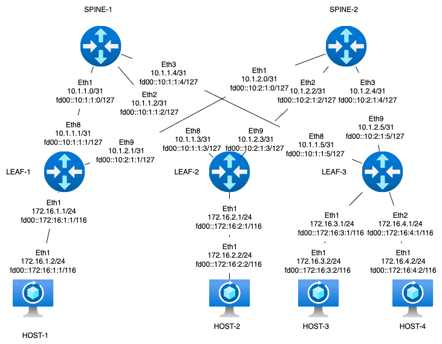
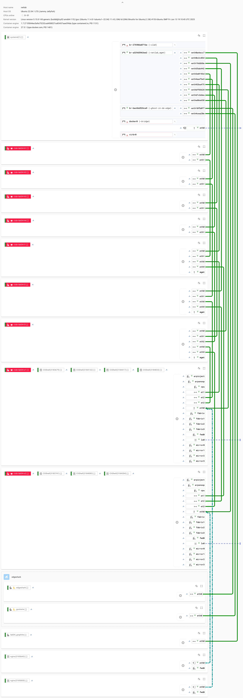
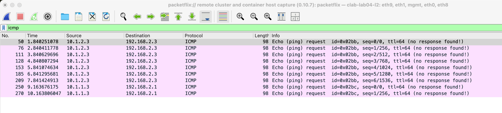

### Задание Underlay. BGP

Цель:
Настроить BGP для Underlay сети.

Описание/Пошаговая инструкция выполнения домашнего задания:
В этой самостоятельной работе мы ожидаем, что вы самостоятельно:

Настроите BGP в Underlay сети, для IP связанности между всеми сетевыми устройствами. iBGP или eBGP - решать вам!
Зафиксируете в документации - план работы, адресное пространство, схему сети, конфигурацию устройств
Убедитесь в наличии IP связанности между устройствами в BGP домене


### Схема стенда



Стенд делаем по принципу - хосты linux, leaf - frr, spine - eos (arista)

### Распределение адресного пространства для Underlay

План составлен с учетом 10.x.y.z, где x - номер DC, y - номер spine, z - по очереди для подключения leaf
Адреса для хостов - 172.16.x.z/24, где x - номер leaf, z - по порядку адрес хоста, на leaf ip .1
Адреса loopback 192.168.a.b/32, где a - 1 для spine, 2 - для leaf, b - номер spine, leaf по порядку
Адресацию ipv6 делаем по прицнипу из fd00::[IPv4]

Interconnect ipv4 ipv6

| Device A | Interface A | IPv4 A        | IPv6 A               | Device B | Interface B | IPv4 B        | IPv6 B               |
|----------|-------------|---------------|----------------------|----------|-------------|---------------|----------------------|
| Spine-1  | Eth1        | 10.1.1.0/31    | fd00::10:1:1:0/127    | Leaf-1   | Eth8        | 10.1.1.1/31    | fd00::10:1:1:1/127    |
| Spine-1  | Eth2        | 10.1.1.2/31    | fd00::10:1:1:2/127    | Leaf-2   | Eth8        | 10.1.1.3/31    | fd00::10:1:1:3/127    |
| Spine-1  | Eth3        | 10.1.1.4/31    | fd00::10:1:1:4/127    | Leaf-3   | Eth8        | 10.1.1.5/31    | fd00::10:1:1:5/127    |
| Spine-2  | Eth2        | 10.1.2.0/31    | fd00::10:2:1:0/127    | Leaf-1   | Eth9        | 10.1.2.1/31    | fd00::10:2:1:1/127    |
| Spine-2  | Eth2        | 10.1.2.2/31    | fd00::10:2:1:2/127    | Leaf-2   | Eth9        | 10.1.2.3/31    | fd00::10:2:1:3/127    |
| Spine-2  | Eth3        | 10.1.2.4/31    | fd00::10:2:1:4/127    | Leaf-3   | Eth9        | 10.1.2.5/31    | fd00::10:2:1:5/127    |
| Host-1   | Eth1        | 172.16.1.2/24  | fd00::172:16:1:2/116   | Leaf-1   | Eth1        | 172.16.1.1/24  | fd00::172:16:1:1/116   |
| Host-2   | Eth1        | 172.16.2.2/24  | fd00::172:16:2:2/116   | Leaf-2   | Eth1        | 172.16.2.1/24  | fd00::172:16:2:1/116   |
| Host-3   | Eth1        | 172.16.3.2/24  | fd00::172:16:3:2/116  | Leaf-3   | Eth1        | 172.16.3.1/24  | fd00::172:16:3:1/116   |
| Host-4   | Eth1        | 172.16.4.2/24  | fd00::172:16:4:2/116   | Leaf-3   | Eth2        | 172.16.4.1/24  | fd00::172:16:4:1/116   |

loopback

| Device | Loopback ipv4| loopback ipv6|
|-------------|---------------|-----------|
| Spine-1  | 192.168.1.1 | fd00::192:168:1:1 |
| Spine-2  | 192.168.1.2 | fd00::192:168:1:2 |
| Leaf-1   | 192.168.2.1 | fd00::192:168:2:1 |
| Leaf-2   | 192.168.2.2 | fd00::192:168:2:2 |
| Leaf-3   | 192.168.2.3 | fd00::192:168:2:3 |

Номера AS выдаем по принципу spine 65000 leaf 6500x, где x - номер leaf
Таблица net 
| Device  | AS number  |
|---------|---------|
| Spine-1 | 65000   |
| Spine-2 | 65000   |
| Leaf-1  | 65001   |
| Leaf-2  | 65002   |
| Leaf-3  | 65003   |


### Примечание - так как в явном виде не указано что делать с адресацией на хостовых машинах, а в качестве leaf и spine выступают роутеры, до настройки overlay адреса на хостах распределены из разных подсетей.
Когда поднимем overlay засунем все в одну подсеть чтобы эмулировать l2. Из маршрутизации интерфейсы к которым подключены хосты убираем.

### Запуск лабараторной в среде netlab
Заметки по использованию netlab:  
Как мы знаем из более ранних попыток есть вопросы с запуском bfd из файла первичной конфигурации, поэтому пришлось:
1) Поправить модуль /usr/local/lib/python3.10/dist-packages/netsim/modules/bgp.yml добавив в секцию node параметр bfd
<details>
  <summary>bgp.yml</summary>
  
  ```txt  
  node:
    bfd: bool
  
  interface:
    bfd: bool
    
```
</details>


2) Добавить в макросы  /usr/local/lib/python3.10/dist-packages/netsim/ansible/templates/bgp/eos.macro.j2  /usr/local/lib/python3.10/dist-packages/netsim/ansible/templates/bgp/frr.j2 обработчик параметров bfd
<details>
  <summary>add to eos.macro.j2</summary>
  
  ```txt  
  В секцию  Define a BGP neighbor добавляем



  neighbor {{ peer }} bfd

    
```
</details>

<details>
  <summary>add to frr.j2</summary>
  
  ```txt  
  В секцию  Create neighbors добавляем



  neighbor {{ peer }} bfd

    
```
</details>

А после всех этих манипуляций понять, что читать документацию надо внимательно и обнаружить плагин bgp.session, который не только bfd включит, но и в полной мере может управлять создаваемыми сессиями. 
По ходу чтения документации нашел встраиваемый инструмент edgeshark, позволяющий снифать трафик, получать маршрутную информацию, отслеживать линки с инстансов netlab. Его крутые возможности приведу в скринах ниже. Включается она 2мя строками.
```
tools:
  edgeshark:
```


или под катом

<details>
  <summary>topology.yml </summary>

  ```yml
---
provider: clab
module: [ bgp, bfd]
plugin: [ bgp.session ]

tools:
  edgeshark:
  graphite:

bgp.bfd: True

nodes:
 s1:
  device: eos
  id: 1
  loopback:
    ipv4: 192.168.1.1/32
    ipv6: fd00::192:168:1:1/128
  bgp:
   as: 65000
   sessions:
     ipv4: [ebgp]
     ipv6: [ebgp]
 s2:
  device: eos
  id: 2
  loopback:
    ipv4: 192.168.1.2/32
    ipv6: fd00::192:168:1:2/128
  bgp:
   as: 65000
   sessions:
     ipv4: [ebgp]
     ipv6: [ebgp]
 l1:
  device: frr
  id: 3
  loopback:
    ipv4: 192.168.2.1/32
    ipv6: fd00::192:168:2:1/128
  bgp:
   as: 65001
   sessions:
     ipv4: [ebgp]
     ipv6: [ebgp]
 l2:
  device: frr
  id: 4
  loopback:
    ipv4: 192.168.2.2/32
    ipv6: fd00::192:168:2:2/128
  bgp:
   as: 65002
   sessions:
     ipv4: [ebgp]
     ipv6: [ebgp]
 l3:
  device: frr
  id: 5
  loopback:
    ipv4: 192.168.2.3/32
    ipv6: fd00::192:168:2:3/128
  bgp:
   as: 65003
   sessions:
     ipv4: [ebgp]
     ipv6: [ebgp]
 h1:
  device: linux
 h2:
  device: linux
 h3:
  device: linux
 h4:
  device: linux

links:
#spine1-leaf1,2,3
  - interfaces:
      - node: s1
        ifname: eth1
        ipv4: 10.1.1.0
        ipv6: fd00::10:1:1:0
      - node: l1
        ifname: eth8
        ipv4: 10.1.1.1
        ipv6: fd00::10:1:1:1
    prefix:
      ipv4: 10.1.1.0/31
      ipv6: fd00::10:1:1:0/127
  - interfaces:
      - node: s1
        ifname: eth2
        ipv4: 10.1.1.2
        ipv6: fd00::10:1:1:2
      - node: l2
        ifname: eth8
        ipv4: 10.1.1.3
        ipv6: fd00::10:1:1:3
    prefix:
      ipv4: 10.1.1.2/31
      ipv6: fd00::10:1:1:2/127
  - interfaces:
      - node: s1
        ifname: eth3
        ipv4: 10.1.1.4
        ipv6: fd00::10:1:1:4
      - node: l3
        ifname: eth8
        ipv4: 10.1.1.5
        ipv6: fd00::10:1:1:5
    prefix:
      ipv4: 10.1.1.4/31
      ipv6: fd00::10:1:1:4/127
#spine2-leaf1,2,3
  - interfaces:
      - node: s2
        ifname: eth1
        ipv4: 10.1.2.0
        ipv6: fd00::10:1:2:0
      - node: l1
        ifname: eth9
        ipv4: 10.1.2.1
        ipv6: fd00::10:1:2:1
    prefix:
      ipv4: 10.1.2.0/31
      ipv6: fd00::10:1:2:0/127
  - interfaces:
      - node: s2
        ifname: eth2
        ipv4: 10.1.2.2
        ipv6: fd00::10:1:2:2
      - node: l2
        ifname: eth9
        ipv4: 10.1.2.3
        ipv6: fd00::10:1:2:3
    prefix:
      ipv4: 10.1.2.2/31
      ipv6: fd00::10:1:2:2/127
  - interfaces:
      - node: s2
        ifname: eth3
        ipv4: 10.1.2.4
        ipv6: fd00::10:1:2:4
      - node: l3
        ifname: eth9
        ipv4: 10.1.2.5
        ipv6: fd00::10:1:2:5
    prefix:
      ipv4: 10.1.2.4/31
      ipv6: fd00::10:1:2:4/127
#host1
  - interfaces:
      - node: h1
        ifname: eth1
        ipv4: 172.16.1.2
        ipv6: fd00::172:16:1:2
      - node: l1
        ifname: eth1
        ipv4: 172.16.1.1
        ipv6: fd00::172:16:1:1
    prefix:
      ipv4: 172.16.1.0/24
      ipv6: fd00::172:16:1:0/116
#host2
  - interfaces:
      - node: h2
        ifname: eth1
        ipv4: 172.16.2.2
        ipv6: fd00::172:16:2:2
      - node: l2
        ifname: eth1
        ipv4: 172.16.2.1
        ipv6: fd00::172:16:2:1
    prefix:
      ipv4: 172.16.2.0/24
      ipv6: fd00::172:16:1:0/116
#host3
  - interfaces:
      - node: h3
        ifname: eth1
        ipv4: 172.16.3.2
        ipv6: fd00::172:16:3:2
      - node: l3
        ifname: eth1
        ipv4: 172.16.3.1
        ipv6: fd00::172:16:3:1
    prefix:
      ipv4: 172.16.3.0/24
      ipv6: fd00::172:16:3:0/116
#host4
  - interfaces:
      - node: h4
        ifname: eth1
        ipv4: 172.16.4.2
        ipv6: fd00::172:16:4:2
      - node: l3
        ifname: eth2
        ipv4: 172.16.4.1
        ipv6: fd00::172:16:4:1
    prefix:
      ipv4: 172.16.4.0/24
      ipv6: fd00::172:16:4:0/116


```
</details>

## Проверка работы

<details>
  <summary>spine-1</summary>
  
  ```txt  
s1#show ip ro

VRF: default

Gateway of last resort is not set


 C        10.1.1.0/31
           directly connected, Ethernet1
 C        10.1.1.2/31
           directly connected, Ethernet2
 C        10.1.1.4/31
           directly connected, Ethernet3
 B E      172.16.1.0/24 [200/0]
           via 10.1.1.1, Ethernet1
 B E      172.16.2.0/24 [200/0]
           via 10.1.1.3, Ethernet2
 B E      172.16.3.0/24 [200/0]
           via 10.1.1.5, Ethernet3
 B E      172.16.4.0/24 [200/0]
           via 10.1.1.5, Ethernet3
 C        192.168.1.1/32
           directly connected, Loopback0
 B E      192.168.2.1/32 [200/0]
           via 10.1.1.1, Ethernet1
 B E      192.168.2.2/32 [200/0]
           via 10.1.1.3, Ethernet2
 B E      192.168.2.3/32 [200/0]
           via 10.1.1.5, Ethernet3


s1#show ipv6 ro

VRF: default

 C        fd00::10:1:1:0/127 [0/0]
           via Ethernet1, directly connected
 C        fd00::10:1:1:2/127 [0/0]
           via Ethernet2, directly connected
 C        fd00::10:1:1:4/127 [0/0]
           via Ethernet3, directly connected
 B E      fd00::172:16:1:0/116 [200/0]
           via fd00::10:1:1:1, Ethernet1
 B E      fd00::172:16:2:0/116 [200/0]
           via fd00::10:1:1:3, Ethernet2
 B E      fd00::172:16:3:0/116 [200/0]
           via fd00::10:1:1:5, Ethernet3
 B E      fd00::172:16:4:0/116 [200/0]
           via fd00::10:1:1:5, Ethernet3
 C        fd00::192:168:1:1/128 [0/0]
           via Loopback0, directly connected
 B E      fd00::192:168:2:1/128 [200/0]
           via fd00::10:1:1:1, Ethernet1
 B E      fd00::192:168:2:2/128 [200/0]
           via fd00::10:1:1:3, Ethernet2
 B E      fd00::192:168:2:3/128 [200/0]
           via fd00::10:1:1:5, Ethernet3

s1#show bfd peers
VRF name: default
-----------------
DstAddr       MyDisc    YourDisc  Interface/Transport    Type           LastUp 
--------- ----------- ----------- -------------------- ------- ----------------
10.1.1.1  2581780435  2824933366      Ethernet1(2718)  normal   09/16/25 15:37 
10.1.1.3  3732559854  1902154705      Ethernet2(2734)  normal   09/16/25 15:37 
10.1.1.5  4234480148   127838387      Ethernet3(2732)  normal   09/16/25 15:37 

   LastDown            LastDiag    State
-------------- ------------------- -----
         NA       No Diagnostic       Up
         NA       No Diagnostic       Up
         NA       No Diagnostic       Up

DstAddr            MyDisc   YourDisc Interface/Transport   Type         LastUp 
-------------- ---------- ---------- ------------------- ------ ---------------
fd00::10:1:1:1 1652262492 2803604608     Ethernet1(2718) normal 09/16/25 15:37 
fd00::10:1:1:3 1815725452 2843362118     Ethernet2(2734) normal 09/16/25 15:37 
fd00::10:1:1:5 2833241770  802033556     Ethernet3(2732) normal 09/16/25 15:37 

   LastDown            LastDiag    State
-------------- ------------------- -----
         NA       No Diagnostic       Up
         NA       No Diagnostic       Up
         NA       No Diagnostic       Up

```
</details>

<details>
  <summary>spine-2 </summary>

  ```txt  

s2#show ip ro

Gateway of last resort is not set

 C        10.1.2.0/31
           directly connected, Ethernet1
 C        10.1.2.2/31
           directly connected, Ethernet2
 C        10.1.2.4/31
           directly connected, Ethernet3
 B E      172.16.1.0/24 [200/0]
           via 10.1.2.1, Ethernet1
 B E      172.16.2.0/24 [200/0]
           via 10.1.2.3, Ethernet2
 B E      172.16.3.0/24 [200/0]
           via 10.1.2.5, Ethernet3
 B E      172.16.4.0/24 [200/0]
           via 10.1.2.5, Ethernet3
 C        192.168.1.2/32
           directly connected, Loopback0
 B E      192.168.2.1/32 [200/0]
           via 10.1.2.1, Ethernet1
 B E      192.168.2.2/32 [200/0]
           via 10.1.2.3, Ethernet2
 B E      192.168.2.3/32 [200/0]
           via 10.1.2.5, Ethernet3


s2#show ipv6 ro

VRF: default

 C        fd00::10:1:2:0/127 [0/0]
           via Ethernet1, directly connected
 C        fd00::10:1:2:2/127 [0/0]
           via Ethernet2, directly connected
 C        fd00::10:1:2:4/127 [0/0]
           via Ethernet3, directly connected
 B E      fd00::172:16:1:0/116 [200/0]
           via fd00::10:1:2:1, Ethernet1
 B E      fd00::172:16:2:0/116 [200/0]
           via fd00::10:1:2:3, Ethernet2
 B E      fd00::172:16:3:0/116 [200/0]
           via fd00::10:1:2:5, Ethernet3
 B E      fd00::172:16:4:0/116 [200/0]
           via fd00::10:1:2:5, Ethernet3
 C        fd00::192:168:1:2/128 [0/0]
           via Loopback0, directly connected
 B E      fd00::192:168:2:1/128 [200/0]
           via fd00::10:1:2:1, Ethernet1
 B E      fd00::192:168:2:2/128 [200/0]
           via fd00::10:1:2:3, Ethernet2
 B E      fd00::192:168:2:3/128 [200/0]
           via fd00::10:1:2:5, Ethernet3

s2#show bfd peers
VRF name: default
-----------------
DstAddr       MyDisc    YourDisc  Interface/Transport    Type           LastUp 
--------- ----------- ----------- -------------------- ------- ----------------
10.1.2.1  2769141842   416998736      Ethernet1(2717)  normal   09/16/25 15:37 
10.1.2.3  1190010339  4031563154      Ethernet2(2721)  normal   09/16/25 15:37 
10.1.2.5   405007780  3992401038      Ethernet3(2727)  normal   09/16/25 15:37 

   LastDown            LastDiag    State
-------------- ------------------- -----
         NA       No Diagnostic       Up
         NA       No Diagnostic       Up
         NA       No Diagnostic       Up

DstAddr            MyDisc   YourDisc Interface/Transport   Type         LastUp 
-------------- ---------- ---------- ------------------- ------ ---------------
fd00::10:1:2:1  356403669  198425777     Ethernet1(2717) normal 09/16/25 15:37 
fd00::10:1:2:3 3312820639 2830340384     Ethernet2(2721) normal 09/16/25 15:37 
fd00::10:1:2:5 2589451238 1692913741     Ethernet3(2727) normal 09/16/25 15:37 

   LastDown            LastDiag    State
-------------- ------------------- -----
         NA       No Diagnostic       Up
         NA       No Diagnostic       Up
         NA       No Diagnostic       Up


s2#show bgp neighbors 

BGP neighbor is 10.1.2.1, remote AS 65001, external link
 Description: l1
  BGP version 4, remote router ID 192.168.2.1, VRF default
  Last read 00:00:02, last write 00:00:01
  Hold time is 9, keepalive interval is 3 seconds
  Configured hold time is 180, keepalive interval is 60 seconds
  Effective minimum hold time is 3 seconds
  Send failure hold time is 0 seconds
  Hold timer is active, time left: 00:00:07
  Keepalive timer is active, time left: 00:00:01
  Connect timer is inactive
  Idle-restart timer is inactive
  BGP state is Established, up for 00:11:02
  Number of transitions to established: 3
  Last state was OpenConfirm
  Last event was RecvUpdate
  Last sent notification:Cease/administrative reset, Last time 00:11:05
  Last rcvd notification:Cease/administrative reset, Last time 00:11:02
  Last rcvd socket-error:Connection reset by peer, Last time 00:11:09
  Types of communities advertised: standard large
  Enhanced route refresh stale path removal disabled
  Outbound enhanced route refresh enabled
  Neighbor Capabilities:
    Multiprotocol IPv4 Unicast: advertised and received and negotiated
    Four Octet ASN: advertised and received and negotiated
    Route Refresh: advertised and received and negotiated
    Enhanced route refresh: advertised and received and negotiated
    Send End-of-RIB messages: advertised and received and negotiated
    Additional-paths recv capability:
      IPv4 Unicast: advertised
    Additional-paths send capability:
      IPv4 Unicast: received
    Graceful Restart advertised:
      Restart-time is 300
      Restart-State bit: no
      Graceful notification: yes
    Graceful Restart received:
      Restart-time is 120
      Restart-State bit: yes
      Graceful notification: yes
    Long Lived Graceful Restart received:
      IPv4 Unicast is enabled, Forwarding State is preserved, Stale time is 0 se conds
  Restart timer is inactive
  End of rib timer is inactive
    IPv4 Unicast End-of-RIB received: Yes
      Received 00:11:00
      Number of stale paths removed after graceful restart: 0
      Number of paths received before End-of-RIB: 2
  IPv4 Unicast AS_SET/AS_CONFED_SET processing: accept
  IPv6 Unicast AS_SET/AS_CONFED_SET processing: accept
  AIGP attribute send and receive for IPv4 Unicast are disabled
  AIGP attribute send and receive for IPv4 with MPLS Labels are disabled
  AIGP attribute send and receive for IPv6 Unicast are disabled
  AIGP attribute send and receive for IPv6 with MPLS Labels are disabled
  BGP session driven failover for IPv4 Unicast is disabled
  BGP session driven failover for IPv6 Unicast is disabled
  Message Statistics:
                                  Sent      Rcvd
    Opens:                           4         3
    Notifications:                   1         1
    Updates:                        10        12
    Keepalives:                    263       224
    Enhanced Route Refresh:          0         0
    Begin of Route Refresh:          0         0
    End of Route Refresh:            0         0
    Total messages:                278       240
  Prefix Statistics:
                                   Sent      Rcvd     Best Paths     Best ECMP P 
aths
    IPv4 Unicast:                     6         2              2                    0
    IPv6 Unicast:                     0         0              0                    0
  Configured maximum total number of routes is 256000, warning limit is 204800
  Inbound updates dropped by reason:
    AS path loop detection: 4
    Cluster ID loop detection: 0
    Enforced First AS: 0
    Malformed MPBGP routes: 0
    Originator ID matches local router ID: 0
    Nexthop matches local IP address: 0
    Unexpected IPv6 nexthop for IPv4 routes: 0
    AS_SET/AS_CONFED_SET in AS_PATH for IPv4 Unicast: 0
    AS_SET/AS_CONFED_SET in AS_PATH for IPv6 Unicast: 0
  Inbound updates with attribute errors:
    Resulting in removal of all paths in update (treat as withdraw): 0
    Resulting in AFI/SAFI disable: 0
    Resulting in attribute ignore: 0
    Disabled AFI/SAFIs: None
  Inbound paths dropped by reason:
    IPv4 unicast NLRIs dropped due to martian prefix: 0
    IPv4 unicast NLRIs dropped due to maximum route limit violation: 0
    IPv6 unicast NLRIs dropped due to martian prefix: 0
    IPv4 labeled-unicast NLRIs dropped due to excessive labels: 0
    IPv4 labeled-unicast NLRIs dropped due to martian prefix: 0
    IPv6 labeled-unicast NLRIs dropped due to excessive labels: 0
    IPv6 labeled-unicast NLRIs dropped due to martian prefix: 0
    VPN-IPv4 NLRIs dropped due to route import match failure: 0
    VPN-IPv6 NLRIs dropped due to route import match failure: 0
    L2VPN EVPN NLRIs dropped due to route import match failure: 0
    L2VPN EVPN NLRIs dropped due to unsupported route type: 0
    Link-state NLRIs dropped because reception is unsupported: 0
    RT Membership NLRIs dropped due to local origin ASN received from external p eer: 0
  Outbound paths dropped by reason:
    IPv4 local address not available: 0
    IPv6 local address not available: 0
Local AS is 65000, local router ID 192.168.1.2
TTL is 1
Local TCP address is 10.1.2.0, local port is 179
Remote TCP address is 10.1.2.1, remote port is 41916
Local next hop for next hop self:
  IPv4 Unicast: 10.1.2.0
BFD is enabled and state is Up
! Sending extended community not configured, updates will be sent without extend ed communities or route targets
TCP Socket Information:
  TCP state is ESTABLISHED
  Recv-Q: 0/32768
  Send-Q: 0/87040
  Outgoing Maximum Segment Size (MSS): 1448
  Total Number of TCP retransmissions: 0
  Options:
    Timestamps enabled: yes
    Selective Acknowledgments enabled: yes
    Window Scale enabled: yes
    Explicit Congestion Notification (ECN) enabled: no
  Socket Statistics:
    Window Scale (wscale): 7,7
    Retransmission Timeout (rto): 204.0ms
    Round-trip Time (rtt/rtvar): 0.1ms/0.0ms
    Delayed Ack Timeout (ato): 40.0ms
    Congestion Window (cwnd): 10
    TCP Throughput: 1466.33 Mbps
    Advertised Recv Window (rcv_space): 14600

BGP neighbor is 10.1.2.3, remote AS 65002, external link
 Description: l2
  BGP version 4, remote router ID 192.168.2.2, VRF default
  Last read 00:00:02, last write 00:00:02
  Hold time is 9, keepalive interval is 3 seconds
  Configured hold time is 180, keepalive interval is 60 seconds
  Effective minimum hold time is 3 seconds
  Send failure hold time is 0 seconds
  Hold timer is active, time left: 00:00:07
  Keepalive timer is active, time left: 00:00:00
  Connect timer is inactive
  Idle-restart timer is inactive
  BGP state is Established, up for 00:11:02
  Number of transitions to established: 3
  Last state was OpenConfirm
  Last event was RecvUpdate
  Last sent notification:Cease/administrative reset, Last time 00:11:05
  Last rcvd notification:Cease/administrative reset, Last time 00:11:02
  Last rcvd socket-error:Connection reset by peer, Last time 00:11:05, First tim e 00:11:09, Repeats 1
  Types of communities advertised: standard large
  Enhanced route refresh stale path removal disabled
  Outbound enhanced route refresh enabled
  Neighbor Capabilities:
    Multiprotocol IPv4 Unicast: advertised and received and negotiated
    Four Octet ASN: advertised and received and negotiated
    Route Refresh: advertised and received and negotiated
    Enhanced route refresh: advertised and received and negotiated
    Send End-of-RIB messages: advertised and received and negotiated
    Additional-paths recv capability:
      IPv4 Unicast: advertised
    Additional-paths send capability:
      IPv4 Unicast: received
    Graceful Restart advertised:
      Restart-time is 300
      Restart-State bit: no
      Graceful notification: yes
    Graceful Restart received:
      Restart-time is 120
      Restart-State bit: yes
      Graceful notification: yes
    Long Lived Graceful Restart received:
      IPv4 Unicast is enabled, Forwarding State is preserved, Stale time is 0 se conds
  Restart timer is inactive
  End of rib timer is inactive
    IPv4 Unicast End-of-RIB received: Yes
      Received 00:11:01
      Number of stale paths removed after graceful restart: 0
      Number of paths received before End-of-RIB: 2
  IPv4 Unicast AS_SET/AS_CONFED_SET processing: accept
  IPv6 Unicast AS_SET/AS_CONFED_SET processing: accept
  AIGP attribute send and receive for IPv4 Unicast are disabled
  AIGP attribute send and receive for IPv4 with MPLS Labels are disabled
  AIGP attribute send and receive for IPv6 Unicast are disabled
  AIGP attribute send and receive for IPv6 with MPLS Labels are disabled
  BGP session driven failover for IPv4 Unicast is disabled
  BGP session driven failover for IPv6 Unicast is disabled
  Message Statistics:
                                  Sent      Rcvd
    Opens:                           4         3
    Notifications:                   1         1
    Updates:                         8        12
    Keepalives:                    265       224
    Enhanced Route Refresh:          0         0
    Begin of Route Refresh:          0         0
    End of Route Refresh:            0         0
    Total messages:                278       240
  Prefix Statistics:
                                   Sent      Rcvd     Best Paths     Best ECMP P 
aths
    IPv4 Unicast:                     6         2              2                    0
    IPv6 Unicast:                     0         0              0                    0
  Configured maximum total number of routes is 256000, warning limit is 204800
  Inbound updates dropped by reason:
    AS path loop detection: 4
    Cluster ID loop detection: 0
    Enforced First AS: 0
    Malformed MPBGP routes: 0
    Originator ID matches local router ID: 0
    Nexthop matches local IP address: 0
    Unexpected IPv6 nexthop for IPv4 routes: 0
    AS_SET/AS_CONFED_SET in AS_PATH for IPv4 Unicast: 0
    AS_SET/AS_CONFED_SET in AS_PATH for IPv6 Unicast: 0
  Inbound updates with attribute errors:
    Resulting in removal of all paths in update (treat as withdraw): 0
    Resulting in AFI/SAFI disable: 0
    Resulting in attribute ignore: 0
    Disabled AFI/SAFIs: None
  Inbound paths dropped by reason:
    IPv4 unicast NLRIs dropped due to martian prefix: 0
    IPv4 unicast NLRIs dropped due to maximum route limit violation: 0
    IPv6 unicast NLRIs dropped due to martian prefix: 0
    IPv4 labeled-unicast NLRIs dropped due to excessive labels: 0
    IPv4 labeled-unicast NLRIs dropped due to martian prefix: 0
    IPv6 labeled-unicast NLRIs dropped due to excessive labels: 0
    IPv6 labeled-unicast NLRIs dropped due to martian prefix: 0
    VPN-IPv4 NLRIs dropped due to route import match failure: 0
    VPN-IPv6 NLRIs dropped due to route import match failure: 0
    L2VPN EVPN NLRIs dropped due to route import match failure: 0
    L2VPN EVPN NLRIs dropped due to unsupported route type: 0
    Link-state NLRIs dropped because reception is unsupported: 0
    RT Membership NLRIs dropped due to local origin ASN received from external p eer: 0
  Outbound paths dropped by reason:
    IPv4 local address not available: 0
    IPv6 local address not available: 0
Local AS is 65000, local router ID 192.168.1.2
TTL is 1
Local TCP address is 10.1.2.2, local port is 179
Remote TCP address is 10.1.2.3, remote port is 38026
Local next hop for next hop self:
  IPv4 Unicast: 10.1.2.2
BFD is enabled and state is Up
! Sending extended community not configured, updates will be sent without extend ed communities or route targets
TCP Socket Information:
  TCP state is ESTABLISHED
  Recv-Q: 0/32768
  Send-Q: 0/87040
  Outgoing Maximum Segment Size (MSS): 1448
  Total Number of TCP retransmissions: 0
  Options:
    Timestamps enabled: yes
    Selective Acknowledgments enabled: yes
    Window Scale enabled: yes
    Explicit Congestion Notification (ECN) enabled: no
  Socket Statistics:
    Window Scale (wscale): 7,7
    Retransmission Timeout (rto): 204.0ms
    Round-trip Time (rtt/rtvar): 0.1ms/0.0ms
    Delayed Ack Timeout (ato): 40.0ms
    Congestion Window (cwnd): 10
    TCP Throughput: 1146.93 Mbps
    Advertised Recv Window (rcv_space): 14600

BGP neighbor is 10.1.2.5, remote AS 65003, external link
 Description: l3
  BGP version 4, remote router ID 192.168.2.3, VRF default
  Last read 00:00:02, last write 00:00:01
  Hold time is 9, keepalive interval is 3 seconds
  Configured hold time is 180, keepalive interval is 60 seconds
  Effective minimum hold time is 3 seconds
  Send failure hold time is 0 seconds
  Hold timer is active, time left: 00:00:07
  Keepalive timer is active, time left: 00:00:01
  Connect timer is inactive
  Idle-restart timer is inactive
  BGP state is Established, up for 00:11:02
  Number of transitions to established: 3
  Last state was OpenConfirm
  Last event was RecvUpdate
  Last sent notification:Cease/administrative reset, Last time 00:11:05
  Last rcvd notification:Cease/administrative reset, Last time 00:11:02
  Last rcvd socket-error:Connection reset by peer, Last time 00:11:09
  Types of communities advertised: standard large
  Enhanced route refresh stale path removal disabled
  Outbound enhanced route refresh enabled
  Neighbor Capabilities:
    Multiprotocol IPv4 Unicast: advertised and received and negotiated
    Four Octet ASN: advertised and received and negotiated
    Route Refresh: advertised and received and negotiated
    Enhanced route refresh: advertised and received and negotiated
    Send End-of-RIB messages: advertised and received and negotiated
    Additional-paths recv capability:
      IPv4 Unicast: advertised
    Additional-paths send capability:
      IPv4 Unicast: received
    Graceful Restart advertised:
      Restart-time is 300
      Restart-State bit: no
      Graceful notification: yes
    Graceful Restart received:
      Restart-time is 120
      Restart-State bit: yes
      Graceful notification: yes
    Long Lived Graceful Restart received:
      IPv4 Unicast is enabled, Forwarding State is preserved, Stale time is 0 se conds
  Restart timer is inactive
  End of rib timer is inactive
    IPv4 Unicast End-of-RIB received: Yes
      Received 00:11:01
      Number of stale paths removed after graceful restart: 0
      Number of paths received before End-of-RIB: 3
  IPv4 Unicast AS_SET/AS_CONFED_SET processing: accept
  IPv6 Unicast AS_SET/AS_CONFED_SET processing: accept
  AIGP attribute send and receive for IPv4 Unicast are disabled
  AIGP attribute send and receive for IPv4 with MPLS Labels are disabled
  AIGP attribute send and receive for IPv6 Unicast are disabled
  AIGP attribute send and receive for IPv6 with MPLS Labels are disabled
  BGP session driven failover for IPv4 Unicast is disabled
  BGP session driven failover for IPv6 Unicast is disabled
  Message Statistics:
                                  Sent      Rcvd
    Opens:                           4         3
    Notifications:                   1         1
    Updates:                         8        12
    Keepalives:                    265       224
    Enhanced Route Refresh:          0         0
    Begin of Route Refresh:          0         0
    End of Route Refresh:            0         0
    Total messages:                278       240
  Prefix Statistics:
                                   Sent      Rcvd     Best Paths     Best ECMP P aths
    IPv4 Unicast:                     5         3              3                    0
    IPv6 Unicast:                     0         0              0                    0
  Configured maximum total number of routes is 256000, warning limit is 204800
  Inbound updates dropped by reason:
    AS path loop detection: 4
    Cluster ID loop detection: 0
    Enforced First AS: 0
    Malformed MPBGP routes: 0
    Originator ID matches local router ID: 0
    Nexthop matches local IP address: 0
    Unexpected IPv6 nexthop for IPv4 routes: 0
    AS_SET/AS_CONFED_SET in AS_PATH for IPv4 Unicast: 0
    AS_SET/AS_CONFED_SET in AS_PATH for IPv6 Unicast: 0
  Inbound updates with attribute errors:
    Resulting in removal of all paths in update (treat as withdraw): 0
    Resulting in AFI/SAFI disable: 0
    Resulting in attribute ignore: 0
    Disabled AFI/SAFIs: None
  Inbound paths dropped by reason:
    IPv4 unicast NLRIs dropped due to martian prefix: 0
    IPv4 unicast NLRIs dropped due to maximum route limit violation: 0
    IPv6 unicast NLRIs dropped due to martian prefix: 0
    IPv4 labeled-unicast NLRIs dropped due to excessive labels: 0
    IPv4 labeled-unicast NLRIs dropped due to martian prefix: 0
    IPv6 labeled-unicast NLRIs dropped due to excessive labels: 0
    IPv6 labeled-unicast NLRIs dropped due to martian prefix: 0
    VPN-IPv4 NLRIs dropped due to route import match failure: 0
    VPN-IPv6 NLRIs dropped due to route import match failure: 0
    L2VPN EVPN NLRIs dropped due to route import match failure: 0
    L2VPN EVPN NLRIs dropped due to unsupported route type: 0
    Link-state NLRIs dropped because reception is unsupported: 0
    RT Membership NLRIs dropped due to local origin ASN received from external p eer: 0
  Outbound paths dropped by reason:
    IPv4 local address not available: 0
    IPv6 local address not available: 0
Local AS is 65000, local router ID 192.168.1.2
TTL is 1
Local TCP address is 10.1.2.4, local port is 179
Remote TCP address is 10.1.2.5, remote port is 35588
Local next hop for next hop self:
  IPv4 Unicast: 10.1.2.4
BFD is enabled and state is Up
! Sending extended community not configured, updates will be sent without extend  
ed communities or route targets
TCP Socket Information:
  TCP state is ESTABLISHED
  Recv-Q: 0/32768
  Send-Q: 0/87040
  Outgoing Maximum Segment Size (MSS): 1448
  Total Number of TCP retransmissions: 0
  Options:
    Timestamps enabled: yes
    Selective Acknowledgments enabled: yes
    Window Scale enabled: yes
    Explicit Congestion Notification (ECN) enabled: no
  Socket Statistics:
    Window Scale (wscale): 7,7
    Retransmission Timeout (rto): 204.0ms
    Round-trip Time (rtt/rtvar): 0.1ms/0.0ms
    Delayed Ack Timeout (ato): 40.0ms
    Congestion Window (cwnd): 10
    TCP Throughput: 1586.85 Mbps
    Advertised Recv Window (rcv_space): 14600

BGP neighbor is fd00::10:1:2:1, remote AS 65001, external link
 Description: l1
  BGP version 4, remote router ID 192.168.2.1, VRF default
  Last read 00:00:02, last write 00:00:03
  Hold time is 9, keepalive interval is 3 seconds
  Configured hold time is 180, keepalive interval is 60 seconds
  Effective minimum hold time is 3 seconds
  Send failure hold time is 0 seconds
  Hold timer is active, time left: 00:00:07
  Keepalive timer is inactive
  Connect timer is inactive
  Idle-restart timer is inactive
  BGP state is Established, up for 00:11:02
  Number of transitions to established: 3
  Last state was OpenConfirm
  Last event was RecvUpdate
  Last sent notification:Cease/administrative reset, Last time 00:11:05
  Last rcvd notification:Cease/administrative reset, Last time 00:11:02
  Types of communities advertised: standard large
  Enhanced route refresh stale path removal disabled
  Outbound enhanced route refresh enabled
  Neighbor Capabilities:
    Multiprotocol IPv6 Unicast: advertised and received and negotiated
    Four Octet ASN: advertised and received and negotiated
    Route Refresh: advertised and received and negotiated
    Enhanced route refresh: advertised and received and negotiated
    Send End-of-RIB messages: advertised and received and negotiated
    Additional-paths recv capability:
      IPv6 Unicast: advertised
    Additional-paths send capability:
      IPv6 Unicast: received
    Graceful Restart advertised:
      Restart-time is 300
      Restart-State bit: no
      Graceful notification: yes
    Graceful Restart received:
      Restart-time is 120
      Restart-State bit: yes
      Graceful notification: yes
    Long Lived Graceful Restart received:
      IPv6 Unicast is enabled, Forwarding State is preserved, Stale time is 0 se conds
  Restart timer is inactive
  End of rib timer is inactive
    IPv6 Unicast End-of-RIB received: Yes
      Received 00:11:01
      Number of stale paths removed after graceful restart: 0
      Number of paths received before End-of-RIB: 2
  IPv4 Unicast AS_SET/AS_CONFED_SET processing: accept
  IPv6 Unicast AS_SET/AS_CONFED_SET processing: accept
  AIGP attribute send and receive for IPv4 Unicast are disabled
  AIGP attribute send and receive for IPv4 with MPLS Labels are disabled
  AIGP attribute send and receive for IPv6 Unicast are disabled
  AIGP attribute send and receive for IPv6 with MPLS Labels are disabled
  BGP session driven failover for IPv4 Unicast is disabled
  BGP session driven failover for IPv6 Unicast is disabled
  Message Statistics:
                                  Sent      Rcvd
    Opens:                           3         3
    Notifications:                   1         1
    Updates:                        10        12
    Keepalives:                    265       224
    Enhanced Route Refresh:          0         0
    Begin of Route Refresh:          0         0
    End of Route Refresh:            0         0
    Total messages:                279       240
  Prefix Statistics:
                                   Sent      Rcvd     Best Paths     Best ECMP P aths
    IPv4 Unicast:                     0         0              0                    0
    IPv6 Unicast:                     6         2              2                    0
  Configured maximum total number of routes is 256000, warning limit is 204800
  Inbound updates dropped by reason:
    AS path loop detection: 4
    Cluster ID loop detection: 0
    Enforced First AS: 0
    Malformed MPBGP routes: 0
    Originator ID matches local router ID: 0
    Nexthop matches local IP address: 0
    Unexpected IPv6 nexthop for IPv4 routes: 0
    AS_SET/AS_CONFED_SET in AS_PATH for IPv4 Unicast: 0
    AS_SET/AS_CONFED_SET in AS_PATH for IPv6 Unicast: 0
  Inbound updates with attribute errors:
    Resulting in removal of all paths in update (treat as withdraw): 0
    Resulting in AFI/SAFI disable: 0
    Resulting in attribute ignore: 0
    Disabled AFI/SAFIs: None
  Inbound paths dropped by reason:
    IPv4 unicast NLRIs dropped due to martian prefix: 0
    IPv6 unicast NLRIs dropped due to martian prefix: 0
    IPv6 unicast NLRIs dropped due to maximum route limit violation: 0
    IPv4 labeled-unicast NLRIs dropped due to excessive labels: 0
    IPv4 labeled-unicast NLRIs dropped due to martian prefix: 0
    IPv6 labeled-unicast NLRIs dropped due to excessive labels: 0
    IPv6 labeled-unicast NLRIs dropped due to martian prefix: 0
    VPN-IPv4 NLRIs dropped due to route import match failure: 0
    VPN-IPv6 NLRIs dropped due to route import match failure: 0
    L2VPN EVPN NLRIs dropped due to route import match failure: 0
    L2VPN EVPN NLRIs dropped due to unsupported route type: 0
    Link-state NLRIs dropped because reception is unsupported: 0
    RT Membership NLRIs dropped due to local origin ASN received from external p eer: 0
  Outbound paths dropped by reason:
    IPv4 local address not available: 0
    IPv6 local address not available: 0
Local AS is 65000, local router ID 192.168.1.2
TTL is 1
Local TCP address is fd00::10:1:2:0, local port is 179
Remote TCP address is fd00::10:1:2:1, remote port is 51794
Local next hop for next hop self:
  IPv6 Unicast: fd00::10:1:2:0
BFD is enabled and state is Up
! Sending extended community not configured, updates will be sent without extend ed communities or route targets
TCP Socket Information:
  TCP state is ESTABLISHED
  Recv-Q: 0/32768
  Send-Q: 0/87040
  Outgoing Maximum Segment Size (MSS): 1428
  Total Number of TCP retransmissions: 0
  Options:
    Timestamps enabled: yes
    Selective Acknowledgments enabled: yes
    Window Scale enabled: yes
    Explicit Congestion Notification (ECN) enabled: no
  Socket Statistics:
    Window Scale (wscale): 7,7
    Retransmission Timeout (rto): 204.0ms
    Round-trip Time (rtt/rtvar): 0.1ms/0.0ms
    Delayed Ack Timeout (ato): 40.0ms
    Congestion Window (cwnd): 10
    TCP Throughput: 1543.78 Mbps
    Advertised Recv Window (rcv_space): 14400

BGP neighbor is fd00::10:1:2:3, remote AS 65002, external link
 Description: l2
  BGP version 4, remote router ID 192.168.2.2, VRF default
  Last read 00:00:02, last write 00:00:03
  Hold time is 9, keepalive interval is 3 seconds
  Configured hold time is 180, keepalive interval is 60 seconds
  Effective minimum hold time is 3 seconds
  Send failure hold time is 0 seconds
  Hold timer is active, time left: 00:00:07
  Keepalive timer is inactive
  Connect timer is inactive
  Idle-restart timer is inactive
  BGP state is Established, up for 00:11:02
  Number of transitions to established: 3
  Last state was OpenConfirm
  Last event was RecvUpdate
  Last sent notification:Cease/administrative reset, Last time 00:11:05
  Last rcvd notification:Cease/administrative reset, Last time 00:11:02
  Last rcvd socket-error:Connection reset by peer, Last time 00:11:09
  Types of communities advertised: standard large
  Enhanced route refresh stale path removal disabled
  Outbound enhanced route refresh enabled
  Neighbor Capabilities:
    Multiprotocol IPv6 Unicast: advertised and received and negotiated
    Four Octet ASN: advertised and received and negotiated
    Route Refresh: advertised and received and negotiated
    Enhanced route refresh: advertised and received and negotiated
    Send End-of-RIB messages: advertised and received and negotiated
    Additional-paths recv capability:
      IPv6 Unicast: advertised
    Additional-paths send capability:
      IPv6 Unicast: received
    Graceful Restart advertised:
      Restart-time is 300
      Restart-State bit: no
      Graceful notification: yes
    Graceful Restart received:
      Restart-time is 120
      Restart-State bit: yes
      Graceful notification: yes
    Long Lived Graceful Restart received:
      IPv6 Unicast is enabled, Forwarding State is preserved, Stale time is 0 se conds
  Restart timer is inactive
  End of rib timer is inactive
    IPv6 Unicast End-of-RIB received: Yes
      Received 00:11:01
      Number of stale paths removed after graceful restart: 0
      Number of paths received before End-of-RIB: 2
  IPv4 Unicast AS_SET/AS_CONFED_SET processing: accept
  IPv6 Unicast AS_SET/AS_CONFED_SET processing: accept
  AIGP attribute send and receive for IPv4 Unicast are disabled
  AIGP attribute send and receive for IPv4 with MPLS Labels are disabled
  AIGP attribute send and receive for IPv6 Unicast are disabled
  AIGP attribute send and receive for IPv6 with MPLS Labels are disabled
  BGP session driven failover for IPv4 Unicast is disabled
  BGP session driven failover for IPv6 Unicast is disabled
  Message Statistics:
                                  Sent      Rcvd
    Opens:                           4         3
    Notifications:                   1         1
    Updates:                         8        11
    Keepalives:                    266       224
    Enhanced Route Refresh:          0         0
    Begin of Route Refresh:          0         0
    End of Route Refresh:            0         0
    Total messages:                279       239
  Prefix Statistics:
                                   Sent      Rcvd     Best Paths     Best ECMP P aths
    IPv4 Unicast:                     0         0              0                    0
    IPv6 Unicast:                     6         2              2                  --More-- 
   0
  Configured maximum total number of routes is 256000, warning limit is 204800
  Inbound updates dropped by reason:
    AS path loop detection: 3
    Cluster ID loop detection: 0
    Enforced First AS: 0
    Malformed MPBGP routes: 0
    Originator ID matches local router ID: 0
    Nexthop matches local IP address: 0
    Unexpected IPv6 nexthop for IPv4 routes: 0
    AS_SET/AS_CONFED_SET in AS_PATH for IPv4 Unicast: 0
    AS_SET/AS_CONFED_SET in AS_PATH for IPv6 Unicast: 0
  Inbound updates with attribute errors:
    Resulting in removal of all paths in update (treat as withdraw): 0
    Resulting in AFI/SAFI disable: 0
    Resulting in attribute ignore: 0
    Disabled AFI/SAFIs: None
  Inbound paths dropped by reason:
    IPv4 unicast NLRIs dropped due to martian prefix: 0
    IPv6 unicast NLRIs dropped due to martian prefix: 0
    IPv6 unicast NLRIs dropped due to maximum route limit violation: 0
    IPv4 labeled-unicast NLRIs dropped due to excessive labels: 0
    IPv4 labeled-unicast NLRIs dropped due to martian prefix: 0
    IPv6 labeled-unicast NLRIs dropped due to excessive labels: 0
    IPv6 labeled-unicast NLRIs dropped due to martian prefix: 0
    VPN-IPv4 NLRIs dropped due to route import match failure: 0
    VPN-IPv6 NLRIs dropped due to route import match failure: 0
    L2VPN EVPN NLRIs dropped due to route import match failure: 0
    L2VPN EVPN NLRIs dropped due to unsupported route type: 0
    Link-state NLRIs dropped because reception is unsupported: 0
    RT Membership NLRIs dropped due to local origin ASN received from external p eer: 0
  Outbound paths dropped by reason:
    IPv4 local address not available: 0
    IPv6 local address not available: 0
Local AS is 65000, local router ID 192.168.1.2
TTL is 1
Local TCP address is fd00::10:1:2:2, local port is 179
Remote TCP address is fd00::10:1:2:3, remote port is 58480
Local next hop for next hop self:
  IPv6 Unicast: fd00::10:1:2:2
BFD is enabled and state is Up
! Sending extended community not configured, updates will be sent without extend ed communities or route targets
TCP Socket Information:
  TCP state is ESTABLISHED
  Recv-Q: 0/32768
  Send-Q: 0/87040
  Outgoing Maximum Segment Size (MSS): 1428
  Total Number of TCP retransmissions: 0
  Options:
    Timestamps enabled: yes
    Selective Acknowledgments enabled: yes
    Window Scale enabled: yes
    Explicit Congestion Notification (ECN) enabled: no
  Socket Statistics:
    Window Scale (wscale): 7,7
    Retransmission Timeout (rto): 204.0ms
    Round-trip Time (rtt/rtvar): 0.1ms/0.0ms
    Delayed Ack Timeout (ato): 40.0ms
    Congestion Window (cwnd): 10
    TCP Throughput: 1393.17 Mbps
    Advertised Recv Window (rcv_space): 14400

BGP neighbor is fd00::10:1:2:5, remote AS 65003, external link
 Description: l3
  BGP version 4, remote router ID 192.168.2.3, VRF default
  Last read 00:00:02, last write 00:00:01
  Hold time is 9, keepalive interval is 3 seconds
  Configured hold time is 180, keepalive interval is 60 seconds
  Effective minimum hold time is 3 seconds
  Send failure hold time is 0 seconds
  Hold timer is active, time left: 00:00:07
  Keepalive timer is active, time left: 00:00:01
  Connect timer is inactive
  Idle-restart timer is inactive
  BGP state is Established, up for 00:11:02
  Number of transitions to established: 3
  Last state was OpenConfirm
  Last event was RecvUpdate
  Last sent notification:Cease/administrative reset, Last time 00:11:05
  Last rcvd notification:Cease/administrative reset, Last time 00:11:02
  Last rcvd socket-error:Connection reset by peer, Last time 00:11:09
  Types of communities advertised: standard large
  Enhanced route refresh stale path removal disabled
  Outbound enhanced route refresh enabled
  Neighbor Capabilities:
    Multiprotocol IPv6 Unicast: advertised and received and negotiated
    Four Octet ASN: advertised and received and negotiated
    Route Refresh: advertised and received and negotiated
    Enhanced route refresh: advertised and received and negotiated
    Send End-of-RIB messages: advertised and received and negotiated
    Additional-paths recv capability:
      IPv6 Unicast: advertised
    Additional-paths send capability:
      IPv6 Unicast: received
    Graceful Restart advertised:
      Restart-time is 300
      Restart-State bit: no
      Graceful notification: yes
    Graceful Restart received:
      Restart-time is 120
      Restart-State bit: yes
      Graceful notification: yes
    Long Lived Graceful Restart received:
      IPv6 Unicast is enabled, Forwarding State is preserved, Stale time is 0 se conds
  Restart timer is inactive
  End of rib timer is inactive
    IPv6 Unicast End-of-RIB received: Yes
      Received 00:11:01
      Number of stale paths removed after graceful restart: 0
      Number of paths received before End-of-RIB: 3
  IPv4 Unicast AS_SET/AS_CONFED_SET processing: accept
  IPv6 Unicast AS_SET/AS_CONFED_SET processing: accept
  AIGP attribute send and receive for IPv4 Unicast are disabled
  AIGP attribute send and receive for IPv4 with MPLS Labels are disabled
  AIGP attribute send and receive for IPv6 Unicast are disabled
  AIGP attribute send and receive for IPv6 with MPLS Labels are disabled
  BGP session driven failover for IPv4 Unicast is disabled
  BGP session driven failover for IPv6 Unicast is disabled
  Message Statistics:
                                  Sent      Rcvd
    Opens:                           4         3
    Notifications:                   1         1
    Updates:                         8        12
    Keepalives:                    266       224
    Enhanced Route Refresh:          0         0
    Begin of Route Refresh:          0         0
    End of Route Refresh:            0         0
    Total messages:                279       240
  Prefix Statistics:
                                   Sent      Rcvd     Best Paths     Best ECMP P aths
    IPv4 Unicast:                     0         0              0                    0
    IPv6 Unicast:                     5         3              3                    0
  Configured maximum total number of routes is 256000, warning limit is 204800
  Inbound updates dropped by reason:
    AS path loop detection: 4
    Cluster ID loop detection: 0
    Enforced First AS: 0
    Malformed MPBGP routes: 0
    Originator ID matches local router ID: 0
    Nexthop matches local IP address: 0
    Unexpected IPv6 nexthop for IPv4 routes: 0
    AS_SET/AS_CONFED_SET in AS_PATH for IPv4 Unicast: 0
    AS_SET/AS_CONFED_SET in AS_PATH for IPv6 Unicast: 0
  Inbound updates with attribute errors:
    Resulting in removal of all paths in update (treat as withdraw): 0
    Resulting in AFI/SAFI disable: 0
    Resulting in attribute ignore: 0
    Disabled AFI/SAFIs: None
  Inbound paths dropped by reason:
    IPv4 unicast NLRIs dropped due to martian prefix: 0
    IPv6 unicast NLRIs dropped due to martian prefix: 0
    IPv6 unicast NLRIs dropped due to maximum route limit violation: 0
    IPv4 labeled-unicast NLRIs dropped due to excessive labels: 0
    IPv4 labeled-unicast NLRIs dropped due to martian prefix: 0
    IPv6 labeled-unicast NLRIs dropped due to excessive labels: 0
    IPv6 labeled-unicast NLRIs dropped due to martian prefix: 0
    VPN-IPv4 NLRIs dropped due to route import match failure: 0
    VPN-IPv6 NLRIs dropped due to route import match failure: 0
    L2VPN EVPN NLRIs dropped due to route import match failure: 0
    L2VPN EVPN NLRIs dropped due to unsupported route type: 0
    Link-state NLRIs dropped because reception is unsupported: 0
    RT Membership NLRIs dropped due to local origin ASN received from external p eer: 0
  Outbound paths dropped by reason:
    IPv4 local address not available: 0
    IPv6 local address not available: 0
Local AS is 65000, local router ID 192.168.1.2
TTL is 1
Local TCP address is fd00::10:1:2:4, local port is 179
Remote TCP address is fd00::10:1:2:5, remote port is 41726
Local next hop for next hop self:
  IPv6 Unicast: fd00::10:1:2:4
BFD is enabled and state is Up
! Sending extended community not configured, updates will be sent without extend ed communities or route targets
TCP Socket Information:
  TCP state is ESTABLISHED
  Recv-Q: 0/32768
  Send-Q: 0/87040
  Outgoing Maximum Segment Size (MSS): 1428
  Total Number of TCP retransmissions: 0
  Options:
    Timestamps enabled: yes
    Selective Acknowledgments enabled: yes
    Window Scale enabled: yes
    Explicit Congestion Notification (ECN) enabled: no
  Socket Statistics:
    Window Scale (wscale): 7,7
    Retransmission Timeout (rto): 204.0ms
    Round-trip Time (rtt/rtvar): 0.1ms/0.0ms
    Delayed Ack Timeout (ato): 40.0ms
    Congestion Window (cwnd): 10
    TCP Throughput: 1393.17 Mbps
    Advertised Recv Window (rcv_space): 14400


```
</details>

### Проверяем пинг loopback всех устройств с leaf-2.

<details>
  <summary>leaf-2 pings 1st try </summary>

  ```txt
l2# ping 192.168.2.1
PING 192.168.2.1 (192.168.2.1): 56 data bytes
^C
--- 192.168.2.1 ping statistics ---
2 packets transmitted, 0 packets received, 100% packet loss
l2# ping 192.168.2.2
PING 192.168.2.2 (192.168.2.2): 56 data bytes
64 bytes from 192.168.2.2: seq=0 ttl=64 time=0.060 ms
64 bytes from 192.168.2.2: seq=1 ttl=64 time=0.055 ms
^C
--- 192.168.2.2 ping statistics ---
2 packets transmitted, 2 packets received, 0% packet loss
round-trip min/avg/max = 0.055/0.057/0.060 ms
l2# ping 192.168.2.3
PING 192.168.2.3 (192.168.2.3): 56 data bytes
^C
--- 192.168.2.3 ping statistics ---
2 packets transmitted, 0 packets received, 100% packet loss
  ```
</details>

И кроме себя никого не видим. Тут то мне и пригодился edgeshark.

Он нам не только позволяет видеть простыню подключений, но и снимать трафик

Видим что у нас соурс адрес подставляет интерфейс. Request доходит до целевого хоста, а вот reply сформироваться не может, так как leaf ничего не знает о том как другие leaf подключены к spine. Только лупбеки, можно или явно добавить в анонс сети в bgp на оборудовании. Напрямую указывать в frr соурс адрес из оболочки vtysh нельзя, поэтому делаем пинг из системы. 
<details>
  <summary>leaf-2 pings 2nd try </summary>
</details>


  ```txt  
l2(bash)# ping -I 192.168.2.2 l1
PING l1 (192.168.2.1) from 192.168.2.2: 56 data bytes
64 bytes from 192.168.2.1: seq=0 ttl=63 time=1.242 ms
64 bytes from 192.168.2.1: seq=1 ttl=63 time=1.321 ms
64 bytes from 192.168.2.1: seq=2 ttl=63 time=1.081 ms
^C
--- l1 ping statistics ---
3 packets transmitted, 3 packets received, 0% packet loss
round-trip min/avg/max = 1.081/1.214/1.321 ms
l2(bash)# ping -I 192.168.2.2 l3
PING l3 (192.168.2.3) from 192.168.2.2: 56 data bytes
64 bytes from 192.168.2.3: seq=0 ttl=63 time=1.133 ms
64 bytes from 192.168.2.3: seq=1 ttl=63 time=1.054 ms
64 bytes from 192.168.2.3: seq=2 ttl=63 time=0.948 ms
^C
--- l3 ping statistics ---
3 packets transmitted, 3 packets received, 0% packet loss
round-trip min/avg/max = 0.948/1.045/1.133 ms
l2(bash)# ping -I 192.168.2.2 s1
PING s1 (192.168.1.1) from 192.168.2.2: 56 data bytes
64 bytes from 192.168.1.1: seq=0 ttl=64 time=0.078 ms
64 bytes from 192.168.1.1: seq=1 ttl=64 time=0.086 ms
^C
--- s1 ping statistics ---
2 packets transmitted, 2 packets received, 0% packet loss
round-trip min/avg/max = 0.078/0.082/0.086 ms
l2(bash)# ping -I 192.168.2.2 s2
PING s2 (192.168.1.2) from 192.168.2.2: 56 data bytes
64 bytes from 192.168.1.2: seq=0 ttl=64 time=0.077 ms
64 bytes from 192.168.1.2: seq=1 ttl=64 time=0.090 ms
64 bytes from 192.168.1.2: seq=2 ttl=64 time=0.098 ms
^C
--- s2 ping statistics ---
3 packets transmitted, 3 packets received, 0% packet loss
round-trip min/avg/max = 0.077/0.088/0.098 ms

l2(bash)# ping6 -I fd00::192:168:2:2 l1
PING l1 (fd00::192:168:2:1) from fd00::192:168:2:2: 56 data bytes
64 bytes from fd00::192:168:2:1: seq=0 ttl=63 time=0.824 ms
64 bytes from fd00::192:168:2:1: seq=1 ttl=63 time=0.806 ms
64 bytes from fd00::192:168:2:1: seq=2 ttl=63 time=0.861 ms
^C
--- l1 ping statistics ---
3 packets transmitted, 3 packets received, 0% packet loss
round-trip min/avg/max = 0.806/0.830/0.861 ms

l2(bash)# ping6 -I fd00::192:168:2:2 l3
PING l3 (fd00::192:168:2:3) from fd00::192:168:2:2: 56 data bytes
64 bytes from fd00::192:168:2:3: seq=0 ttl=63 time=1.042 ms
64 bytes from fd00::192:168:2:3: seq=1 ttl=63 time=1.011 ms
64 bytes from fd00::192:168:2:3: seq=2 ttl=63 time=1.122 ms
^C
--- l3 ping statistics ---
3 packets transmitted, 3 packets received, 0% packet loss
round-trip min/avg/max = 1.011/1.058/1.122 ms
l2(bash)# ping6 -I fd00::192:168:2:2 s1
PING s1 (fd00::192:168:1:1) from fd00::192:168:2:2: 56 data bytes
64 bytes from fd00::192:168:1:1: seq=0 ttl=64 time=0.110 ms
64 bytes from fd00::192:168:1:1: seq=1 ttl=64 time=0.113 ms
64 bytes from fd00::192:168:1:1: seq=2 ttl=64 time=0.102 ms
^C
--- s1 ping statistics ---
3 packets transmitted, 3 packets received, 0% packet loss
round-trip min/avg/max = 0.102/0.108/0.113 ms
l2(bash)# ping6 -I fd00::192:168:2:2 s2
PING s2 (fd00::192:168:1:2) from fd00::192:168:2:2: 56 data bytes
64 bytes from fd00::192:168:1:2: seq=0 ttl=64 time=0.121 ms
64 bytes from fd00::192:168:1:2: seq=1 ttl=64 time=0.095 ms
64 bytes from fd00::192:168:1:2: seq=2 ttl=64 time=0.123 ms
^C
--- s2 ping statistics ---
3 packets transmitted, 3 packets received, 0% packet loss
round-trip min/avg/max = 0.095/0.113/0.123 ms

```
</details>

Конфигурационные файлы устройств:  


