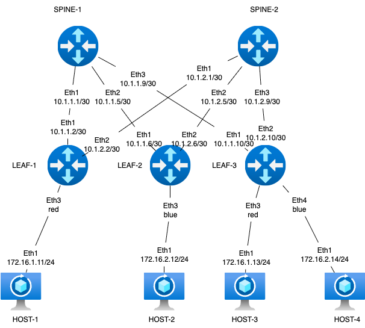
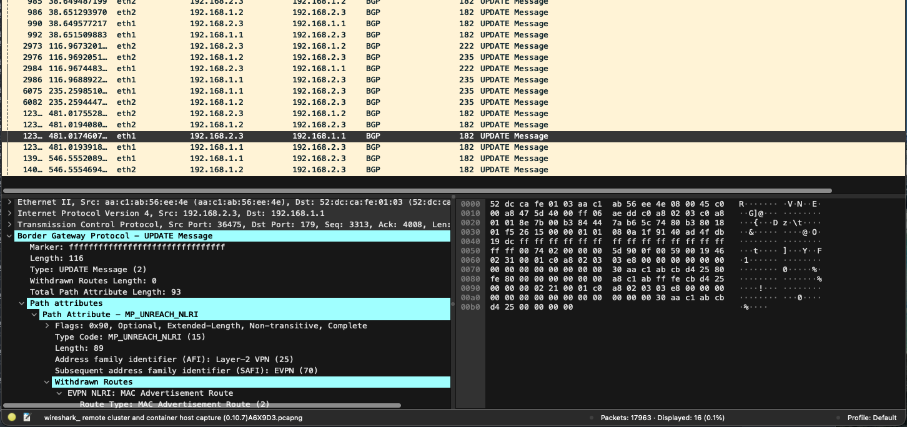

### Задание VxLAN. L2 VNI

Цель:
Настроить Overlay на основе VxLAN EVPN для L2 связанности между клиентами.

Описание/Пошаговая инструкция выполнения домашнего задания:
В этой самостоятельной работе мы ожидаем, что вы самостоятельно:

Настроите BGP peering между Leaf и Spine в AF l2vpn evpn
Настроите связанность между клиентами в первой зоне и убедитесь в её наличии
Зафиксируете в документации - план работы, адресное пространство, схему сети, конфигурацию устройств

### Схема стенда



Стенд делаем по принципу - хосты linux, leaf - frr, spine - eos (arista)

### Распределение адресного пространства для Underlay

План составлен с учетом 10.x.y.z, где x - номер DC, y - номер spine, z - по очереди для подключения leaf
Адреса для хостов - 172.16.x.z/24, где x - номер leaf, z - по порядку адрес хоста, на leaf ip .1
Адреса loopback 192.168.a.b/32, где a - 1 для spine, 2 - для leaf, b - номер spine, leaf по порядку
Адресацию ipv6 делаем по прицнипу из fd00::[IPv4]

Interconnect ipv4 ipv6

| Device A | Interface A | IPv4 A        | IPv6 A               | Device B | Interface B | IPv4 B        | IPv6 B               |
|----------|-------------|---------------|----------------------|----------|-------------|---------------|----------------------|
| Spine-1  | Eth1        | 10.1.1.0/31    | fd00::10:1:1:0/127    | Leaf-1   | Eth1        | 10.1.1.1/31    | fd00::10:1:1:1/127    |
| Spine-1  | Eth2        | 10.1.1.2/31    | fd00::10:1:1:2/127    | Leaf-2   | Eth1        | 10.1.1.3/31    | fd00::10:1:1:3/127    |
| Spine-1  | Eth3        | 10.1.1.4/31    | fd00::10:1:1:4/127    | Leaf-3   | Eth1        | 10.1.1.5/31    | fd00::10:1:1:5/127    |
| Spine-2  | Eth2        | 10.1.2.0/31    | fd00::10:2:1:0/127    | Leaf-1   | Eth2        | 10.1.2.1/31    | fd00::10:2:1:1/127    |
| Spine-2  | Eth2        | 10.1.2.2/31    | fd00::10:2:1:2/127    | Leaf-2   | Eth2        | 10.1.2.3/31    | fd00::10:2:1:3/127    |
| Spine-2  | Eth3        | 10.1.2.4/31    | fd00::10:2:1:4/127    | Leaf-3   | Eth2        | 10.1.2.5/31    | fd00::10:2:1:5/127    |
| Host-1   | Eth1        | 172.16.1.11/24  | fd00::172:16:1:b/116   | Leaf-1   | Eth3        | access vlan red | access vlan red   |
| Host-2   | Eth1        | 172.16.2.12/24  | fd00::172:16:2:c/116   | Leaf-2   | Eth3        | access vlan blue  | access vlan blue    |
| Host-3   | Eth1        | 172.16.1.13/24  | fd00::172:16:3:e/116   | Leaf-3   | Eth3        | access vlan red | access vlan red   | 
| Host-4   | Eth1        | 172.16.2.14/24  | fd00::172:16:4:d/116   | Leaf-3   | Eth4        | access vlan blue  | access vlan blue   |

loopback

| Device | Loopback ipv4| loopback ipv6|
|-------------|---------------|-----------|
| Spine-1  | 192.168.1.1 | fd00::192:168:1:1 |
| Spine-2  | 192.168.1.2 | fd00::192:168:1:2 |
| Leaf-1   | 192.168.2.1 | fd00::192:168:2:1 |
| Leaf-2   | 192.168.2.2 | fd00::192:168:2:2 |
| Leaf-3   | 192.168.2.3 | fd00::192:168:2:3 |

Собираем топологию на базе ospf+ibgp. Area ospf 0, bgp as 65500

### Запуск лабараторной в среде netlab
Казалось бы все просто, но очень долго мучался с работой access на frr. Оказалось что если назначать подключаемые интерфейсы не по порядку, то происходит mismatching и с точки зрения frr настраиваются не те интерфейсы которые настраиваются в бриджинг со стороны linux alpine внутри которого этот frr крутится. 
Так же меня не очень устроило что по умолчанию создается сессия между spine выступающими route reflector, которая не совсем понятно зачем нужна в случае отсутсвия прямого линка между ними.
Поэтому лезем в код, а именно покурив  /usr/local/lib/python3.10/dist-packages/netsim/modules/bgp.py  узнаем что при создании сессий в случае присутсвия роут рефлектора, строится не full mesh а сессии только от RR, но не обрабатываются ситуация сессий с другими RR, добавив условие проверки, получаем что netlab работать перестает. Немного вспомнив курсы по python понимаю, что накосячил с отступами, все поправил - netlab запустился. Вроде все хорошо, но понял что данное изменение безоговорочно убирает сессию, хотя опрос всех знакомых сетевых инженеров так и не принес ответа зачем может понадобится такая сессия, решил что может кому и понадобится, а значит добавляем в обработчик /usr/local/lib/python3.10/dist-packages/netsim/modules/bgp.yml параметр который поможет управлять этим процессом. По умолчанию выставил False. Пару раз пришлось все перезапускать чтобы проверить корректность работы. 
Измененные файлы прилагаю если вдруг кто то найдет их здесь раньше, чем я доберусь до того чтобы законтрибьютить это в проект netlaba. 


или под катом

<details>
  <summary>topology.yml </summary>

  ```yml

 ---
provider: clab
module: [ vlan,vxlan,ospf,bgp,evpn,bfd ]
plugin: [ bgp.session ]

#bgp
bgp.bfd: True
bgp.as: 65500

tools:
  edgeshark:
  graphite:


nodes:
 s1:
  device: eos
  id: 1
  bgp.rr: True
  loopback:
    ipv4: 192.168.1.1/32
    ipv6: fd00::192:168:1:1/128
 s2:
  device: eos
  id: 2
  bgp.rr: True
  loopback:
    ipv4: 192.168.1.2/32
    ipv6: fd00::192:168:1:2/128
 l1:
  device: frr
  id: 3
  loopback:
    ipv4: 192.168.2.1/32
    ipv6: fd00::192:168:2:1/128
 l2:
  device: frr
  id: 4
  loopback:
    ipv4: 192.168.2.2/32
    ipv6: fd00::192:168:2:2/128
 l3:
  device: frr
  id: 5
  loopback:
    ipv4: 192.168.2.3/32
    ipv6: fd00::192:168:2:3/128
 h1:
  id: 11
  device: linux
 h2:
  id: 12
  device: linux
 h3:
  id: 13
  device: linux
 h4:
  id: 14
  device: linux

#vlan
vlans:
  red:
    mode: bridge
    prefix:
      ipv4: 172.16.1.0/24
      ipv6: fd00::172:16:1:0/116
  blue:
    mode: bridge
    prefix:
      ipv4: 172.16.2.0/24
      ipv6: fd00::172:16:2:0/116


links:
#spine1-leaf1,2,3
  - interfaces:
      - node: s1
        ifname: eth1
        ipv4: 10.1.1.0
        ipv6: fd00::10:1:1:0
        ospf:
          password: 'spine1'
          bfd: true
      - node: l1
        ifname: eth1
        ipv4: 10.1.1.1
        ipv6: fd00::10:1:1:1
        ospf:
          password: 'spine1'
          bfd: true
    prefix:
      ipv4: 10.1.1.0/31
      ipv6: fd00::10:1:1:0/127
  - interfaces:
      - node: s1
        ifname: eth2
        ipv4: 10.1.1.2
        ipv6: fd00::10:1:1:2
        ospf:
          password: 'spine1'
          bfd: true
      - node: l2
        ifname: eth1
        ipv4: 10.1.1.3
        ipv6: fd00::10:1:1:3
        ospf:
          password: 'spine1'
          bfd: true
    prefix:
      ipv4: 10.1.1.2/31
      ipv6: fd00::10:1:1:2/127
  - interfaces:
      - node: s1
        ifname: eth3
        ipv4: 10.1.1.4
        ipv6: fd00::10:1:1:4
        ospf:
          password: 'spine1'
          bfd: true
      - node: l3
        ifname: eth1
        ipv4: 10.1.1.5
        ipv6: fd00::10:1:1:5
        ospf:
          password: 'spine1'
          bfd: true
    prefix:
      ipv4: 10.1.1.4/31
      ipv6: fd00::10:1:1:4/127
#spine2-leaf1,2,3
  - interfaces:
      - node: s2
        ifname: eth1
        ipv4: 10.1.2.0
        ipv6: fd00::10:1:2:0
        ospf:
          password: 'spine2'
          bfd: true
      - node: l1
        ifname: eth2
        ipv4: 10.1.2.1
        ipv6: fd00::10:1:2:1
        ospf:
          password: 'spine2'
          bfd: true
    prefix:
      ipv4: 10.1.2.0/31
      ipv6: fd00::10:1:2:0/127
  - interfaces:
      - node: s2
        ifname: eth2
        ipv4: 10.1.2.2
        ipv6: fd00::10:1:2:2
        ospf:
          password: 'spine2'
          bfd: true
      - node: l2
        ifname: eth2
        ipv4: 10.1.2.3
        ipv6: fd00::10:1:2:3
        ospf:
          password: 'spine2'
          bfd: true
    prefix:
      ipv4: 10.1.2.2/31
      ipv6: fd00::10:1:2:2/127
  - interfaces:
      - node: s2
        ifname: eth3
        ipv4: 10.1.2.4
        ipv6: fd00::10:1:2:4
        ospf:
          password: 'spine2'
          bfd: true
      - node: l3
        ifname: eth2
        ipv4: 10.1.2.5
        ipv6: fd00::10:1:2:5
        ospf:
          password: 'spine2'
          bfd: true
    prefix:
      ipv4: 10.1.2.4/31
      ipv6: fd00::10:1:2:4/127
#host1
  - interfaces:
      - node: h1
        ifname: eth1
      - node: l1
        ifname: eth3
        vlan.access: red
#host2
  - interfaces:
      - node: h2
        ifname: eth1
      - node: l2
        ifname: eth3
        vlan.access: blue
#host3
  - interfaces:
      - node: h3
        ifname: eth1
      - node: l3
        ifname: eth3
        vlan.access: red
#host4
  - interfaces:
      - node: h4
        ifname: eth1
      - node: l3
        ifname: eth4
        vlan.access: blue

     ```
</details>


### Проверка работы

Какой конечный результат мы хотели? связность между h1 и h3, h2 и h4 соответственно. И чтобы через vxlan.
Стартуем и смотрим на пинги

<details>
  <summary>h1 pings </summary>
  
  ```txt  
lh1:/# ping h3
PING h3 (172.16.1.13): 56 data bytes
64 bytes from 172.16.1.13: seq=0 ttl=64 time=0.786 ms
64 bytes from 172.16.1.13: seq=1 ttl=64 time=0.965 ms
64 bytes from 172.16.1.13: seq=2 ttl=64 time=0.914 ms
64 bytes from 172.16.1.13: seq=3 ttl=64 time=0.975 ms
^C
--- h3 ping statistics ---
4 packets transmitted, 4 packets received, 0% packet loss
round-trip min/avg/max = 0.786/0.910/0.975 ms
h1:/# ping6 h3
PING h3 (fd00::172:16:1:d): 56 data bytes
64 bytes from fd00::172:16:1:d: seq=0 ttl=64 time=1.686 ms
64 bytes from fd00::172:16:1:d: seq=1 ttl=64 time=0.852 ms
64 bytes from fd00::172:16:1:d: seq=2 ttl=64 time=0.905 ms
64 bytes from fd00::172:16:1:d: seq=3 ttl=64 time=1.057 ms
x64 bytes from fd00::172:16:1:d: seq=4 ttl=64 time=0.860 ms
^C
--- h3 ping statistics ---
5 packets transmitted, 5 packets received, 0% packet loss
round-trip min/avg/max = 0.852/1.072/1.686 ms

```
</details>

<details>
  <summary>h4 pings </summary>
  
  ```txt  
h4:/# ping h2
PING h2 (172.16.2.12): 56 data bytes
64 bytes from 172.16.2.12: seq=0 ttl=64 time=1.647 ms
64 bytes from 172.16.2.12: seq=1 ttl=64 time=0.915 ms
64 bytes from 172.16.2.12: seq=2 ttl=64 time=0.883 ms
64 bytes from 172.16.2.12: seq=3 ttl=64 time=0.848 ms
64 bytes from 172.16.2.12: seq=4 ttl=64 time=0.971 ms
^C
--- h2 ping statistics ---
5 packets transmitted, 5 packets received, 0% packet loss
round-trip min/avg/max = 0.848/1.052/1.647 ms
h4:/# ping6 h2
PING h2 (fd00::172:16:2:c): 56 data bytes
64 bytes from fd00::172:16:2:c: seq=0 ttl=64 time=1.910 ms
64 bytes from fd00::172:16:2:c: seq=1 ttl=64 time=0.982 ms
64 bytes from fd00::172:16:2:c: seq=2 ttl=64 time=1.177 ms
64 bytes from fd00::172:16:2:c: seq=3 ttl=64 time=1.105 ms
64 bytes from fd00::172:16:2:c: seq=4 ttl=64 time=1.021 ms
^C
--- h2 ping statistics ---
5 packets transmitted, 5 packets received, 0% packet loss
round-trip min/avg/max = 0.982/1.239/1.910 ms

```
</details>

Пинги между хостами побежали, значит можно посмотреть что происходит у нас на leaf и spine, какие есть маршруты и прочее.
Учитывая что у нас поднялся evpn и по ipv4 и по ipv6 будет весело но для понимания введем таблицу mac для устройств
|Host| MAC                | ipv4           | ipv6                 | ipv6 local                   | vlan  | vni     |
| h1 | aa:c1:ab:0d:85:f0  | 172.16.1.11/24 | fd00::172:16:1:b/116 | fe80::a8c1:abff:fe0d:85f0/64 | red   | 101000  |
| h2 | aa:c1:ab:a5:c3:48  | 172.16.2.12/24 | fd00::172:16:2:c/116 | fe80::a8c1:abff:fea5:c348/64 | blue  | 101001  |
| h3 | aa:c1:ab:cb:d4:25  | 172.16.1.13/24 | fd00::172:16:1:d/116 | fe80::a8c1:abff:fecb:d425/64 | red   | 101000  |
| h4 | aa:c1:ab:60:b1:45  | 172.16.2.14/24 | fd00::172:16:2:e/116 | fe80::a8c1:abff:fe60:b145/64 | blue  | 101001  |


Вот что показывает spine-1 о наших evpn

<details>
  <summary>spine-1 show evpn </summary>

```text
s1#show bgp evpn vni 101000
BGP routing table information for VRF default
Router identifier 192.168.1.1, local AS number 65500
Route status codes: * - valid, > - active, S - Stale, E - ECMP head, e - ECMP
                    c - Contributing to ECMP, % - Pending best path selection
Origin codes: i - IGP, e - EGP, ? - incomplete
AS Path Attributes: Or-ID - Originator ID, C-LST - Cluster List, LL Nexthop - Link Local Nexthop

          Network                Next Hop              Metric  LocPref Weight  Path
 * >Ec    RD: 192.168.2.1:1000 mac-ip 52dc.cafd.0300 fe80::50dc:caff:fefd:300
                                 192.168.2.1           -       100     0       i
 *  ec    RD: 192.168.2.1:1000 mac-ip 52dc.cafd.0300 fe80::50dc:caff:fefd:300
                                 192.168.2.1           -       100     0       i
 * >Ec    RD: 192.168.2.3:1000 mac-ip 52dc.cafd.0500 fe80::50dc:caff:fefd:500
                                 192.168.2.3           -       100     0       i
 *  ec    RD: 192.168.2.3:1000 mac-ip 52dc.cafd.0500 fe80::50dc:caff:fefd:500
                                 192.168.2.3           -       100     0       i
 * >Ec    RD: 192.168.2.1:1000 mac-ip aac1.ab0d.85f0
                                 192.168.2.1           -       100     0       i
 *  ec    RD: 192.168.2.1:1000 mac-ip aac1.ab0d.85f0
                                 192.168.2.1           -       100     0       i
 * >Ec    RD: 192.168.2.1:1000 mac-ip aac1.ab0d.85f0 fe80::a8c1:abff:fe0d:85f0
                                 192.168.2.1           -       100     0       i
 *  ec    RD: 192.168.2.1:1000 mac-ip aac1.ab0d.85f0 fe80::a8c1:abff:fe0d:85f0
                                 192.168.2.1           -       100     0       i
 * >Ec    RD: 192.168.2.3:1000 mac-ip aac1.abcb.d425
                                 192.168.2.3           -       100     0       i
 *  ec    RD: 192.168.2.3:1000 mac-ip aac1.abcb.d425
                                 192.168.2.3           -       100     0       i
 * >Ec    RD: 192.168.2.3:1000 mac-ip aac1.abcb.d425 fe80::a8c1:abff:fecb:d425
                                 192.168.2.3           -       100     0       i
 *  ec    RD: 192.168.2.3:1000 mac-ip aac1.abcb.d425 fe80::a8c1:abff:fecb:d425
                                 192.168.2.3           -       100     0       i
 * >Ec    RD: 192.168.2.1:1000 imet 192.168.2.1
                                 192.168.2.1           -       100     0       i
 *  ec    RD: 192.168.2.1:1000 imet 192.168.2.1
                                 192.168.2.1           -       100     0       i
 * >Ec    RD: 192.168.2.3:1000 imet 192.168.2.3
                                 192.168.2.3           -       100     0       i
 *  ec    RD: 192.168.2.3:1000 imet 192.168.2.3
                                 192.168.2.3           -       100     0       i

s1#show bgp evpn vni 101001
BGP routing table information for VRF default
Router identifier 192.168.1.1, local AS number 65500
Route status codes: * - valid, > - active, S - Stale, E - ECMP head, e - ECMP
                    c - Contributing to ECMP, % - Pending best path selection
Origin codes: i - IGP, e - EGP, ? - incomplete
AS Path Attributes: Or-ID - Originator ID, C-LST - Cluster List, LL Nexthop - Link Local Nexthop

          Network                Next Hop              Metric  LocPref Weight  Path
 * >Ec    RD: 192.168.2.2:1001 mac-ip 52dc.cafd.0400 fe80::50dc:caff:fefd:400
                                 192.168.2.2           -       100     0       i
 *  ec    RD: 192.168.2.2:1001 mac-ip 52dc.cafd.0400 fe80::50dc:caff:fefd:400
                                 192.168.2.2           -       100     0       i
 * >Ec    RD: 192.168.2.3:1001 mac-ip 52dc.cafd.0501 fe80::50dc:caff:fefd:501
                                 192.168.2.3           -       100     0       i
 *  ec    RD: 192.168.2.3:1001 mac-ip 52dc.cafd.0501 fe80::50dc:caff:fefd:501
                                 192.168.2.3           -       100     0       i
 * >Ec    RD: 192.168.2.3:1001 mac-ip aac1.ab60.b145
                                 192.168.2.3           -       100     0       i
 *  ec    RD: 192.168.2.3:1001 mac-ip aac1.ab60.b145
                                 192.168.2.3           -       100     0       i
 * >Ec    RD: 192.168.2.3:1001 mac-ip aac1.ab60.b145 fe80::a8c1:abff:fe60:b145
                                 192.168.2.3           -       100     0       i
 *  ec    RD: 192.168.2.3:1001 mac-ip aac1.ab60.b145 fe80::a8c1:abff:fe60:b145
                                 192.168.2.3           -       100     0       i
 * >Ec    RD: 192.168.2.2:1001 mac-ip aac1.aba5.c348
                                 192.168.2.2           -       100     0       i
 *  ec    RD: 192.168.2.2:1001 mac-ip aac1.aba5.c348
                                 192.168.2.2           -       100     0       i
 * >Ec    RD: 192.168.2.2:1001 mac-ip aac1.aba5.c348 fe80::a8c1:abff:fea5:c348
                                 192.168.2.2           -       100     0       i
 *  ec    RD: 192.168.2.2:1001 mac-ip aac1.aba5.c348 fe80::a8c1:abff:fea5:c348
                                 192.168.2.2           -       100     0       i
 * >Ec    RD: 192.168.2.2:1001 imet 192.168.2.2
                                 192.168.2.2           -       100     0       i
 *  ec    RD: 192.168.2.2:1001 imet 192.168.2.2
                                 192.168.2.2           -       100     0       i
 * >Ec    RD: 192.168.2.3:1001 imet 192.168.2.3
                                 192.168.2.3           -       100     0       i
 *  ec    RD: 192.168.2.3:1001 imet 192.168.2.3
                                 192.168.2.3           -       100     0       i

```

  </details>

Как видим распространяются link-local еще и vlan-if которые прибиты внутри frr, ниже выдержка ip a c leaf-3
```
3: vlan1000: <BROADCAST,MULTICAST,UP,LOWER_UP> mtu 1500 qdisc noqueue state UP group default qlen 1000
    link/ether 52:dc:ca:fd:05:00 brd ff:ff:ff:ff:ff:ff
    inet6 fe80::50dc:caff:fefd:500/64 scope link
       valid_lft forever preferred_lft forever
4: vlan1001: <BROADCAST,MULTICAST,UP,LOWER_UP> mtu 1500 qdisc noqueue state UP group default qlen 1000
    link/ether 52:dc:ca:fd:05:01 brd ff:ff:ff:ff:ff:ff
    inet6 fe80::50dc:caff:fefd:501/64 scope link
       valid_lft forever preferred_lft forever
```

А вот и вывод по evpn маршрутам с leaf-3 

<details>
  <summary>leaf-3 show evpn </summary>

```text

l3# show bgp evpn route vni 101000
BGP table version is 1164, local router ID is 192.168.2.3
Status codes: s suppressed, d damped, h history, * valid, > best, i - internal
Origin codes: i - IGP, e - EGP, ? - incomplete
EVPN type-1 prefix: [1]:[EthTag]:[ESI]:[IPlen]:[VTEP-IP]:[Frag-id]
EVPN type-2 prefix: [2]:[EthTag]:[MAClen]:[MAC]:[IPlen]:[IP]
EVPN type-3 prefix: [3]:[EthTag]:[IPlen]:[OrigIP]
EVPN type-4 prefix: [4]:[ESI]:[IPlen]:[OrigIP]
EVPN type-5 prefix: [5]:[EthTag]:[IPlen]:[IP]

   Network          Next Hop            Metric LocPrf Weight Path
 *>i [2]:[0]:[48]:[52:dc:ca:fd:03:00]:[128]:[fe80::50dc:caff:fefd:300]
                    192.168.2.1                   100      0 i
                    RT:65500:1000 ET:8
 *=i [2]:[0]:[48]:[52:dc:ca:fd:03:00]:[128]:[fe80::50dc:caff:fefd:300]
                    192.168.2.1                   100      0 i
                    RT:65500:1000 ET:8
 *=i [2]:[0]:[48]:[52:dc:ca:fd:03:00]:[128]:[fe80::50dc:caff:fefd:300]
                    192.168.2.1                   100      0 i
                    RT:65500:1000 ET:8
 *=i [2]:[0]:[48]:[52:dc:ca:fd:03:00]:[128]:[fe80::50dc:caff:fefd:300]
                    192.168.2.1                   100      0 i
                    RT:65500:1000 ET:8
 *>  [2]:[0]:[48]:[52:dc:ca:fd:05:00]:[128]:[fe80::50dc:caff:fefd:500]
                    192.168.2.3(l3)                    32768 i
                    ET:8 RT:65500:1000
 *>i [2]:[0]:[48]:[aa:c1:ab:0d:85:f0]:[128]:[fe80::a8c1:abff:fe0d:85f0]
                    192.168.2.1                   100      0 i
                    RT:65500:1000 ET:8
 *=i [2]:[0]:[48]:[aa:c1:ab:0d:85:f0]:[128]:[fe80::a8c1:abff:fe0d:85f0]
                    192.168.2.1                   100      0 i
                    RT:65500:1000 ET:8
 *=i [2]:[0]:[48]:[aa:c1:ab:0d:85:f0]:[128]:[fe80::a8c1:abff:fe0d:85f0]
                    192.168.2.1                   100      0 i
                    RT:65500:1000 ET:8
 *=i [2]:[0]:[48]:[aa:c1:ab:0d:85:f0]:[128]:[fe80::a8c1:abff:fe0d:85f0]
                    192.168.2.1                   100      0 i
                    RT:65500:1000 ET:8
 *>  [2]:[0]:[48]:[aa:c1:ab:cb:d4:25]:[128]:[fe80::a8c1:abff:fecb:d425]
                    192.168.2.3(l3)                    32768 i
                    ET:8 RT:65500:1000
 *>i [3]:[0]:[32]:[192.168.2.1]
                    192.168.2.1                   100      0 i
                    RT:65500:1000 ET:8
 *=i [3]:[0]:[32]:[192.168.2.1]
                    192.168.2.1                   100      0 i
                    RT:65500:1000 ET:8
 *=i [3]:[0]:[32]:[192.168.2.1]
                    192.168.2.1                   100      0 i
                    RT:65500:1000 ET:8
 *=i [3]:[0]:[32]:[192.168.2.1]
                    192.168.2.1                   100      0 i
                    RT:65500:1000 ET:8
 *>  [3]:[0]:[32]:[192.168.2.3]
                    192.168.2.3(l3)                    32768 i
                    ET:8 RT:65500:1000

Displayed 6 prefixes (15 paths)

l3# show bgp evpn route vni 101001
BGP table version is 1170, local router ID is 192.168.2.3
Status codes: s suppressed, d damped, h history, * valid, > best, i - internal
Origin codes: i - IGP, e - EGP, ? - incomplete
EVPN type-1 prefix: [1]:[EthTag]:[ESI]:[IPlen]:[VTEP-IP]:[Frag-id]
EVPN type-2 prefix: [2]:[EthTag]:[MAClen]:[MAC]:[IPlen]:[IP]
EVPN type-3 prefix: [3]:[EthTag]:[IPlen]:[OrigIP]
EVPN type-4 prefix: [4]:[ESI]:[IPlen]:[OrigIP]
EVPN type-5 prefix: [5]:[EthTag]:[IPlen]:[IP]

   Network          Next Hop            Metric LocPrf Weight Path
 *>i [2]:[0]:[48]:[52:dc:ca:fd:04:00]:[128]:[fe80::50dc:caff:fefd:400]
                    192.168.2.2                   100      0 i
                    RT:65500:1001 ET:8
 *=i [2]:[0]:[48]:[52:dc:ca:fd:04:00]:[128]:[fe80::50dc:caff:fefd:400]
                    192.168.2.2                   100      0 i
                    RT:65500:1001 ET:8
 *=i [2]:[0]:[48]:[52:dc:ca:fd:04:00]:[128]:[fe80::50dc:caff:fefd:400]
                    192.168.2.2                   100      0 i
                    RT:65500:1001 ET:8
 *=i [2]:[0]:[48]:[52:dc:ca:fd:04:00]:[128]:[fe80::50dc:caff:fefd:400]
                    192.168.2.2                   100      0 i
                    RT:65500:1001 ET:8
 *>  [2]:[0]:[48]:[52:dc:ca:fd:05:01]:[128]:[fe80::50dc:caff:fefd:501]
                    192.168.2.3(l3)                    32768 i
                    ET:8 RT:65500:1001
 *>  [2]:[0]:[48]:[aa:c1:ab:60:b1:45]:[128]:[fe80::a8c1:abff:fe60:b145]
                    192.168.2.3(l3)                    32768 i
                    ET:8 RT:65500:1001
 *>i [2]:[0]:[48]:[aa:c1:ab:a5:c3:48]:[128]:[fe80::a8c1:abff:fea5:c348]
                    192.168.2.2                   100      0 i
                    RT:65500:1001 ET:8
 *=i [2]:[0]:[48]:[aa:c1:ab:a5:c3:48]:[128]:[fe80::a8c1:abff:fea5:c348]
                    192.168.2.2                   100      0 i
                    RT:65500:1001 ET:8
 *=i [2]:[0]:[48]:[aa:c1:ab:a5:c3:48]:[128]:[fe80::a8c1:abff:fea5:c348]
                    192.168.2.2                   100      0 i
                    RT:65500:1001 ET:8
 *=i [2]:[0]:[48]:[aa:c1:ab:a5:c3:48]:[128]:[fe80::a8c1:abff:fea5:c348]
                    192.168.2.2                   100      0 i
                    RT:65500:1001 ET:8
 *>i [3]:[0]:[32]:[192.168.2.2]
                    192.168.2.2                   100      0 i
                    RT:65500:1001 ET:8
 *=i [3]:[0]:[32]:[192.168.2.2]
                    192.168.2.2                   100      0 i
                    RT:65500:1001 ET:8
 *=i [3]:[0]:[32]:[192.168.2.2]
                    192.168.2.2                   100      0 i
                    RT:65500:1001 ET:8
 *=i [3]:[0]:[32]:[192.168.2.2]
                    192.168.2.2                   100      0 i
                    RT:65500:1001 ET:8
 *>  [3]:[0]:[32]:[192.168.2.3]
                    192.168.2.3(l3)                    32768 i
                    ET:8 RT:65500:1001

Displayed 6 prefixes (15 paths)

```

  </details>

Если заглянуть в wireshark то можно увидеть как на leaf происходит обмен маршрутами второго типа.



