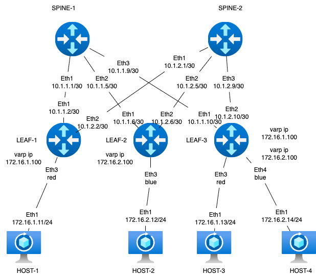
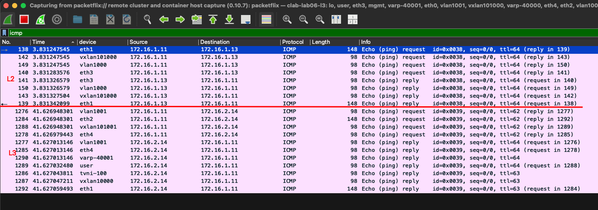

### Задание VxLAN. L3 VNI

Цель:
Настроить маршрутизацию в рамках Overlay между клиентами.


Описание/Пошаговая инструкция выполнения домашнего задания:
В этой самостоятельной работе мы ожидаем, что вы самостоятельно:

Настроите каждого клиента в своем VNI
Настроите маршрутизацию между клиентами.
Зафиксируете в документации - план работы, адресное пространство, схему сети, конфигурацию устройств

### Схема стенда



Стенд делаем по принципу - хосты linux, leaf - frr, spine - eos (arista)

### Распределение адресного пространства для Underlay

План составлен с учетом 10.x.y.z, где x - номер DC, y - номер spine, z - по очереди для подключения leaf
Адреса для хостов - 172.16.x.z/24, где x - номер leaf, z - по порядку адрес хоста, на leaf ip .1
Адреса loopback 192.168.a.b/32, где a - 1 для spine, 2 - для leaf, b - номер spine, leaf по порядку
Адресацию ipv6 делаем по прицнипу из fd00::[IPv4]

Interconnect ipv4 ipv6

| Device A | Interface A | IPv4 A        | IPv6 A               | Device B | Interface B | IPv4 B        | IPv6 B               |
|----------|-------------|---------------|----------------------|----------|-------------|---------------|----------------------|
| Spine-1  | Eth1        | 10.1.1.0/31    | fd00::10:1:1:0/127    | Leaf-1   | Eth1        | 10.1.1.1/31    | fd00::10:1:1:1/127    |
| Spine-1  | Eth2        | 10.1.1.2/31    | fd00::10:1:1:2/127    | Leaf-2   | Eth1        | 10.1.1.3/31    | fd00::10:1:1:3/127    |
| Spine-1  | Eth3        | 10.1.1.4/31    | fd00::10:1:1:4/127    | Leaf-3   | Eth1        | 10.1.1.5/31    | fd00::10:1:1:5/127    |
| Spine-2  | Eth2        | 10.1.2.0/31    | fd00::10:2:1:0/127    | Leaf-1   | Eth2        | 10.1.2.1/31    | fd00::10:2:1:1/127    |
| Spine-2  | Eth2        | 10.1.2.2/31    | fd00::10:2:1:2/127    | Leaf-2   | Eth2        | 10.1.2.3/31    | fd00::10:2:1:3/127    |
| Spine-2  | Eth3        | 10.1.2.4/31    | fd00::10:2:1:4/127    | Leaf-3   | Eth2        | 10.1.2.5/31    | fd00::10:2:1:5/127    |
| Host-1   | Eth1        | 172.16.1.11/24  | fd00::172:16:1:b/116   | Leaf-1   | Eth3        | access vlan red | access vlan red   |
| Host-2   | Eth1        | 172.16.2.12/24  | fd00::172:16:2:c/116   | Leaf-2   | Eth3        | access vlan blue  | access vlan blue    |
| Host-3   | Eth1        | 172.16.1.13/24  | fd00::172:16:3:e/116   | Leaf-3   | Eth3        | access vlan red | access vlan red   | 
| Host-4   | Eth1        | 172.16.2.14/24  | fd00::172:16:4:d/116   | Leaf-3   | Eth4        | access vlan blue  | access vlan blue   |

loopback

| Device | Loopback ipv4| loopback ipv6|
|-------------|---------------|-----------|
| Spine-1  | 192.168.1.1 | fd00::192:168:1:1 |
| Spine-2  | 192.168.1.2 | fd00::192:168:1:2 |
| Leaf-1   | 192.168.2.1 | fd00::192:168:2:1 |
| Leaf-2   | 192.168.2.2 | fd00::192:168:2:2 |
| Leaf-3   | 192.168.2.3 | fd00::192:168:2:3 |

Vlan-if

| Device  |VLAN id | VLANif ipv4   | VLANif ipv6          | VARP ipv4       |
|---------|--------|---------------|----------------------| ----------------|
| Leaf-1  | 1000   | 172.16.1.3/24 | fd00::172:16:1:3/116 | 172.16.1.100/24 |
| Leaf-2  | 1001   | 172.16.2.4/24 | fd00::172:16:2:4/116 | 172.16.2.100/24 |
| Leaf-3  | 1000   | 172.16.1.5/24 | fd00::172:16:1:5/116 | 172.16.1.100/24 |
| Leaf-3  | 1001   | 172.16.2.5/24 | fd00::172:16:2:5/116 | 172.16.2.100/24 |

Собираем топологию на базе ospf+ibgp. Area ospf 0, bgp as 65500

### Запуск лабараторной в среде netlab
 Особенностей в запуске не было, для того чтобы не мешать в одну кучу сервисы и транспорт, ввел vrf - user в который поместил оба vlan-if что позволит хостам общаться между собой. Так же так как в основном я работаю с решением centralized gateway, когда l3 приземляется на border-leaf, решил попробовать distributed  gateway, чтобы посмотреть как оно настраивается и forwadит.
 Единственное модуль gateway, обеспечивающий работу протоколов fhrp растягивает только ipv4 адрес между оборудованием, попытки подружить его с ipv6 не очень получились.


или под катом

<details>
  <summary>topology.yml </summary>

  ```yml
---
provider: clab
module: [ vlan,vxlan,vrf,ospf,bgp,evpn,bfd,gateway ]
plugin: [ bgp.session ]

#bgp
bgp.bfd: True
bgp:
  as: 65500
  rr_list: [ s1,s2 ]
#mesh false
  rr_mesh: False
gateway.protocol: anycast
gateway.id: 100


#jumbo
defaults.interfaces.mtu: 8192

tools:
  edgeshark:
  graphite:


nodes:
 s1:
  device: eos
  id: 1
#  bgp.rr: True
  loopback:
    ipv4: 192.168.1.1/32
    ipv6: fd00::192:168:1:1/128
 s2:
  device: eos
  id: 2
#  bgp.rr: True
  loopback:
    ipv4: 192.168.1.2/32
    ipv6: fd00::192:168:1:2/128
 l1:
  device: frr
  id: 3
  loopback:
    ipv4: 192.168.2.1/32
    ipv6: fd00::192:168:2:1/128
 l2:
  device: frr
  id: 4
  loopback:
    ipv4: 192.168.2.2/32
    ipv6: fd00::192:168:2:2/128
 l3:
  device: frr
  id: 5
  loopback:
    ipv4: 192.168.2.3/32
    ipv6: fd00::192:168:2:3/128
 h1:
  id: 11
  device: linux
 h2:
  id: 12
  device: linux
 h3:
  id: 13
  device: linux
 h4:
  id: 14
  device: linux


#vrf
vrfs:
  user:
    evpn.transit_vni: 10000
    ospf: False

#vlan
vlans:
  red:
    vrf: user
    gateway: True
    prefix:
      ipv4: 172.16.1.0/24
      ipv6: fd00::172:16:1:0/116
  blue:
    vrf: user
    gateway: True
    prefix:
      ipv4: 172.16.2.0/24
      ipv6: fd00::172:16:2:0/116


links:
#spine1-leaf1,2,3
  - interfaces:
      - node: s1
        ifname: eth1
        ipv4: 10.1.1.0
        ipv6: fd00::10:1:1:0
        ospf:
          password: 'spine1'
          bfd: true
      - node: l1
        ifname: eth1
        ipv4: 10.1.1.1
        ipv6: fd00::10:1:1:1
        ospf:
          password: 'spine1'
          bfd: true
    prefix:
      ipv4: 10.1.1.0/31
      ipv6: fd00::10:1:1:0/127
  - interfaces:
      - node: s1
        ifname: eth2
        ipv4: 10.1.1.2
        ipv6: fd00::10:1:1:2
        ospf:
          password: 'spine1'
          bfd: true
      - node: l2
        ifname: eth1
        ipv4: 10.1.1.3
        ipv6: fd00::10:1:1:3
        ospf:
          password: 'spine1'
          bfd: true
    prefix:
      ipv4: 10.1.1.2/31
      ipv6: fd00::10:1:1:2/127
  - interfaces:
      - node: s1
        ifname: eth3
        ipv4: 10.1.1.4
        ipv6: fd00::10:1:1:4
        ospf:
          password: 'spine1'
          bfd: true
      - node: l3
        ifname: eth1
        ipv4: 10.1.1.5
        ipv6: fd00::10:1:1:5
        ospf:
          password: 'spine1'
          bfd: true
    prefix:
      ipv4: 10.1.1.4/31
      ipv6: fd00::10:1:1:4/127
#spine2-leaf1,2,3
  - interfaces:
      - node: s2
        ifname: eth1
        ipv4: 10.1.2.0
        ipv6: fd00::10:1:2:0
        ospf:
          password: 'spine2'
          bfd: true
      - node: l1
        ifname: eth2
        ipv4: 10.1.2.1
        ipv6: fd00::10:1:2:1
        ospf:
          password: 'spine2'
          bfd: true
    prefix:
      ipv4: 10.1.2.0/31
      ipv6: fd00::10:1:2:0/127
  - interfaces:
      - node: s2
        ifname: eth2
        ipv4: 10.1.2.2
        ipv6: fd00::10:1:2:2
        ospf:
          password: 'spine2'
          bfd: true
      - node: l2
        ifname: eth2
        ipv4: 10.1.2.3
        ipv6: fd00::10:1:2:3
        ospf:
          password: 'spine2'
          bfd: true
    prefix:
      ipv4: 10.1.2.2/31
      ipv6: fd00::10:1:2:2/127
  - interfaces:
      - node: s2
        ifname: eth3
        ipv4: 10.1.2.4
        ipv6: fd00::10:1:2:4
        ospf:
          password: 'spine2'
          bfd: true
      - node: l3
        ifname: eth2
        ipv4: 10.1.2.5
        ipv6: fd00::10:1:2:5
        ospf:
          password: 'spine2'
          bfd: true
    prefix:
      ipv4: 10.1.2.4/31
      ipv6: fd00::10:1:2:4/127
#host1
  - interfaces:
      - node: h1
        ifname: eth1
      - node: l1
        ifname: eth3
        vlan.access: red
#host2
  - interfaces:
      - node: h2
        ifname: eth1
      - node: l2
        ifname: eth3
        vlan.access: blue
#host3
  - interfaces:
      - node: h3
        ifname: eth1
      - node: l3
        ifname: eth3
        vlan.access: red
#host4
  - interfaces:
      - node: h4
        ifname: eth1
      - node: l3
        ifname: eth4
        vlan.access: blue

```
 </details>


### Проверка работы

Именно в этом этапе и пришла идея засунуть в vrf хосты(сервера), чтобы можно было смотреть и показывать таблицы роутинга без перемешивания. Исходя из топологии у нас все хосты должны видеть друг друга, включая interface vlan на всех коммутаторах. 


<details>
  <summary>h1 pings </summary>
  
  ```txt  

h1:/# ping h2
PING h2 (172.16.2.12): 56 data bytes
64 bytes from 172.16.2.12: seq=0 ttl=62 time=1.160 ms
64 bytes from 172.16.2.12: seq=1 ttl=62 time=0.931 ms
^C
--- h2 ping statistics ---
2 packets transmitted, 2 packets received, 0% packet loss
round-trip min/avg/max = 0.931/1.045/1.160 ms
h1:/# ping h3
PING h3 (172.16.1.13): 56 data bytes
64 bytes from 172.16.1.13: seq=0 ttl=64 time=1.530 ms
64 bytes from 172.16.1.13: seq=1 ttl=64 time=1.136 ms
64 bytes from 172.16.1.13: seq=2 ttl=64 time=1.219 ms
^C
--- h3 ping statistics ---
3 packets transmitted, 3 packets received, 0% packet loss
round-trip min/avg/max = 1.136/1.295/1.530 ms
h1:/# ping h4
PING h4 (172.16.2.14): 56 data bytes
64 bytes from 172.16.2.14: seq=0 ttl=62 time=1.763 ms
64 bytes from 172.16.2.14: seq=1 ttl=62 time=1.621 ms
64 bytes from 172.16.2.14: seq=2 ttl=62 time=1.800 ms
^C
--- h4 ping statistics ---
3 packets transmitted, 3 packets received, 0% packet loss
round-trip min/avg/max = 1.621/1.728/1.800 ms
h1:/# ping6 h3
PING h3 (fd00::172:16:1:d): 56 data bytes
64 bytes from fd00::172:16:1:d: seq=0 ttl=64 time=2.523 ms
64 bytes from fd00::172:16:1:d: seq=1 ttl=64 time=1.141 ms
^C
--- h3 ping statistics ---
2 packets transmitted, 2 packets received, 0% packet loss
round-trip min/avg/max = 1.141/1.832/2.523 ms
h1:/# ping6 h2
PING h2 (fd00::172:16:2:c): 56 data bytes
64 bytes from fd00::172:16:2:c: seq=0 ttl=62 time=1.904 ms
64 bytes from fd00::172:16:2:c: seq=1 ttl=62 time=1.125 ms
64 bytes from fd00::172:16:2:c: seq=2 ttl=62 time=0.879 ms
^C
--- h2 ping statistics ---
3 packets transmitted, 3 packets received, 0% packet loss
round-trip min/avg/max = 0.879/1.302/1.904 ms
h1:/# ping6 h4
PING h4 (fd00::172:16:2:e): 56 data bytes
64 bytes from fd00::172:16:2:e: seq=0 ttl=62 time=2.180 ms
64 bytes from fd00::172:16:2:e: seq=1 ttl=62 time=1.397 ms
64 bytes from fd00::172:16:2:e: seq=2 ttl=62 time=1.545 ms
^C
--- h4 ping statistics ---
3 packets transmitted, 3 packets received, 0% packet loss
round-trip min/avg/max = 1.397/1.707/2.180 ms
h1:/# ping 172.16.1.100
PING 172.16.1.100 (172.16.1.100): 56 data bytes
64 bytes from 172.16.1.100: seq=0 ttl=64 time=0.115 ms
64 bytes from 172.16.1.100: seq=1 ttl=64 time=0.098 ms
^C
--- 172.16.1.100 ping statistics ---
2 packets transmitted, 2 packets received, 0% packet loss
round-trip min/avg/max = 0.098/0.106/0.115 ms
h1:/# ping 172.16.2.100
PING 172.16.2.100 (172.16.2.100): 56 data bytes
64 bytes from 172.16.2.100: seq=0 ttl=63 time=1.668 ms
64 bytes from 172.16.2.100: seq=1 ttl=63 time=0.912 ms
64 bytes from 172.16.2.100: seq=2 ttl=63 time=1.198 ms
^C
--- 172.16.2.100 ping statistics ---
3 packets transmitted, 3 packets received, 0% packet loss
round-trip min/avg/max = 0.912/1.259/1.668 ms
h1:/# ping 172.16.1.5
PING 172.16.1.5 (172.16.1.5): 56 data bytes
64 bytes from 172.16.1.5: seq=0 ttl=63 time=1.136 ms
64 bytes from 172.16.1.5: seq=1 ttl=63 time=1.136 ms
^C
--- 172.16.1.5 ping statistics ---
2 packets transmitted, 2 packets received, 0% packet loss
round-trip min/avg/max = 1.136/1.136/1.136 ms
h1:/# ping 172.16.2.4
PING 172.16.2.4 (172.16.2.4): 56 data bytes
64 bytes from 172.16.2.4: seq=0 ttl=63 time=1.110 ms
64 bytes from 172.16.2.4: seq=1 ttl=63 time=1.235 ms
64 bytes from 172.16.2.4: seq=2 ttl=63 time=0.982 ms
^C
--- 172.16.2.4 ping statistics ---
3 packets transmitted, 3 packets received, 0% packet loss
round-trip min/avg/max = 0.982/1.109/1.235 ms

```
</details>

С других хостов пинговать смысла наверное нет, т.к. все видят всех, и имеют общую таблицу маршрутизации, вот она с leaf-3(там более показательно так как на нем оба vlan)

<details>
  <summary>leaf-3 show ip route vrf user </summary>

```text

l3# show ip route vrf user
Codes: K - kernel route, C - connected, L - local, S - static,
       R - RIP, O - OSPF, I - IS-IS, B - BGP, E - EIGRP, N - NHRP,
       T - Table, v - VNC, V - VNC-Direct, A - Babel, F - PBR,
       f - OpenFabric, t - Table-Direct,
       > - selected route, * - FIB route, q - queued, r - rejected, b - backup
       t - trapped, o - offload failure

IPv4 unicast VRF user:
C * 172.16.1.0/24 [0/1024] is directly connected, varp-40000, weight 1, 00:21:53
C>* 172.16.1.0/24 is directly connected, vlan1000, weight 1, 00:22:00
B>* 172.16.1.3/32 [200/0] via 192.168.2.1, tvni-100 onlink, weight 1, 00:21:45
                          via 192.168.2.1, tvni-100 onlink, weight 1, 00:21:45
                          via 192.168.2.1, tvni-100 onlink, weight 1, 00:21:45
                          via 192.168.2.1, tvni-100 onlink, weight 1, 00:21:45
L>* 172.16.1.5/32 is directly connected, vlan1000, weight 1, 00:22:00
B>* 172.16.1.11/32 [200/0] via 192.168.2.1, tvni-100 onlink, weight 1, 00:05:21
                           via 192.168.2.1, tvni-100 onlink, weight 1, 00:05:21
                           via 192.168.2.1, tvni-100 onlink, weight 1, 00:05:21
                           via 192.168.2.1, tvni-100 onlink, weight 1, 00:05:21
L>* 172.16.1.100/32 is directly connected, varp-40000, weight 1, 00:21:53
C * 172.16.2.0/24 [0/1024] is directly connected, varp-40001, weight 1, 00:21:53
C>* 172.16.2.0/24 is directly connected, vlan1001, weight 1, 00:22:00
B>* 172.16.2.4/32 [200/0] via 192.168.2.2, tvni-100 onlink, weight 1, 00:21:45
                          via 192.168.2.2, tvni-100 onlink, weight 1, 00:21:45
                          via 192.168.2.2, tvni-100 onlink, weight 1, 00:21:45
                          via 192.168.2.2, tvni-100 onlink, weight 1, 00:21:45
L>* 172.16.2.5/32 is directly connected, vlan1001, weight 1, 00:22:00
B>* 172.16.2.12/32 [200/0] via 192.168.2.2, tvni-100 onlink, weight 1, 00:05:21
                           via 192.168.2.2, tvni-100 onlink, weight 1, 00:05:21
                           via 192.168.2.2, tvni-100 onlink, weight 1, 00:05:21
                           via 192.168.2.2, tvni-100 onlink, weight 1, 00:05:21
L>* 172.16.2.100/32 is directly connected, varp-40001, weight 1, 00:21:53

```
</details>

Как видим у нас дублируются маршруты, происходит это потому что bgp evpn у нас поднят и на ipv4 и на ipv6. Уж не знаю поднимает ли кто фабрику с dual-stack evpn, но в целом идея интересная. Надо бы попробовать собрать смешанную фабрику где spine-1 ipv4 only, spine-2 ipv6 only, но отложим эксперимент на другой раз.
Ниже выводы подтверждающие тезис о дублировании
<details>
  <summary>leaf-3 show ip route vrf user </summary>

```text

====== убираем evpn peer ipv6 ======
l3# conf t
l3(config)# router bgp 65500
l3(config-router)# address-family l2vpn evpn
l3(config-router-af)# no neighbor fd00::192:168:1:1 activate
l3(config-router-af)# no neighbor fd00::192:168:1:2 activate
l3(config-router-af)# end

======= смотрим evpn пиры и проверяем количество маршрутов =======

l3# show bgp evpn summary
BGP router identifier 192.168.2.3, local AS number 65500 VRF default vrf-id 0
BGP table version 0
RIB entries 15, using 1920 bytes of memory
Peers 2, using 33 KiB of memory

Neighbor        V         AS   MsgRcvd   MsgSent   TblVer  InQ OutQ  Up/Down State/PfxRcd   PfxSnt Desc
192.168.1.1     4      65500       662       556       22    0    0 00:26:06           12       12 s1
192.168.1.2     4      65500       660       555       22    0    0 00:26:06           12       12 s2

Total number of neighbors 2
l3# show ip route vrf user
Codes: K - kernel route, C - connected, L - local, S - static,
       R - RIP, O - OSPF, I - IS-IS, B - BGP, E - EIGRP, N - NHRP,
       T - Table, v - VNC, V - VNC-Direct, A - Babel, F - PBR,
       f - OpenFabric, t - Table-Direct,
       > - selected route, * - FIB route, q - queued, r - rejected, b - backup
       t - trapped, o - offload failure

IPv4 unicast VRF user:
C * 172.16.1.0/24 [0/1024] is directly connected, varp-40000, weight 1, 00:26:19
C>* 172.16.1.0/24 is directly connected, vlan1000, weight 1, 00:26:26
B>* 172.16.1.3/32 [200/0] via 192.168.2.1, tvni-100 onlink, weight 1, 00:00:23
                          via 192.168.2.1, tvni-100 onlink, weight 1, 00:00:23
L>* 172.16.1.5/32 is directly connected, vlan1000, weight 1, 00:26:26
L>* 172.16.1.100/32 is directly connected, varp-40000, weight 1, 00:26:19
C * 172.16.2.0/24 [0/1024] is directly connected, varp-40001, weight 1, 00:26:19
C>* 172.16.2.0/24 is directly connected, vlan1001, weight 1, 00:26:26
B>* 172.16.2.4/32 [200/0] via 192.168.2.2, tvni-100 onlink, weight 1, 00:00:23
                          via 192.168.2.2, tvni-100 onlink, weight 1, 00:00:23
L>* 172.16.2.5/32 is directly connected, vlan1001, weight 1, 00:26:26
L>* 172.16.2.100/32 is directly connected, varp-40001, weight 1, 00:26:19

======= возвращеаем evpn пиры =======

l3# conf t
l3(config)# router bgp 65500
l3(config-router)# address-family l2vpn evpn
l3(config-router-af)# neighbor fd00::192:168:1:2 activate
l3(config-router-af)# neighbor fd00::192:168:1:1 activate
l3(config-router-af)# end
l3# show bgp evpn
  import-rt  Show import route target
  route      EVPN route information
  summary    Summary of BGP neighbor status
  vni        Show VNI
l3# show bgp evpn summary
BGP router identifier 192.168.2.3, local AS number 65500 VRF default vrf-id 0
BGP table version 0
RIB entries 15, using 1920 bytes of memory
Peers 4, using 66 KiB of memory

Neighbor          V         AS   MsgRcvd   MsgSent   TblVer  InQ OutQ  Up/Down State/PfxRcd   PfxSnt Desc
192.168.1.1       4      65500       683       574       30    0    0 00:26:59           12       12 s1
192.168.1.2       4      65500       681       573       30    0    0 00:26:59           12       12 s2
fd00::192:168:1:1 4      65500       705       595       30    0    0 00:00:10           12       12 s1
fd00::192:168:1:2 4      65500       705       595       30    0    0 00:00:13           12       12 s2

Total number of neighbors 4

l3# show ip route vrf user
Codes: K - kernel route, C - connected, L - local, S - static,
       R - RIP, O - OSPF, I - IS-IS, B - BGP, E - EIGRP, N - NHRP,
       T - Table, v - VNC, V - VNC-Direct, A - Babel, F - PBR,
       f - OpenFabric, t - Table-Direct,
       > - selected route, * - FIB route, q - queued, r - rejected, b - backup
       t - trapped, o - offload failure

IPv4 unicast VRF user:
C * 172.16.1.0/24 [0/1024] is directly connected, varp-40000, weight 1, 00:38:55
C>* 172.16.1.0/24 is directly connected, vlan1000, weight 1, 00:39:02
B>* 172.16.1.3/32 [200/0] via 192.168.2.1, tvni-100 onlink, weight 1, 00:11:59
                          via 192.168.2.1, tvni-100 onlink, weight 1, 00:11:59
                          via 192.168.2.1, tvni-100 onlink, weight 1, 00:11:59
                          via 192.168.2.1, tvni-100 onlink, weight 1, 00:11:59
L>* 172.16.1.5/32 is directly connected, vlan1000, weight 1, 00:39:02
L>* 172.16.1.100/32 is directly connected, varp-40000, weight 1, 00:38:55
C * 172.16.2.0/24 [0/1024] is directly connected, varp-40001, weight 1, 00:38:55
C>* 172.16.2.0/24 is directly connected, vlan1001, weight 1, 00:39:02
B>* 172.16.2.4/32 [200/0] via 192.168.2.2, tvni-100 onlink, weight 1, 00:11:59
                          via 192.168.2.2, tvni-100 onlink, weight 1, 00:11:59
                          via 192.168.2.2, tvni-100 onlink, weight 1, 00:11:59
                          via 192.168.2.2, tvni-100 onlink, weight 1, 00:11:59
L>* 172.16.2.5/32 is directly connected, vlan1001, weight 1, 00:39:02
L>* 172.16.2.100/32 is directly connected, varp-40001, weight 1, 00:38:55

```
</details>

Все вернулось на свое место. Кстати по умолчанию ipv6 peer для evpn на аристах работать не захотел, пришлось поправить темплейт арист для настройке в файле usr/local/lib/python3.10/dist-packages/netsim/ansible/templates/evpn/eos.j2 

Раз роутинг между хостами заработал, а ведь ради этого и собирались, посмотрим как видят происходящее фабрика.

Вот что показывает spine-1 о наших evpn

<details>
  <summary>spine-1 show evpn </summary>

```text
s1#show bgp evpn vni 101000
BGP routing table information for VRF default
Router identifier 192.168.1.1, local AS number 65500
Route status codes: * - valid, > - active, S - Stale, E - ECMP head, e - ECMP
                    c - Contributing to ECMP, % - Pending best path selection
Origin codes: i - IGP, e - EGP, ? - incomplete
AS Path Attributes: Or-ID - Originator ID, C-LST - Cluster List, LL Nexthop - Link Local Nexthop

          Network                Next Hop              Metric  LocPref Weight  Path
 * >Ec    RD: 192.168.2.1:1000 mac-ip 52dc.cafd.0300 172.16.1.3
                                 192.168.2.1           -       100     0       i
 *  ec    RD: 192.168.2.1:1000 mac-ip 52dc.cafd.0300 172.16.1.3
                                 192.168.2.1           -       100     0       i
 * >Ec    RD: 192.168.2.1:1000 mac-ip 52dc.cafd.0300 fd00::172:16:1:3
                                 192.168.2.1           -       100     0       i
 *  ec    RD: 192.168.2.1:1000 mac-ip 52dc.cafd.0300 fd00::172:16:1:3
                                 192.168.2.1           -       100     0       i
 * >Ec    RD: 192.168.2.1:1000 mac-ip 52dc.cafd.0300 fe80::f8c0:10c7:908e:9108
                                 192.168.2.1           -       100     0       i
 *  ec    RD: 192.168.2.1:1000 mac-ip 52dc.cafd.0300 fe80::f8c0:10c7:908e:9108
                                 192.168.2.1           -       100     0       i
 * >Ec    RD: 192.168.2.3:1000 mac-ip 52dc.cafd.0500 172.16.1.5
                                 192.168.2.3           -       100     0       i
 *  ec    RD: 192.168.2.3:1000 mac-ip 52dc.cafd.0500 172.16.1.5
                                 192.168.2.3           -       100     0       i
 * >Ec    RD: 192.168.2.3:1000 mac-ip 52dc.cafd.0500 fd00::172:16:1:5
                                 192.168.2.3           -       100     0       i
 *  ec    RD: 192.168.2.3:1000 mac-ip 52dc.cafd.0500 fd00::172:16:1:5
                                 192.168.2.3           -       100     0       i
 * >Ec    RD: 192.168.2.3:1000 mac-ip 52dc.cafd.0500 fe80::5ee8:40ce:592a:2792
                                 192.168.2.3           -       100     0       i
 *  ec    RD: 192.168.2.3:1000 mac-ip 52dc.cafd.0500 fe80::5ee8:40ce:592a:2792
                                 192.168.2.3           -       100     0       i
 * >Ec    RD: 192.168.2.1:1000 imet 192.168.2.1
                                 192.168.2.1           -       100     0       i
 *  ec    RD: 192.168.2.1:1000 imet 192.168.2.1
                                 192.168.2.1           -       100     0       i
 * >Ec    RD: 192.168.2.3:1000 imet 192.168.2.3
                                 192.168.2.3           -       100     0       i
 *  ec    RD: 192.168.2.3:1000 imet 192.168.2.3
                                 192.168.2.3           -       100     0       i
s1#show bgp evpn vni 101001
BGP routing table information for VRF default
Router identifier 192.168.1.1, local AS number 65500
Route status codes: * - valid, > - active, S - Stale, E - ECMP head, e - ECMP
                    c - Contributing to ECMP, % - Pending best path selection
Origin codes: i - IGP, e - EGP, ? - incomplete
AS Path Attributes: Or-ID - Originator ID, C-LST - Cluster List, LL Nexthop - Link Local Nexthop

          Network                Next Hop              Metric  LocPref Weight  Path
 * >Ec    RD: 192.168.2.2:1001 mac-ip 52dc.cafd.0400 172.16.2.4
                                 192.168.2.2           -       100     0       i
 *  ec    RD: 192.168.2.2:1001 mac-ip 52dc.cafd.0400 172.16.2.4
                                 192.168.2.2           -       100     0       i
 * >Ec    RD: 192.168.2.2:1001 mac-ip 52dc.cafd.0400 fd00::172:16:2:4
                                 192.168.2.2           -       100     0       i
 *  ec    RD: 192.168.2.2:1001 mac-ip 52dc.cafd.0400 fd00::172:16:2:4
                                 192.168.2.2           -       100     0       i
 * >Ec    RD: 192.168.2.2:1001 mac-ip 52dc.cafd.0400 fe80::67f9:517b:db31:5bad
                                 192.168.2.2           -       100     0       i
 *  ec    RD: 192.168.2.2:1001 mac-ip 52dc.cafd.0400 fe80::67f9:517b:db31:5bad
                                 192.168.2.2           -       100     0       i
 * >Ec    RD: 192.168.2.3:1001 mac-ip 52dc.cafd.0501 172.16.2.5
                                 192.168.2.3           -       100     0       i
 *  ec    RD: 192.168.2.3:1001 mac-ip 52dc.cafd.0501 172.16.2.5
                                 192.168.2.3           -       100     0       i
 * >Ec    RD: 192.168.2.3:1001 mac-ip 52dc.cafd.0501 fd00::172:16:2:5
                                 192.168.2.3           -       100     0       i
 *  ec    RD: 192.168.2.3:1001 mac-ip 52dc.cafd.0501 fd00::172:16:2:5
                                 192.168.2.3           -       100     0       i
 * >Ec    RD: 192.168.2.3:1001 mac-ip 52dc.cafd.0501 fe80::e5c3:2894:3166:e3e0
                                 192.168.2.3           -       100     0       i
 *  ec    RD: 192.168.2.3:1001 mac-ip 52dc.cafd.0501 fe80::e5c3:2894:3166:e3e0
                                 192.168.2.3           -       100     0       i
 * >Ec    RD: 192.168.2.2:1001 imet 192.168.2.2
                                 192.168.2.2           -       100     0       i
 *  ec    RD: 192.168.2.2:1001 imet 192.168.2.2
                                 192.168.2.2           -       100     0       i
 * >Ec    RD: 192.168.2.3:1001 imet 192.168.2.3
                                 192.168.2.3           -       100     0       i
 *  ec    RD: 192.168.2.3:1001 imet 192.168.2.3
                                 192.168.2.3           -       100     0       i

s1#show bgp evpn vni 10000
BGP routing table information for VRF default
Router identifier 192.168.1.1, local AS number 65500
Route status codes: * - valid, > - active, S - Stale, E - ECMP head, e - ECMP
                    c - Contributing to ECMP, % - Pending best path selection
Origin codes: i - IGP, e - EGP, ? - incomplete
AS Path Attributes: Or-ID - Originator ID, C-LST - Cluster List, LL Nexthop - Link Local Nexthop

          Network                Next Hop              Metric  LocPref Weight  Path
 * >Ec    RD: 192.168.2.1:1000 mac-ip 52dc.cafd.0300 172.16.1.3
                                 192.168.2.1           -       100     0       i
 *  ec    RD: 192.168.2.1:1000 mac-ip 52dc.cafd.0300 172.16.1.3
                                 192.168.2.1           -       100     0       i
 * >Ec    RD: 192.168.2.1:1000 mac-ip 52dc.cafd.0300 fd00::172:16:1:3
                                 192.168.2.1           -       100     0       i
 *  ec    RD: 192.168.2.1:1000 mac-ip 52dc.cafd.0300 fd00::172:16:1:3
                                 192.168.2.1           -       100     0       i
 * >Ec    RD: 192.168.2.2:1001 mac-ip 52dc.cafd.0400 172.16.2.4
                                 192.168.2.2           -       100     0       i
 *  ec    RD: 192.168.2.2:1001 mac-ip 52dc.cafd.0400 172.16.2.4
                                 192.168.2.2           -       100     0       i
 * >Ec    RD: 192.168.2.2:1001 mac-ip 52dc.cafd.0400 fd00::172:16:2:4
                                 192.168.2.2           -       100     0       i
 *  ec    RD: 192.168.2.2:1001 mac-ip 52dc.cafd.0400 fd00::172:16:2:4
                                 192.168.2.2           -       100     0       i
 * >Ec    RD: 192.168.2.3:1000 mac-ip 52dc.cafd.0500 172.16.1.5
                                 192.168.2.3           -       100     0       i
 *  ec    RD: 192.168.2.3:1000 mac-ip 52dc.cafd.0500 172.16.1.5
                                 192.168.2.3           -       100     0       i
 * >Ec    RD: 192.168.2.3:1000 mac-ip 52dc.cafd.0500 fd00::172:16:1:5
                                 192.168.2.3           -       100     0       i
 *  ec    RD: 192.168.2.3:1000 mac-ip 52dc.cafd.0500 fd00::172:16:1:5
                                 192.168.2.3           -       100     0       i
 * >Ec    RD: 192.168.2.3:1001 mac-ip 52dc.cafd.0501 172.16.2.5
                                 192.168.2.3           -       100     0       i
 *  ec    RD: 192.168.2.3:1001 mac-ip 52dc.cafd.0501 172.16.2.5
                                 192.168.2.3           -       100     0       i
 * >Ec    RD: 192.168.2.3:1001 mac-ip 52dc.cafd.0501 fd00::172:16:2:5
                                 192.168.2.3           -       100     0       i
 *  ec    RD: 192.168.2.3:1001 mac-ip 52dc.cafd.0501 fd00::172:16:2:5
                                 192.168.2.3           -       100     0       i
 * >      RD: 65500:1 ip-prefix 172.16.1.0/24
                                 192.168.2.1           0       100     0       ?
 *        RD: 65500:1 ip-prefix 172.16.1.0/24
                                 192.168.2.1           0       100     0       ?
 *        RD: 65500:1 ip-prefix 172.16.1.0/24
                                 192.168.2.3           0       100     0       ?
 *        RD: 65500:1 ip-prefix 172.16.1.0/24
                                 192.168.2.3           0       100     0       ?
 * >      RD: 65500:1 ip-prefix 172.16.2.0/24
                                 192.168.2.2           0       100     0       ?
 *        RD: 65500:1 ip-prefix 172.16.2.0/24
                                 192.168.2.2           0       100     0       ?
 *        RD: 65500:1 ip-prefix 172.16.2.0/24
                                 192.168.2.3           0       100     0       ?
 *        RD: 65500:1 ip-prefix 172.16.2.0/24
                                 192.168.2.3           0       100     0       ?
 * >      RD: 65500:1 ip-prefix fd00::172:16:1:0/116
                                 192.168.2.1           0       100     0       ?
 *        RD: 65500:1 ip-prefix fd00::172:16:1:0/116
                                 192.168.2.1           0       100     0       ?
 *        RD: 65500:1 ip-prefix fd00::172:16:1:0/116
                                 192.168.2.3           0       100     0       ?
 *        RD: 65500:1 ip-prefix fd00::172:16:1:0/116
                                 192.168.2.3           0       100     0       ?
 * >      RD: 65500:1 ip-prefix fd00::172:16:2:0/116
                                 192.168.2.2           0       100     0       ?
 *        RD: 65500:1 ip-prefix fd00::172:16:2:0/116
                                 192.168.2.2           0       100     0       ?
 *        RD: 65500:1 ip-prefix fd00::172:16:2:0/116
                                 192.168.2.3           0       100     0       ?
 *        RD: 65500:1 ip-prefix fd00::172:16:2:0/116
                                 192.168.2.3           0       100     0       ?

```

  </details>

Получается у нас есть 3 vni - 101000, 101001 l2 домен, и 10000 который bindится к vrf user. То есть у нас symmetric IRB.

Вот что мы увидим если заглянем в wireshark на leaf-3
 
То есть в случае когда у нас идет взаимодействие в рамках одного l2 домена используется 1 vxlan, а когда нужно межвзаимодействие между разными то другой.
Если честно то я не очень уверен, что это должно работать именно так, но очень похоже на правду. То есть vlan-if и нужные vni мы заводим только на тех leaf к которым подключены хосты непосредственно в них, а для обмена между ними заводим ip-vrf который и будет маршрутизировать трафик между разными vxlan. 

посмотрим в таблицу evpn маршрутов на leaf-1

<details>
  <summary>leaf-1 show bgp evpn route </summary>

```text

l1# show bgp evpn route
BGP table version is 4, local router ID is 192.168.2.1
Status codes: s suppressed, d damped, h history, * valid, > best, i - internal
Origin codes: i - IGP, e - EGP, ? - incomplete
EVPN type-1 prefix: [1]:[EthTag]:[ESI]:[IPlen]:[VTEP-IP]:[Frag-id]
EVPN type-2 prefix: [2]:[EthTag]:[MAClen]:[MAC]:[IPlen]:[IP]
EVPN type-3 prefix: [3]:[EthTag]:[IPlen]:[OrigIP]
EVPN type-4 prefix: [4]:[ESI]:[IPlen]:[OrigIP]
EVPN type-5 prefix: [5]:[EthTag]:[IPlen]:[IP]

   Network          Next Hop            Metric LocPrf Weight Path
                    Extended Community
====L3 vrf====

Route Distinguisher: 65500:1
 *>  [5]:[0]:[24]:[172.16.1.0]
                    192.168.2.1(l1)          0         32768 ?
                    ET:8 RT:65500:1 Rmac:de:3e:3c:f0:75:bc
 *>i [5]:[0]:[24]:[172.16.2.0]
                    192.168.2.2              0    100      0 ?
                    RT:65500:1 ET:8 Rmac:82:cd:a3:ee:28:04
 *=i [5]:[0]:[24]:[172.16.2.0]
                    192.168.2.2              0    100      0 ?
                    RT:65500:1 ET:8 Rmac:82:cd:a3:ee:28:04
 *=i [5]:[0]:[24]:[172.16.2.0]
                    192.168.2.2              0    100      0 ?
                    RT:65500:1 ET:8 Rmac:82:cd:a3:ee:28:04
 *=i [5]:[0]:[24]:[172.16.2.0]
                    192.168.2.2              0    100      0 ?
                    RT:65500:1 ET:8 Rmac:82:cd:a3:ee:28:04
 *>  [5]:[0]:[116]:[fd00::172:16:1:0]
                    192.168.2.1(l1)          0         32768 ?
                    ET:8 RT:65500:1 Rmac:de:3e:3c:f0:75:bc
 *>i [5]:[0]:[116]:[fd00::172:16:2:0]
                    192.168.2.2              0    100      0 ?
                    RT:65500:1 ET:8 Rmac:82:cd:a3:ee:28:04
 *=i [5]:[0]:[116]:[fd00::172:16:2:0]
                    192.168.2.2              0    100      0 ?
                    RT:65500:1 ET:8 Rmac:82:cd:a3:ee:28:04
 *=i [5]:[0]:[116]:[fd00::172:16:2:0]
                    192.168.2.2              0    100      0 ?
                    RT:65500:1 ET:8 Rmac:82:cd:a3:ee:28:04
 *=i [5]:[0]:[116]:[fd00::172:16:2:0]
                    192.168.2.2              0    100      0 ?
                    RT:65500:1 ET:8 Rmac:82:cd:a3:ee:28:04

====Leaf-1 vlan 1000====

Route Distinguisher: 192.168.2.1:1000
 *>  [2]:[0]:[48]:[52:dc:ca:fd:03:00]:[32]:[172.16.1.3]
                    192.168.2.1(l1)                    32768 i
                    ET:8 RT:65000:1000 RT:65500:1 Rmac:de:3e:3c:f0:75:bc
 *>  [2]:[0]:[48]:[52:dc:ca:fd:03:00]:[128]:[fd00::172:16:1:3]
                    192.168.2.1(l1)                    32768 i
                    ET:8 RT:65000:1000 RT:65500:1 Rmac:de:3e:3c:f0:75:bc
 *>  [2]:[0]:[48]:[52:dc:ca:fd:03:00]:[128]:[fe80::f8c0:10c7:908e:9108]
                    192.168.2.1(l1)                    32768 i
                    ET:8 RT:65000:1000
 *>  [3]:[0]:[32]:[192.168.2.1]
                    192.168.2.1(l1)                    32768 i
                    ET:8 RT:65000:1000

====Leaf-2 vlan 1001====

Route Distinguisher: 192.168.2.2:1001
 *>i [2]:[0]:[48]:[52:dc:ca:fd:04:00]:[32]:[172.16.2.4]
                    192.168.2.2                   100      0 i
                    RT:65000:1001 RT:65500:1 ET:8 Rmac:82:cd:a3:ee:28:04
 *=i [2]:[0]:[48]:[52:dc:ca:fd:04:00]:[32]:[172.16.2.4]
                    192.168.2.2                   100      0 i
                    RT:65000:1001 RT:65500:1 ET:8 Rmac:82:cd:a3:ee:28:04
 *=i [2]:[0]:[48]:[52:dc:ca:fd:04:00]:[32]:[172.16.2.4]
                    192.168.2.2                   100      0 i
                    RT:65000:1001 RT:65500:1 ET:8 Rmac:82:cd:a3:ee:28:04
 *=i [2]:[0]:[48]:[52:dc:ca:fd:04:00]:[32]:[172.16.2.4]
                    192.168.2.2                   100      0 i
                    RT:65000:1001 RT:65500:1 ET:8 Rmac:82:cd:a3:ee:28:04
 *>i [2]:[0]:[48]:[52:dc:ca:fd:04:00]:[128]:[fd00::172:16:2:4]
                    192.168.2.2                   100      0 i
                    RT:65000:1001 RT:65500:1 ET:8 Rmac:82:cd:a3:ee:28:04
 *=i [2]:[0]:[48]:[52:dc:ca:fd:04:00]:[128]:[fd00::172:16:2:4]
                    192.168.2.2                   100      0 i
                    RT:65000:1001 RT:65500:1 ET:8 Rmac:82:cd:a3:ee:28:04
 *=i [2]:[0]:[48]:[52:dc:ca:fd:04:00]:[128]:[fd00::172:16:2:4]
                    192.168.2.2                   100      0 i
                    RT:65000:1001 RT:65500:1 ET:8 Rmac:82:cd:a3:ee:28:04
 *=i [2]:[0]:[48]:[52:dc:ca:fd:04:00]:[128]:[fd00::172:16:2:4]
                    192.168.2.2                   100      0 i
                    RT:65000:1001 RT:65500:1 ET:8 Rmac:82:cd:a3:ee:28:04
 *>i [2]:[0]:[48]:[52:dc:ca:fd:04:00]:[128]:[fe80::67f9:517b:db31:5bad]
                    192.168.2.2                   100      0 i
                    RT:65000:1001 ET:8
 *=i [2]:[0]:[48]:[52:dc:ca:fd:04:00]:[128]:[fe80::67f9:517b:db31:5bad]
                    192.168.2.2                   100      0 i
                    RT:65000:1001 ET:8
 *=i [2]:[0]:[48]:[52:dc:ca:fd:04:00]:[128]:[fe80::67f9:517b:db31:5bad]
                    192.168.2.2                   100      0 i
                    RT:65000:1001 ET:8
 *=i [2]:[0]:[48]:[52:dc:ca:fd:04:00]:[128]:[fe80::67f9:517b:db31:5bad]
                    192.168.2.2                   100      0 i
                    RT:65000:1001 ET:8
 *>i [3]:[0]:[32]:[192.168.2.2]
                    192.168.2.2                   100      0 i
                    RT:65000:1001 ET:8
 *=i [3]:[0]:[32]:[192.168.2.2]
                    192.168.2.2                   100      0 i
                    RT:65000:1001 ET:8
 *=i [3]:[0]:[32]:[192.168.2.2]
                    192.168.2.2                   100      0 i
                    RT:65000:1001 ET:8
 *=i [3]:[0]:[32]:[192.168.2.2]
                    192.168.2.2                   100      0 i
                    RT:65000:1001 ET:8
====Leaf-3 vlan 1000====

Route Distinguisher: 192.168.2.3:1000
 *>i [2]:[0]:[48]:[52:dc:ca:fd:05:00]:[32]:[172.16.1.5]
                    192.168.2.3                   100      0 i
                    RT:65000:1000 RT:65500:1 ET:8 Rmac:02:b6:43:39:ff:b7
 *=i [2]:[0]:[48]:[52:dc:ca:fd:05:00]:[32]:[172.16.1.5]
                    192.168.2.3                   100      0 i
                    RT:65000:1000 RT:65500:1 ET:8 Rmac:02:b6:43:39:ff:b7
 *=i [2]:[0]:[48]:[52:dc:ca:fd:05:00]:[32]:[172.16.1.5]
                    192.168.2.3                   100      0 i
                    RT:65000:1000 RT:65500:1 ET:8 Rmac:02:b6:43:39:ff:b7
 *=i [2]:[0]:[48]:[52:dc:ca:fd:05:00]:[32]:[172.16.1.5]
                    192.168.2.3                   100      0 i
                    RT:65000:1000 RT:65500:1 ET:8 Rmac:02:b6:43:39:ff:b7
 *>i [2]:[0]:[48]:[52:dc:ca:fd:05:00]:[128]:[fd00::172:16:1:5]
                    192.168.2.3                   100      0 i
                    RT:65000:1000 RT:65500:1 ET:8 Rmac:02:b6:43:39:ff:b7
 *=i [2]:[0]:[48]:[52:dc:ca:fd:05:00]:[128]:[fd00::172:16:1:5]
                    192.168.2.3                   100      0 i
                    RT:65000:1000 RT:65500:1 ET:8 Rmac:02:b6:43:39:ff:b7
 *=i [2]:[0]:[48]:[52:dc:ca:fd:05:00]:[128]:[fd00::172:16:1:5]
                    192.168.2.3                   100      0 i
                    RT:65000:1000 RT:65500:1 ET:8 Rmac:02:b6:43:39:ff:b7
 *=i [2]:[0]:[48]:[52:dc:ca:fd:05:00]:[128]:[fd00::172:16:1:5]
                    192.168.2.3                   100      0 i
                    RT:65000:1000 RT:65500:1 ET:8 Rmac:02:b6:43:39:ff:b7
 *>i [2]:[0]:[48]:[52:dc:ca:fd:05:00]:[128]:[fe80::5ee8:40ce:592a:2792]
                    192.168.2.3                   100      0 i
                    RT:65000:1000 ET:8
 *=i [2]:[0]:[48]:[52:dc:ca:fd:05:00]:[128]:[fe80::5ee8:40ce:592a:2792]
                    192.168.2.3                   100      0 i
                    RT:65000:1000 ET:8
 *=i [2]:[0]:[48]:[52:dc:ca:fd:05:00]:[128]:[fe80::5ee8:40ce:592a:2792]
                    192.168.2.3                   100      0 i
                    RT:65000:1000 ET:8
 *=i [2]:[0]:[48]:[52:dc:ca:fd:05:00]:[128]:[fe80::5ee8:40ce:592a:2792]
                    192.168.2.3                   100      0 i
                    RT:65000:1000 ET:8
 *>i [3]:[0]:[32]:[192.168.2.3]
                    192.168.2.3                   100      0 i
                    RT:65000:1000 ET:8
 *=i [3]:[0]:[32]:[192.168.2.3]
                    192.168.2.3                   100      0 i
                    RT:65000:1000 ET:8
 *=i [3]:[0]:[32]:[192.168.2.3]
                    192.168.2.3                   100      0 i
                    RT:65000:1000 ET:8
 *=i [3]:[0]:[32]:[192.168.2.3]
                    192.168.2.3                   100      0 i
                    RT:65000:1000 ET:8

====Leaf-3 vlan 1001====

Route Distinguisher: 192.168.2.3:1001
 *>i [2]:[0]:[48]:[52:dc:ca:fd:05:01]:[32]:[172.16.2.5]
                    192.168.2.3                   100      0 i
                    RT:65000:1001 RT:65500:1 ET:8 Rmac:02:b6:43:39:ff:b7
 *=i [2]:[0]:[48]:[52:dc:ca:fd:05:01]:[32]:[172.16.2.5]
                    192.168.2.3                   100      0 i
                    RT:65000:1001 RT:65500:1 ET:8 Rmac:02:b6:43:39:ff:b7
 *=i [2]:[0]:[48]:[52:dc:ca:fd:05:01]:[32]:[172.16.2.5]
                    192.168.2.3                   100      0 i
                    RT:65000:1001 RT:65500:1 ET:8 Rmac:02:b6:43:39:ff:b7
 *=i [2]:[0]:[48]:[52:dc:ca:fd:05:01]:[32]:[172.16.2.5]
                    192.168.2.3                   100      0 i
                    RT:65000:1001 RT:65500:1 ET:8 Rmac:02:b6:43:39:ff:b7
 *>i [2]:[0]:[48]:[52:dc:ca:fd:05:01]:[128]:[fd00::172:16:2:5]
                    192.168.2.3                   100      0 i
                    RT:65000:1001 RT:65500:1 ET:8 Rmac:02:b6:43:39:ff:b7
 *=i [2]:[0]:[48]:[52:dc:ca:fd:05:01]:[128]:[fd00::172:16:2:5]
                    192.168.2.3                   100      0 i
                    RT:65000:1001 RT:65500:1 ET:8 Rmac:02:b6:43:39:ff:b7
 *=i [2]:[0]:[48]:[52:dc:ca:fd:05:01]:[128]:[fd00::172:16:2:5]
                    192.168.2.3                   100      0 i
                    RT:65000:1001 RT:65500:1 ET:8 Rmac:02:b6:43:39:ff:b7
 *=i [2]:[0]:[48]:[52:dc:ca:fd:05:01]:[128]:[fd00::172:16:2:5]
                    192.168.2.3                   100      0 i
                    RT:65000:1001 RT:65500:1 ET:8 Rmac:02:b6:43:39:ff:b7
 *>i [2]:[0]:[48]:[52:dc:ca:fd:05:01]:[128]:[fe80::e5c3:2894:3166:e3e0]
                    192.168.2.3                   100      0 i
                    RT:65000:1001 ET:8
 *=i [2]:[0]:[48]:[52:dc:ca:fd:05:01]:[128]:[fe80::e5c3:2894:3166:e3e0]
                    192.168.2.3                   100      0 i
                    RT:65000:1001 ET:8
 *=i [2]:[0]:[48]:[52:dc:ca:fd:05:01]:[128]:[fe80::e5c3:2894:3166:e3e0]
                    192.168.2.3                   100      0 i
                    RT:65000:1001 ET:8
 *=i [2]:[0]:[48]:[52:dc:ca:fd:05:01]:[128]:[fe80::e5c3:2894:3166:e3e0]
                    192.168.2.3                   100      0 i
                    RT:65000:1001 ET:8
 *>i [3]:[0]:[32]:[192.168.2.3]
                    192.168.2.3                   100      0 i
                    RT:65000:1001 ET:8
 *=i [3]:[0]:[32]:[192.168.2.3]
                    192.168.2.3                   100      0 i
                    RT:65000:1001 ET:8
 *=i [3]:[0]:[32]:[192.168.2.3]
                    192.168.2.3                   100      0 i
                    RT:65000:1001 ET:8
 *=i [3]:[0]:[32]:[192.168.2.3]
                    192.168.2.3                   100      0 i
                    RT:65000:1001 ET:8

Displayed 20 prefixes (62 paths)

```
</details>

В которой и видим маршруты типов 2 и 3 для l2 vni, и маршрут 5го типа для l3 vni. 


Конфигурационные файлы устройств:  


