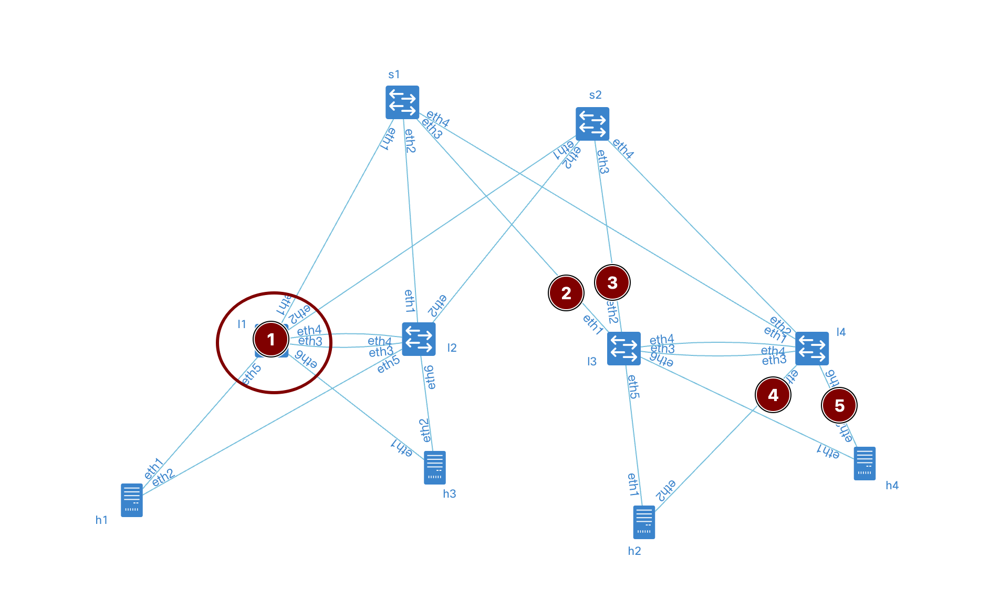
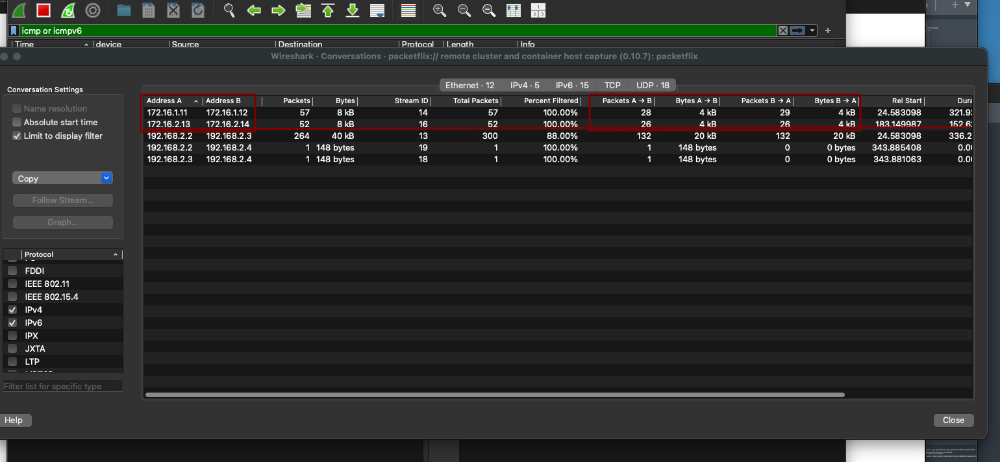
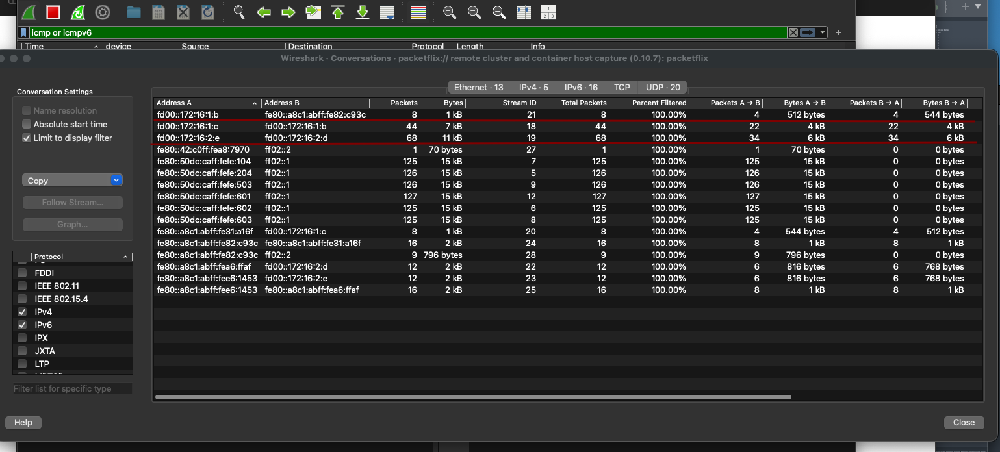
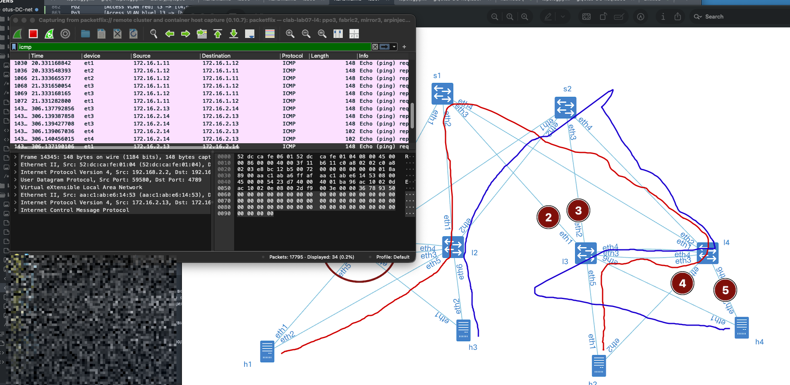

# lab07-VxLAN\&M-LAG

### Задание VXLAN. Multihoming

Цель: Настроить отказоустойчивое подключение клиентов с использованием EVPN Multihoming.

Описание/Пошаговая инструкция выполнения домашнего задания: В этой самостоятельной работе мы ожидаем, что вы самостоятельно:

Подключите клиентов 2-я линками к различным Leaf Настроите агрегированный канал со стороны клиента Настроите multihoming для работы в Overlay сети. Если используете Cisco NXOS - vPC, если иной вендор - то ESI LAG (либо MC-LAG с поддержкой VXLAN) Зафиксируете в документации - план работы, адресное пространство, схему сети, конфигурацию устройств Опционально - протестировать отказоустойчивость - убедиться, что связнность не теряется при отключении одного из линков

### Схема стенда

.png>)

В силу ограничений функционала frr меняем "вендора" leaf на arista, все же frr это роутер, функционал свитчей в них выполняется через средства linux. И mlag запустить на нем не получилось. В качестве клиента оставляем linux c bond. Стенд делаем по принципу - хосты linux, leaf - eos, spine - eos (arista)

### Распределение адресного пространства

План составлен с учетом 10.x.y.z, где x - номер DC, y - номер spine, z - по очереди для подключения leaf Адреса для хостов - 172.16.x.z/24, где x - номер leaf, z - по порядку адрес хоста, на leaf ip . Сеть для построения peerlink 10.0.x.z где x - номер DC, z - по очереди для пары leaf. Адреса loopback 192.168.a.b/32, где a - 1 для spine, 2 - для leaf, b - номер spine, leaf по порядку Адресацию ipv6 делаем по прицнипу из fd00::\[IPv4]

Interconnect ipv4 ipv6

| Device A | Interface A | IPv4 A         | IPv6 A               | Device B | Interface B | IPv4 B           | IPv6 B             |
| -------- | ----------- | -------------- | -------------------- | -------- | ----------- | ---------------- | ------------------ |
| Spine-1  | Eth1        | 10.1.1.0/31    | fd00::10:1:1:0/127   | Leaf-1   | Eth1        | 10.1.1.1/31      | fd00::10:1:1:1/127 |
| Spine-1  | Eth2        | 10.1.1.2/31    | fd00::10:1:1:2/127   | Leaf-2   | Eth1        | 10.1.1.3/31      | fd00::10:1:1:3/127 |
| Spine-1  | Eth3        | 10.1.1.4/31    | fd00::10:1:1:4/127   | Leaf-3   | Eth1        | 10.1.1.5/31      | fd00::10:1:1:5/127 |
| Spine-1  | Eth4        | 10.1.1.6/31    | fd00::10:1:1:6/127   | Leaf-4   | Eth1        | 10.1.1.7/31      | fd00::10:1:1:7/127 |
| Spine-2  | Eth1        | 10.1.2.0/31    | fd00::10:1:2:0/127   | Leaf-1   | Eth2        | 10.1.2.1/31      | fd00::10:1:2:1/127 |
| Spine-2  | Eth2        | 10.1.2.2/31    | fd00::10:1:2:2/127   | Leaf-2   | Eth2        | 10.1.2.3/31      | fd00::10:1:2:3/127 |
| Spine-2  | Eth3        | 10.1.2.4/31    | fd00::10:1:2:4/127   | Leaf-3   | Eth2        | 10.1.2.5/31      | fd00::10:1:2:5/127 |
| Spine-2  | Eth4        | 10.1.2.6/31    | fd00::10:1:2:6/127   | Leaf-4   | Eth2        | 10.1.2.7/31      | fd00::10:1:2:7/127 |
| Leaf-1   | Eth3        | 10.0.1.0/31    | fd00::10:0:1:0/127   | Leaf-2   | Eth3        | 10.0.1.1/31      | fd00::10:0:1:1/127 |
| Leaf-3   | Eth3        | 10.0.1.2/31    | fd00::10:0:1:2/127   | Leaf-4   | Eth3        | 10.0.1.3/31      | fd00::10:0:1:3/127 |
| Leaf-1   | Eth4        | ------------   | ------------         | Leaf-2   | Eth4        | ------------     | ------------       |
| Leaf-3   | Eth4        | ------------   | ------------         | Leaf-4   | Eth4        | ------------     | ------------       |
| Host-1   | Eth1        | 172.16.1.11/24 | fd00::172:16:1:b/116 | Leaf-1   | Eth5        | access vlan red  | access vlan red    |
| Host-1   | Eth2        | 172.16.1.11/24 | fd00::172:16:1:b/116 | Leaf-2   | Eth5        | access vlan red  | access vlan red    |
| Host-2   | Eth1        | 172.16.1.12/24 | fd00::172:16:1:c/116 | Leaf-3   | Eth5        | access vlan red  | access vlan red    |
| Host-2   | Eth2        | 172.16.1.12/24 | fd00::172:16:1:с/116 | Leaf-4   | Eth5        | access vlan red  | access vlan red    |
| Host-3   | Eth1        | 172.16.2.13/24 | fd00::172:16:2:d/116 | Leaf-1   | Eth6        | access vlan blue | access vlan blue   |
| Host-3   | Eth2        | 172.16.2.13/24 | fd00::172:16:2:d/116 | Leaf-2   | Eth6        | access vlan blue | access vlan blue   |
| Host-4   | Eth1        | 172.16.2.14/24 | fd00::172:16:2:e/116 | Leaf-3   | Eth6        | access vlan blue | access vlan blue   |
| Host-4   | Eth2        | 172.16.2.14/24 | fd00::172:16:2:e/116 | Leaf-4   | Eth6        | access vlan blue | access vlan blue   |

loopback

| Device  | Loopback ipv4 | loopback ipv6     |
| ------- | ------------- | ----------------- |
| Spine-1 | 192.168.1.1   | fd00::192:168:1:1 |
| Spine-2 | 192.168.1.2   | fd00::192:168:1:2 |
| Leaf-1  | 192.168.2.1   | fd00::192:168:2:1 |
| Leaf-2  | 192.168.2.2   | fd00::192:168:2:2 |
| Leaf-3  | 192.168.2.3   | fd00::192:168:2:3 |
| Leaf-4  | 192.168.2.4   | fd00::192:168:2:4 |

Собираем топологию на базе ospf+ibgp. Area ospf 0, bgp as 65500

### Запуск лабараторной в среде netlab

Особенностей в запуске не было, для того чтобы не мешать в одну кучу сервисы и транспорт, ввел vrf - user в который поместил оба vlan-if что позволит хостам общаться между собой. Так же так как в основном я работаю с решением centralized gateway, когда l3 приземляется на border-leaf, решил попробовать distributed gateway, чтобы посмотреть как оно настраивается и forwadит. Единственное модуль gateway, обеспечивающий работу протоколов fhrp растягивает только ipv4 адрес между оборудованием, попытки подружить его с ipv6 не очень получились.

[Конфиг-файл](topology.yml) или под катом

<details>

<summary>topology.yml</summary>

```yml
---
p---
provider: clab
module: [ vlan,vxlan,ospf,bgp,evpn,bfd,lag ]
plugin: [ bgp.session ]

#bgp
bgp.bfd: True
bgp:
as: 65500
rr_list: [ s1,s2 ]
rr_mesh: False

tools:
edgeshark:
graphite:


nodes:
s1:
device: eos
id: 1
loopback:
  ipv4: 192.168.1.1/32
  ipv6: fd00::192:168:1:1/128
s2:
device: eos
id: 2
loopback:
  ipv4: 192.168.1.2/32
  ipv6: fd00::192:168:1:2/128
l1:
device: eos
id: 3
loopback:
  ipv4: 192.168.2.1/32
  ipv6: fd00::192:168:2:1/128
l2:
device: eos
id: 4
loopback:
  ipv4: 192.168.2.2/32
  ipv6: fd00::192:168:2:2/128
l3:
device: eos
id: 5
loopback:
  ipv4: 192.168.2.3/32
  ipv6: fd00::192:168:2:3/128
l4:
device: eos
id: 6
loopback:
  ipv4: 192.168.2.4/32
  ipv6: fd00::192:168:2:4/128
h1:
id: 11
module: [ lag ] 
device: linux
h2:
id: 12
module: [ lag ] 
device: linux

h3:
id: 13
module: [ lag ] 
device: linux
h4:
id: 14
module: [ lag ] 
device: linux

#vlan
vlans:
red:
  mode: bridge
  prefix:
    ipv4: 172.16.1.0/24
    ipv6: fd00::172:16:1:0/116
blue:
  mode: bridge
  prefix:
    ipv4: 172.16.2.0/24
    ipv6: fd00::172:16:2:0/116

links:
#spine1-leaf1,2,3,4
- interfaces:
    - node: s1
      ifname: eth1
      ipv4: 10.1.1.0
      ipv6: fd00::10:1:1:0
      ospf:
        password: 'spine1'
        bfd: true
    - node: l1
      ifname: eth1
      ipv4: 10.1.1.1
      ipv6: fd00::10:1:1:1
      ospf:
        password: 'spine1'
        bfd: true
  prefix:
    ipv4: 10.1.1.0/31
    ipv6: fd00::10:1:1:0/127
- interfaces:
    - node: s1
      ifname: eth2
      ipv4: 10.1.1.2
      ipv6: fd00::10:1:1:2
      ospf:
        password: 'spine1'
        bfd: true
    - node: l2
      ifname: eth1
      ipv4: 10.1.1.3
      ipv6: fd00::10:1:1:3
      ospf:
        password: 'spine1'
        bfd: true
  prefix:
    ipv4: 10.1.1.2/31
    ipv6: fd00::10:1:1:2/127
- interfaces:
    - node: s1
      ifname: eth3
      ipv4: 10.1.1.4
      ipv6: fd00::10:1:1:4
      ospf:
        password: 'spine1'
        bfd: true
    - node: l3
      ifname: eth1
      ipv4: 10.1.1.5
      ipv6: fd00::10:1:1:5
      ospf:
        password: 'spine1'
        bfd: true
  prefix:
    ipv4: 10.1.1.4/31
    ipv6: fd00::10:1:1:4/127
- interfaces:
    - node: s1
      ifname: eth4
      ipv4: 10.1.1.6
      ipv6: fd00::10:1:1:6
      ospf:
        password: 'spine1'
        bfd: true
    - node: l4
      ifname: eth1
      ipv4: 10.1.1.7
      ipv6: fd00::10:1:1:7
      ospf:
        password: 'spine1'
        bfd: true
  prefix:
    ipv4: 10.1.1.6/31
    ipv6: fd00::10:1:1:6/127
#spine2-leaf1,2,3,4
- interfaces:
    - node: s2
      ifname: eth1
      ipv4: 10.1.2.0
      ipv6: fd00::10:1:2:0
      ospf:
        password: 'spine2'
        bfd: true
    - node: l1
      ifname: eth2
      ipv4: 10.1.2.1
      ipv6: fd00::10:1:2:1
      ospf:
        password: 'spine2'
        bfd: true
  prefix:
    ipv4: 10.1.2.0/31
    ipv6: fd00::10:1:2:0/127
- interfaces:
    - node: s2
      ifname: eth2
      ipv4: 10.1.2.2
      ipv6: fd00::10:1:2:2
      ospf:
        password: 'spine2'
        bfd: true
    - node: l2
      ifname: eth2
      ipv4: 10.1.2.3
      ipv6: fd00::10:1:2:3
      ospf:
        password: 'spine2'
        bfd: true
  prefix:
    ipv4: 10.1.2.2/31
    ipv6: fd00::10:1:2:2/127
- interfaces:
    - node: s2
      ifname: eth3
      ipv4: 10.1.2.4
      ipv6: fd00::10:1:2:4
      ospf:
        password: 'spine2'
        bfd: true
    - node: l3
      ifname: eth2
      ipv4: 10.1.2.5
      ipv6: fd00::10:1:2:5
      ospf:
        password: 'spine2'
        bfd: true
  prefix:
    ipv4: 10.1.2.4/31
    ipv6: fd00::10:1:2:4/127
- interfaces:
    - node: s2
      ifname: eth4
      ipv4: 10.1.2.6
      ipv6: fd00::10:1:2:6
      ospf:
        password: 'spine2'
        bfd: true
    - node: l4
      ifname: eth2
      ipv4: 10.1.2.7
      ipv6: fd00::10:1:2:7
      ospf:
        password: 'spine2'
        bfd: true
  prefix:
    ipv4: 10.1.2.6/31
    ipv6: fd00::10:1:2:6/127
#l1-l2 
- interfaces:
    - node: l1
      ifname: eth3
      ipv4: 10.0.1.0
      ipv6: fd00::10:0:1:0
      ospf:
        password: 'lag1'
        bfd: true
    - node: l2
      ifname: eth3
      ipv4: 10.0.1.1
      ipv6: fd00::10:0:1:1
      ospf:
        password: 'lag1'
        bfd: true
  prefix:
    ipv4: 10.0.1.0/31
    ipv6: fd00::10:0:1:0/127
#l3-l4 
- interfaces:
    - node: l3
      ifname: eth3
      ipv4: 10.0.1.2
      ipv6: fd00::10:0:1:2
      ospf:
        password: 'lag2'
        bfd: true
    - node: l4
      ifname: eth3
      ipv4: 10.0.1.3
      ipv6: fd00::10:0:1:3
      ospf:
        password: 'lag2'
        bfd: true
  prefix:
    ipv4: 10.0.1.2/31
    ipv6: fd00::10:0:1:2/127
#downlink + mlag
- lag:
    members: [l1-l2]
    mlag.peergroup: 1
- lag:
    members: [l3-l4]
    mlag.peergroup: 2
- lag:
    members: [h1-l1, h1-l2]
  vlan.access: red
- lag:
    members: [l3-h2, l4-h2]
  vlan.access: red

- lag:
    members: [h3-l1, h3-l2]
  vlan.access: blue
- lag:
    members: [h4-l3, h4-l4]
  vlan.access: blue


```

</details>

### Проверка работы

Первым делом убеждаемся что есть пинги, пожалуй пришло время вписывать автотесты. Для этого в файл топологии добавляем блок validate

<details>

<summary>блок validate</summary>

```txt
validate:
wait:
  description: Waiting for stabilize
  wait: 45

ping1:
    description: Pinging H2 from H1
    nodes: [ h1 ]
    devices: [ linux ]
    exec: ping -c 10 h2 -A
    valid: |
      "64 bytes" in stdout

ping2:    
  description: Pinging H4 from H3
  nodes: [ h3 ]
  devices: [ linux ]
  exec: ping -c 10 h3 -A
  valid: |
    "64 bytes" in stdout

ping3:    
  description: Pinging ipv6 H1 from H2
  nodes: [ h2 ]
  devices: [ linux ]
  exec: ping6 -c 10 h1 -A
  valid: |
    "64 bytes" in stdout

ping4:    
  description: Pinging ipv6 H3 from H4
  nodes: [ h4 ]
  devices: [ linux ]
  exec: ping6 -c 10 h3 -A
  valid: |
    "64 bytes" in stdout
```

</details>

И после ввода `netlab validate` получаем:

<details>

<summary>netlab validate</summary>

```txt


[wait]    Waiting for stabilize

[ping1]   Pinging H2 from H1 [ node(s): h1 ]
[PASS]    Validation succeeded on h1
[PASS]    Test succeeded in 0.1 seconds

[ping2]   Pinging H4 from H3 [ node(s): h3 ]
[PASS]    Validation succeeded on h3
[PASS]    Test succeeded in 0.1 seconds

[ping3]   Pinging ipv6 H1 from H2 [ node(s): h2 ]
[PASS]    Validation succeeded on h2
[PASS]    Test succeeded in 0.1 seconds

[ping4]   Pinging ipv6 H3 from H4 [ node(s): h4 ]
[PASS]    Validation succeeded on h4
[PASS]    Test succeeded in 0.1 seconds

[SUCCESS] Tests passed: 4
```

</details>

Ну красота же, иногда мне кажется что это какое то читерство, ибо лаба сама себя собирает, сама себя проверяет, единственное над чем приходится корпеть так это правильно написанный yml. Смотрим что у нас знает spine-2 о наших хостах.

Учитывая что у нас поднялся evpn и по ipv4 и по ipv6 будет весело но для понимания введем таблицу mac для устройств

| Host | MAC               | ipv4           | ipv6                 | ipv6 local                   | vlan | vni    |
| ---- | ----------------- | -------------- | -------------------- | ---------------------------- | ---- | ------ |
| h1   | aa:c1:ab:31:a1:6f | 172.16.1.11/24 | fd00::172:16:1:b/116 | fe80::a8c1:abff:fe0d:85f0/64 | red  | 101000 |
| h2   | aa:c1:ab:82:c9:3c | 172.16.2.12/24 | fd00::172:16:2:c/116 | fe80::a8c1:abff:fea5:c348/64 | red  | 101000 |
| h3   | aa:c1:ab:e6:14:53 | 172.16.1.13/24 | fd00::172:16:1:d/116 | fe80::a8c1:abff:fecb:d425/64 | blue | 101001 |
| h4   | aa:c1:ab:a6:ff:af | 172.16.2.14/24 | fd00::172:16:2:e/116 | fe80::a8c1:abff:fe60:b145/64 | blue | 101001 |

<details>

<summary>spine-1 show evpn</summary>

```
s2#show bgp evpn vni 101000
BGP routing table information for VRF default
Router identifier 192.168.1.2, local AS number 65500
Route status codes: * - valid, > - active, S - Stale, E - ECMP head, e - ECMP
                    c - Contributing to ECMP, % - Pending best path selection
Origin codes: i - IGP, e - EGP, ? - incomplete
AS Path Attributes: Or-ID - Originator ID, C-LST - Cluster List, LL Nexthop - Link Local Nexthop

          Network                Next Hop              Metric  LocPref Weight  Path
 * >Ec    RD: 192.168.2.1:1000 mac-ip aac1.ab31.a16f
                                 192.168.2.1           -       100     0       i
 *  ec    RD: 192.168.2.1:1000 mac-ip aac1.ab31.a16f
                                 192.168.2.1           -       100     0       i
 * >Ec    RD: 192.168.2.2:1000 mac-ip aac1.ab31.a16f
                                 192.168.2.2           -       100     0       i
 *  ec    RD: 192.168.2.2:1000 mac-ip aac1.ab31.a16f
                                 192.168.2.2           -       100     0       i
 * >Ec    RD: 192.168.2.3:1000 mac-ip aac1.ab82.c93c
                                 192.168.2.3           -       100     0       i
 *  ec    RD: 192.168.2.3:1000 mac-ip aac1.ab82.c93c
                                 192.168.2.3           -       100     0       i
 * >Ec    RD: 192.168.2.4:1000 mac-ip aac1.ab82.c93c
                                 192.168.2.4           -       100     0       i
 *  ec    RD: 192.168.2.4:1000 mac-ip aac1.ab82.c93c
                                 192.168.2.4           -       100     0       i
 * >Ec    RD: 192.168.2.1:1000 imet 192.168.2.1
                                 192.168.2.1           -       100     0       i
 *  ec    RD: 192.168.2.1:1000 imet 192.168.2.1
                                 192.168.2.1           -       100     0       i
 * >Ec    RD: 192.168.2.2:1000 imet 192.168.2.2
                                 192.168.2.2           -       100     0       i
 *  ec    RD: 192.168.2.2:1000 imet 192.168.2.2
                                 192.168.2.2           -       100     0       i
 * >Ec    RD: 192.168.2.3:1000 imet 192.168.2.3
                                 192.168.2.3           -       100     0       i
 *  ec    RD: 192.168.2.3:1000 imet 192.168.2.3
                                 192.168.2.3           -       100     0       i
 * >Ec    RD: 192.168.2.4:1000 imet 192.168.2.4
                                 192.168.2.4           -       100     0       i
 *  ec    RD: 192.168.2.4:1000 imet 192.168.2.4
                                 192.168.2.4           -       100     0       i

s2#show bgp evpn vni 101001
BGP routing table information for VRF default
Router identifier 192.168.1.2, local AS number 65500
Route status codes: * - valid, > - active, S - Stale, E - ECMP head, e - ECMP
                    c - Contributing to ECMP, % - Pending best path selection
Origin codes: i - IGP, e - EGP, ? - incomplete
AS Path Attributes: Or-ID - Originator ID, C-LST - Cluster List, LL Nexthop - Link Local Nexthop

          Network                Next Hop              Metric  LocPref Weight  Path
 * >Ec    RD: 192.168.2.3:1001 mac-ip aac1.aba6.ffaf
                                 192.168.2.3           -       100     0       i
 *  ec    RD: 192.168.2.3:1001 mac-ip aac1.aba6.ffaf
                                 192.168.2.3           -       100     0       i
 * >Ec    RD: 192.168.2.4:1001 mac-ip aac1.aba6.ffaf
                                 192.168.2.4           -       100     0       i
 *  ec    RD: 192.168.2.4:1001 mac-ip aac1.aba6.ffaf
                                 192.168.2.4           -       100     0       i
 * >Ec    RD: 192.168.2.1:1001 mac-ip aac1.abe6.1453
                                 192.168.2.1           -       100     0       i
 *  ec    RD: 192.168.2.1:1001 mac-ip aac1.abe6.1453
                                 192.168.2.1           -       100     0       i
 * >Ec    RD: 192.168.2.2:1001 mac-ip aac1.abe6.1453
                                 192.168.2.2           -       100     0       i
 *  ec    RD: 192.168.2.2:1001 mac-ip aac1.abe6.1453
                                 192.168.2.2           -       100     0       i
 * >Ec    RD: 192.168.2.1:1001 imet 192.168.2.1
                                 192.168.2.1           -       100     0       i
 *  ec    RD: 192.168.2.1:1001 imet 192.168.2.1
                                 192.168.2.1           -       100     0       i
 * >Ec    RD: 192.168.2.2:1001 imet 192.168.2.2
                                 192.168.2.2           -       100     0       i
 *  ec    RD: 192.168.2.2:1001 imet 192.168.2.2
                                 192.168.2.2           -       100     0       i
 * >Ec    RD: 192.168.2.3:1001 imet 192.168.2.3
                                 192.168.2.3           -       100     0       i
 *  ec    RD: 192.168.2.3:1001 imet 192.168.2.3
                                 192.168.2.3           -       100     0       i
 * >Ec    RD: 192.168.2.4:1001 imet 192.168.2.4
                                 192.168.2.4           -       100     0       i
 *  ec    RD: 192.168.2.4:1001 imet 192.168.2.4
                                 192.168.2.4           -       100     0       i
```

</details>

В целом l2 vni мы отработали в 5й лабороторной, поэтому смотрим на наши mlag

<details>

<summary>leaf-1 leaf-2 show mlag detail</summary>

```
=======leaf-2=========

l2#show mlag detail
MLAG Configuration:
domain-id                          :               mlag1
local-interface                    :            Vlan4094
peer-address                       :       169.254.127.0
peer-link                          :    Port-Channel4094
hb-peer-address                    :             0.0.0.0
peer-config                        :          consistent

MLAG Status:
state                              :              Active
negotiation status                 :           Connected
peer-link status                   :                  Up
local-int status                   :                  Up
system-id                          :   02:1c:73:34:45:3a
dual-primary detection             :            Disabled
dual-primary interface errdisabled :               False

MLAG Ports:
Disabled                           :                   0
Configured                         :                   0
Inactive                           :                   0
Active-partial                     :                   0
Active-full                        :                   2

MLAG Detailed Status:
State                           :             primary
Peer State                      :           secondary
State changes                   :                   2
Last state change time          :         0:20:51 ago
Hardware ready                  :                True
Failover                        :               False
Failover Cause(s)               :             Unknown
Last failover change time       :               never
Secondary from failover         :               False
Peer MAC address                :   00:1c:73:43:43:66
Peer MAC routing supported      :               False
Reload delay                    :         300 seconds
Non-MLAG reload delay           :         300 seconds
Peer ports errdisabled          :               False
Lacp standby                    :               False
Configured heartbeat interval   :             4000 ms
Effective heartbeat interval    :             4000 ms
Heartbeat timeout               :            60000 ms
Last heartbeat timeout          :               never
Heartbeat timeouts since reboot :                   0
UDP heartbeat alive             :                True
Heartbeats sent/received        :             313/314
Peer monotonic clock offset     :   -0.000096 seconds
Agent should be running         :                True
P2p mount state changes         :                   1
Fast MAC redirection enabled    :               False
Interface activation interlock  :         unsupported

=======leaf-1=========

l1#show mlag detail
MLAG Configuration:
domain-id                          :               mlag1
local-interface                    :            Vlan4094
peer-address                       :       169.254.127.1
peer-link                          :    Port-Channel4094
hb-peer-address                    :             0.0.0.0
peer-config                        :          consistent

MLAG Status:
state                              :              Active
negotiation status                 :           Connected
peer-link status                   :                  Up
local-int status                   :                  Up
system-id                          :   02:1c:73:34:45:3a
dual-primary detection             :            Disabled
dual-primary interface errdisabled :               False

MLAG Ports:
Disabled                           :                   0
Configured                         :                   0
Inactive                           :                   0
Active-partial                     :                   0
Active-full                        :                   2

MLAG Detailed Status:
State                           :           secondary
Peer State                      :             primary
State changes                   :                   2
Last state change time          :         0:21:08 ago
Hardware ready                  :                True
Failover                        :               False
Failover Cause(s)               :             Unknown
Last failover change time       :               never
Secondary from failover         :               False
Peer MAC address                :   00:1c:73:34:45:3a
Peer MAC routing supported      :               False
Reload delay                    :         300 seconds
Non-MLAG reload delay           :         300 seconds
Ports errdisabled               :               False
Lacp standby                    :               False
Configured heartbeat interval   :             4000 ms
Effective heartbeat interval    :             4000 ms
Heartbeat timeout               :            60000 ms
Last heartbeat timeout          :               never
Heartbeat timeouts since reboot :                   0
UDP heartbeat alive             :                True
Heartbeats sent/received        :             317/318
Peer monotonic clock offset     :    0.000055 seconds
Agent should be running         :                True
P2p mount state changes         :                   1
Fast MAC redirection enabled    :               False
Interface activation interlock  :         unsupported

```

</details>

Вот для leaf-3 leaf-4

<details>

<summary>leaf-3 leaf-4 show mlag detail</summary>

```

=======leaf-3=========

l3#show mlag detail
MLAG Configuration:
domain-id                          :               mlag2
local-interface                    :            Vlan4094
peer-address                       :       169.254.127.1
peer-link                          :    Port-Channel4094
hb-peer-address                    :             0.0.0.0
peer-config                        :          consistent

MLAG Status:
state                              :              Active
negotiation status                 :           Connected
peer-link status                   :                  Up
local-int status                   :                  Up
system-id                          :   02:1c:73:3d:6b:db
dual-primary detection             :            Disabled
dual-primary interface errdisabled :               False

MLAG Ports:
Disabled                           :                   0
Configured                         :                   0
Inactive                           :                   0
Active-partial                     :                   0
Active-full                        :                   2

MLAG Detailed Status:
State                           :             primary
Peer State                      :           secondary
State changes                   :                   2
Last state change time          :         0:25:52 ago
Hardware ready                  :                True
Failover                        :               False
Failover Cause(s)               :             Unknown
Last failover change time       :               never
Secondary from failover         :               False
Peer MAC address                :   00:1c:73:65:7b:2c
Peer MAC routing supported      :               False
Reload delay                    :         300 seconds
Non-MLAG reload delay           :         300 seconds
Peer ports errdisabled          :               False
Lacp standby                    :               False
Configured heartbeat interval   :             4000 ms
Effective heartbeat interval    :             4000 ms
Heartbeat timeout               :            60000 ms
Last heartbeat timeout          :               never
Heartbeat timeouts since reboot :                   0
UDP heartbeat alive             :                True
Heartbeats sent/received        :             388/389
Peer monotonic clock offset     :    0.000036 seconds
Agent should be running         :                True
P2p mount state changes         :                   1
Fast MAC redirection enabled    :               False
Interface activation interlock  :         unsupported

=======leaf-4=========

l4#show mlag detail
MLAG Configuration:
domain-id                          :               mlag2
local-interface                    :            Vlan4094
peer-address                       :       169.254.127.0
peer-link                          :    Port-Channel4094
hb-peer-address                    :             0.0.0.0
peer-config                        :          consistent

MLAG Status:
state                              :              Active
negotiation status                 :           Connected
peer-link status                   :                  Up
local-int status                   :                  Up
system-id                          :   02:1c:73:3d:6b:db
dual-primary detection             :            Disabled
dual-primary interface errdisabled :               False

MLAG Ports:
Disabled                           :                   0
Configured                         :                   0
Inactive                           :                   0
Active-partial                     :                   0
Active-full                        :                   2

MLAG Detailed Status:
State                           :           secondary
Peer State                      :             primary
State changes                   :                   2
Last state change time          :         0:26:04 ago
Hardware ready                  :                True
Failover                        :               False
Failover Cause(s)               :             Unknown
Last failover change time       :               never
Secondary from failover         :               False
Peer MAC address                :   00:1c:73:3d:6b:db
Peer MAC routing supported      :               False
Reload delay                    :         300 seconds
Non-MLAG reload delay           :         300 seconds
Ports errdisabled               :               False
Lacp standby                    :               False
Configured heartbeat interval   :             4000 ms
Effective heartbeat interval    :             4000 ms
Heartbeat timeout               :            60000 ms
Last heartbeat timeout          :               never
Heartbeat timeouts since reboot :                   0
UDP heartbeat alive             :                True
Heartbeats sent/received        :             391/392
Peer monotonic clock offset     :   -0.000049 seconds
Agent should be running         :                True
P2p mount state changes         :                   1
Fast MAC redirection enabled    :               False
Interface activation interlock  :         unsupported


```

</details>

Со всех сторон хорошо. Теперь нужно понять спасает ли нас эта технология от выхода из строя оборудования или линков. Предлагается следующий сценарий отказов:

1. Допустим мы проводили работы по обновлению и leaf-1 упал. 1 на картинке
2. Работы проводили не только мы, но и кто то в кроссе и в результате повредили все аплинки для leaf-3. 2-3 на картинке
3. День несчастий продолжался и на leaf-4 сгорела интерфейсная плата в сторону серверов. 4-5 на картинке

Все падения будем эмулировать путем перевода в shutdown интерфейсов. Написал сценарий и самому страшно от такого развития событий, представляю в каком шоке был бы мониторинг хД).



Состояние интерфейсов под катом

<details>

<summary>show interface status</summary>

```
======= leaf-1 ==========

l1#show interfaces status
Port       Name                                              Status       Vlan      Duplex Speed  Type            Flags Encapsulation
Et1        l1 -> s1                                          disabled     routed    full   1G     EbraTestPhyPort
Et2        l1 -> s2                                          disabled     routed    full   1G     EbraTestPhyPort
Et3        l1 -> l2                                          disabled     routed    full   1G     EbraTestPhyPort
Et4        l1 -> l2 (peerlink in channel-group 4094)         disabled     in Po4094 full   1G     EbraTestPhyPort
Et5        l1 -> h1 in channel-group 1                       disabled     in Po1    full   1G     EbraTestPhyPort
Et6        l1 -> h3 in channel-group 2                       disabled     in Po2    full   1G     EbraTestPhyPort
Ma0                                                          connected    routed    a-full a-1G   10/100/1000
Po1        [Access VLAN red] l1 -> [h1,l2] (part of mlag 1)  notconnect   1000      full   unconf N/A
Po2        [Access VLAN blue] l1 -> [h3,l2] (part of mlag 2) notconnect   1001      full   unconf N/A
Po4094     MLAG peerlink(s) l1 -> l2                         notconnect   trunk     full   unconf N/A

======= leaf-2 ==========

l2#show interfaces status
Port       Name                                              Status       Vlan      Duplex Speed  Type            Flags Encapsulation
Et1        l2 -> s1                                          connected    routed    full   1G     EbraTestPhyPort
Et2        l2 -> s2                                          connected    routed    full   1G     EbraTestPhyPort
Et3        l2 -> l1                                          notconnect   routed    full   1G     EbraTestPhyPort
Et4        l2 -> l1 (peerlink in channel-group 4094)         notconnect   in Po4094 full   1G     EbraTestPhyPort
Et5        l2 -> h1 in channel-group 1                       connected    in Po1    full   1G     EbraTestPhyPort
Et6        l2 -> h3 in channel-group 2                       connected    in Po2    full   1G     EbraTestPhyPort
Ma0                                                          connected    routed    a-full a-1G   10/100/1000
Po1        [Access VLAN red] l2 -> [h1,l1] (part of mlag 1)  connected    1000      full   1G     N/A
Po2        [Access VLAN blue] l2 -> [h3,l1] (part of mlag 2) connected    1001      full   1G     N/A
Po4094     MLAG peerlink(s) l2 -> l1                         notconnect   trunk     full   unconf N/A

======= leaf-3 ==========

l3#show interfaces status
Port       Name                                              Status       Vlan      Duplex Speed  Type            Flags Encapsulation
Et1        l3 -> s1                                          disabled     routed    full   1G     EbraTestPhyPort
Et2        l3 -> s2                                          disabled     routed    full   1G     EbraTestPhyPort
Et3        l3 -> l4                                          connected    routed    full   1G     EbraTestPhyPort
Et4        l3 -> l4 (peerlink in channel-group 4094)         connected    in Po4094 full   1G     EbraTestPhyPort
Et5        l3 -> h2 in channel-group 2                       connected    in Po2    full   1G     EbraTestPhyPort
Et6        l3 -> h4 in channel-group 3                       connected    in Po3    full   1G     EbraTestPhyPort
Ma0                                                          connected    routed    a-full a-1G   10/100/1000
Po2        [Access VLAN red] l3 -> [l4,h2] (part of mlag 2)  connected    1000      full   1G     N/A
Po3        [Access VLAN blue] l3 -> [h4,l4] (part of mlag 3) connected    1001      full   1G     N/A
Po4094     MLAG peerlink(s) l3 -> l4                         connected    trunk     full   1G     N/A

======= leaf-4 ==========

l4#show interfaces status
Port       Name                                              Status       Vlan      Duplex Speed  Type            Flags Encapsulation
Et1        l4 -> s1                                          connected    routed    full   1G     EbraTestPhyPort
Et2        l4 -> s2                                          connected    routed    full   1G     EbraTestPhyPort
Et3        l4 -> l3                                          connected    routed    full   1G     EbraTestPhyPort
Et4        l4 -> l3 (peerlink in channel-group 4094)         connected    in Po4094 full   1G     EbraTestPhyPort
Et5        l4 -> h2 in channel-group 2                       disabled     in Po2    full   1G     EbraTestPhyPort
Et6        l4 -> h4 in channel-group 3                       disabled     in Po3    full   1G     EbraTestPhyPort
Ma0                                                          connected    routed    a-full a-1G   10/100/1000
Po2        [Access VLAN red] l4 -> [l3,h2] (part of mlag 2)  notconnect   1000      full   1G     N/A
Po3        [Access VLAN blue] l4 -> [h4,l3] (part of mlag 3) notconnect   1001      full   1G     N/A
Po4094     MLAG peerlink(s) l4 -> l3                         connected    trunk     full   1G     N/A

```

</details>

Прибегаем к чудной команде `netlab validate` и

```
[wait]    Waiting for stabilize

[ping1]   Pinging H2 from H1 [ node(s): h1 ]
[PASS]    Validation succeeded on h1
[PASS]    Test succeeded in 0.1 seconds

[ping2]   Pinging H4 from H3 [ node(s): h3 ]
[PASS]    Validation succeeded on h3
[PASS]    Test succeeded in 0.1 seconds

[ping3]   Pinging ipv6 H1 from H2 [ node(s): h2 ]
[PASS]    Validation succeeded on h2
[PASS]    Test succeeded in 0.1 seconds

[ping4]   Pinging ipv6 H3 from H4 [ node(s): h4 ]
[PASS]    Validation succeeded on h4
[PASS]    Test succeeded in 0.1 seconds

[SUCCESS] Tests passed: 4
```

Тесты успешно пройдены, несмотря на все наши старания. Конечно при определенной сноровке еще парой shutdown мы могли бы дошатать этот стенд, но проявим сочувствие и соберем конфигурацию. Делается это кстати командой `netlab collect`. Все файлы конфигурации ложатся в папку /config в директории лабы. Для любителей wireshark вот информация с leaf-4, путем нескольких стартов валидации. На них наглядно видно что трафик ходит в обе стороны при отказах.

<figure><figcaption></figcaption></figure>

<figure><figcaption></figcaption></figure>

l4 выбран как тот на котором можно увидеть как трафик будет перетекать в peer-link пытаясь попасть на хосты. Где видим что трафик ходит в eth3 и eth4 которые связывают leaf3 и leaf4. eth3 выступает по факту дополнительным путем для evpn, т.к. у нас ibgp то evpn соседство между leaf-3 и spine не упало, просто установился запасной маршрут, и он отлично вещает и принимает маршруты от всех остальных leaf. eth4 выступает peerlink для работы mlag.

<figure><figcaption></figcaption></figure>

<details>

<summary>для интересующихся</summary>

```

l3#show bgp evpn
BGP routing table information for VRF default
Router identifier 192.168.2.3, local AS number 65500
Route status codes: * - valid, > - active, S - Stale, E - ECMP head, e - ECMP
                    c - Contributing to ECMP, % - Pending best path selection
Origin codes: i - IGP, e - EGP, ? - incomplete
AS Path Attributes: Or-ID - Originator ID, C-LST - Cluster List, LL Nexthop - Link Local Nexthop

          Network                Next Hop              Metric  LocPref Weight  Path
 * >Ec    RD: 192.168.2.2:1000 mac-ip aac1.ab31.a16f
                                 192.168.2.2           -       100     0       i Or-ID: 192.168.2.2 C-LST: 192.168.1.1
 *  ec    RD: 192.168.2.2:1000 mac-ip aac1.ab31.a16f
                                 192.168.2.2           -       100     0       i Or-ID: 192.168.2.2 C-LST: 192.168.1.1
 *  ec    RD: 192.168.2.2:1000 mac-ip aac1.ab31.a16f
                                 192.168.2.2           -       100     0       i Or-ID: 192.168.2.2 C-LST: 192.168.1.1
 *  ec    RD: 192.168.2.2:1000 mac-ip aac1.ab31.a16f
                                 192.168.2.2           -       100     0       i Or-ID: 192.168.2.2 C-LST: 192.168.1.1
 * >      RD: 192.168.2.3:1000 mac-ip aac1.ab82.c93c
                                 -                     -       -       0       i
 * >Ec    RD: 192.168.2.4:1000 mac-ip aac1.ab82.c93c
                                 192.168.2.4           -       100     0       i Or-ID: 192.168.2.4 C-LST: 192.168.1.1
 *  ec    RD: 192.168.2.4:1000 mac-ip aac1.ab82.c93c
                                 192.168.2.4           -       100     0       i Or-ID: 192.168.2.4 C-LST: 192.168.1.1
 *  ec    RD: 192.168.2.4:1000 mac-ip aac1.ab82.c93c
                                 192.168.2.4           -       100     0       i Or-ID: 192.168.2.4 C-LST: 192.168.1.1
 *  ec    RD: 192.168.2.4:1000 mac-ip aac1.ab82.c93c
                                 192.168.2.4           -       100     0       i Or-ID: 192.168.2.4 C-LST: 192.168.1.1
 * >Ec    RD: 192.168.2.2:1000 imet 192.168.2.2
                                 192.168.2.2           -       100     0       i Or-ID: 192.168.2.2 C-LST: 192.168.1.1
 *  ec    RD: 192.168.2.2:1000 imet 192.168.2.2
                                 192.168.2.2           -       100     0       i Or-ID: 192.168.2.2 C-LST: 192.168.1.1
 *  ec    RD: 192.168.2.2:1000 imet 192.168.2.2
                                 192.168.2.2           -       100     0       i Or-ID: 192.168.2.2 C-LST: 192.168.1.1
 *  ec    RD: 192.168.2.2:1000 imet 192.168.2.2
                                 192.168.2.2           -       100     0       i Or-ID: 192.168.2.2 C-LST: 192.168.1.1
 * >Ec    RD: 192.168.2.2:1001 imet 192.168.2.2
                                 192.168.2.2           -       100     0       i Or-ID: 192.168.2.2 C-LST: 192.168.1.1
 *  ec    RD: 192.168.2.2:1001 imet 192.168.2.2
                                 192.168.2.2           -       100     0       i Or-ID: 192.168.2.2 C-LST: 192.168.1.1
 *  ec    RD: 192.168.2.2:1001 imet 192.168.2.2
                                 192.168.2.2           -       100     0       i Or-ID: 192.168.2.2 C-LST: 192.168.1.1
 *  ec    RD: 192.168.2.2:1001 imet 192.168.2.2
                                 192.168.2.2           -       100     0       i Or-ID: 192.168.2.2 C-LST: 192.168.1.1
 * >      RD: 192.168.2.3:1000 imet 192.168.2.3
                                 -                     -       -       0       i
 * >      RD: 192.168.2.3:1001 imet 192.168.2.3
                                 -                     -       -       0       i
 * >Ec    RD: 192.168.2.4:1000 imet 192.168.2.4
                                 192.168.2.4           -       100     0       i Or-ID: 192.168.2.4 C-LST: 192.168.1.1
 *  ec    RD: 192.168.2.4:1000 imet 192.168.2.4
                                 192.168.2.4           -       100     0       i Or-ID: 192.168.2.4 C-LST: 192.168.1.1
 *  ec    RD: 192.168.2.4:1000 imet 192.168.2.4
                                 192.168.2.4           -       100     0       i Or-ID: 192.168.2.4 C-LST: 192.168.1.1
 *  ec    RD: 192.168.2.4:1000 imet 192.168.2.4
                                 192.168.2.4           -       100     0       i Or-ID: 192.168.2.4 C-LST: 192.168.1.1
 * >Ec    RD: 192.168.2.4:1001 imet 192.168.2.4
                                 192.168.2.4           -       100     0       i Or-ID: 192.168.2.4 C-LST: 192.168.1.1
 *  ec    RD: 192.168.2.4:1001 imet 192.168.2.4
                                 192.168.2.4           -       100     0       i Or-ID: 192.168.2.4 C-LST: 192.168.1.1
 *  ec    RD: 192.168.2.4:1001 imet 192.168.2.4
                                 192.168.2.4           -       100     0       i Or-ID: 192.168.2.4 C-LST: 192.168.1.1
 *  ec    RD: 192.168.2.4:1001 imet 192.168.2.4
                                 192.168.2.4           -       100     0       i Or-ID: 192.168.2.4 C-LST: 192.168.1.1
l3# show mlag
MLAG Configuration:
domain-id                          :               mlag2
local-interface                    :            Vlan4094
peer-address                       :       169.254.127.1
peer-link                          :    Port-Channel4094
hb-peer-address                    :             0.0.0.0
peer-config                        :          consistent

MLAG Status:
state                              :              Active
negotiation status                 :           Connected
peer-link status                   :                  Up
local-int status                   :                  Up
system-id                          :   02:1c:73:3d:6b:db
dual-primary detection             :            Disabled
dual-primary interface errdisabled :               False

MLAG Ports:
Disabled                           :                   0
Configured                         :                   0
Inactive                           :                   0
Active-partial                     :                   2
Active-full                        :                   0

l3# show mlag detail
MLAG Configuration:
domain-id                          :               mlag2
local-interface                    :            Vlan4094
peer-address                       :       169.254.127.1
peer-link                          :    Port-Channel4094
hb-peer-address                    :             0.0.0.0
peer-config                        :          consistent

MLAG Status:
state                              :              Active
negotiation status                 :           Connected
peer-link status                   :                  Up
local-int status                   :                  Up
system-id                          :   02:1c:73:3d:6b:db
dual-primary detection             :            Disabled
dual-primary interface errdisabled :               False

MLAG Ports:
Disabled                           :                   0
Configured                         :                   0
Inactive                           :                   0
Active-partial                     :                   2
Active-full                        :                   0

MLAG Detailed Status:
State                           :             primary
Peer State                      :           secondary
State changes                   :                   2
Last state change time          :         1:35:07 ago
Hardware ready                  :                True
Failover                        :               False
Failover Cause(s)               :             Unknown
Last failover change time       :               never
Secondary from failover         :               False
Peer MAC address                :   00:1c:73:65:7b:2c
Peer MAC routing supported      :               False
Reload delay                    :         300 seconds
Non-MLAG reload delay           :         300 seconds
Peer ports errdisabled          :               False
Lacp standby                    :               False
Configured heartbeat interval   :             4000 ms
Effective heartbeat interval    :             4000 ms
Heartbeat timeout               :            60000 ms
Last heartbeat timeout          :               never
Heartbeat timeouts since reboot :                   0
UDP heartbeat alive             :                True
Heartbeats sent/received        :           1427/1428
Peer monotonic clock offset     :    0.000041 seconds
Agent should be running         :                True
P2p mount state changes         :                   1
Fast MAC redirection enabled    :               False
Interface activation interlock  :         unsupported

```

</details>

Видим, что линки mlag у нас в состоянии Active-partial, ну у соседа то они лежат. И evpn соседство у нас не упало. Вот кстати и ospf route со spine-1

<details>

<summary>spine-1 show ip route ospf</summary>

```txt

O        10.0.1.2/31 [110/20]
         via 10.1.1.7, Ethernet4
O        10.1.2.2/31 [110/20]
         via 10.1.1.3, Ethernet2
O        10.1.2.6/31 [110/20]
         via 10.1.1.7, Ethernet4
O        192.168.1.2/32 [110/30]
         via 10.1.1.3, Ethernet2
         via 10.1.1.7, Ethernet4
O        192.168.2.2/32 [110/20]
         via 10.1.1.3, Ethernet2
O        192.168.2.3/32 [110/30]
         via 10.1.1.7, Ethernet4
O        192.168.2.4/32 [110/20]
         via 10.1.1.7, Ethernet4

```

</details>

Видим что у нас loopback leaf-3 (192.168.2.3) c ценой маршрута 30. leaf-1(192.168.2.1) вообще не отсвечивает.

Конфигурационные файлы устройств(с поднятыми интерфейсами) :<br>

[Spine-1](s1.cfg) [Spine-2](s2.cfg) [Leaf-1](l1.cfg) [Leaf-2](l2.cfg) [Leaf-3](l3.cfg) [Leaf-4](l4.cfg)
