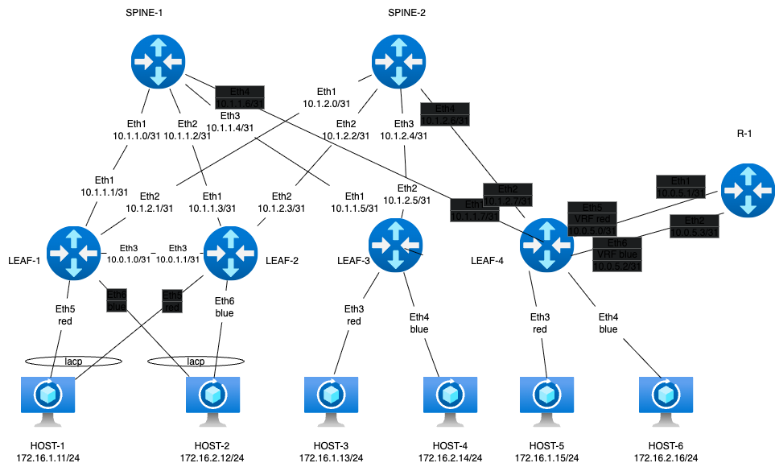
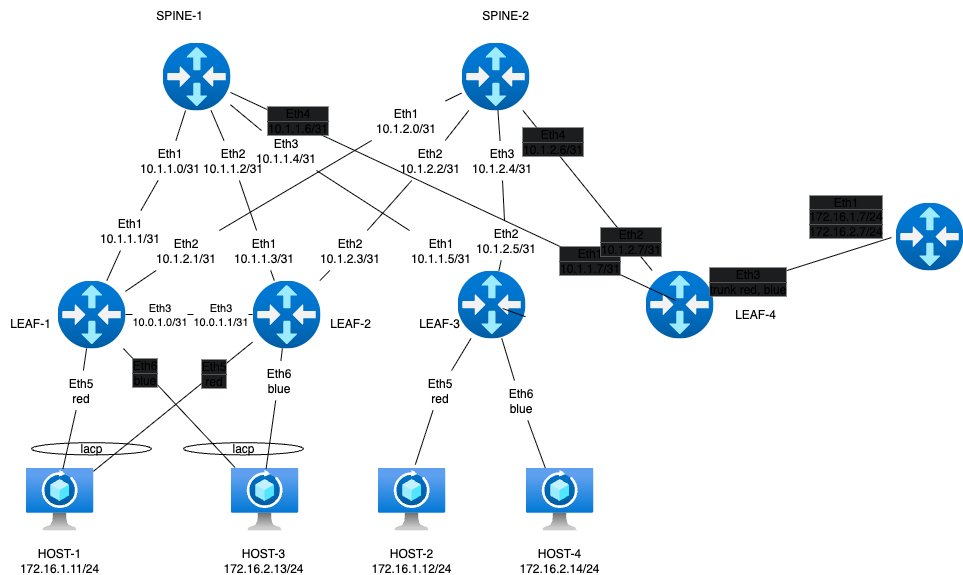
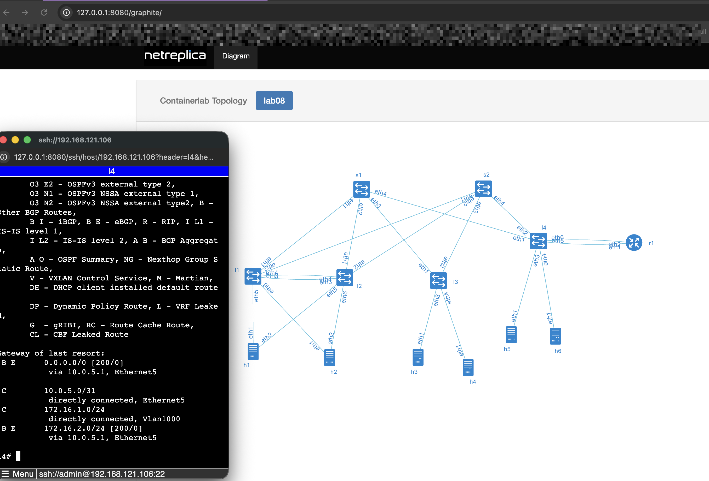
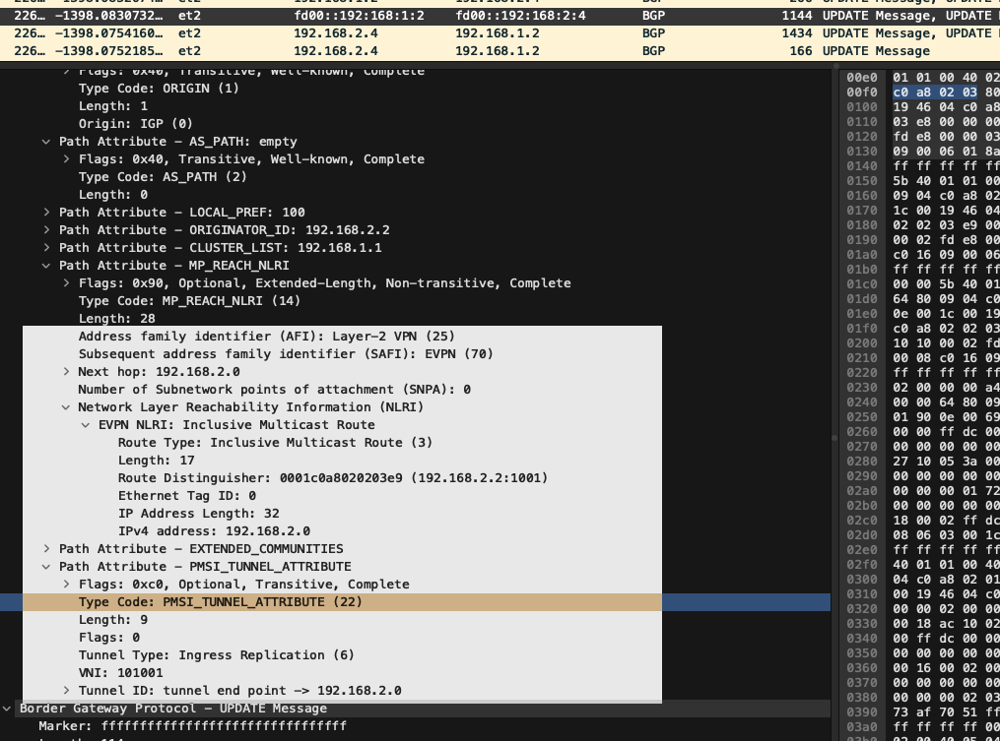

# lab08-VxLAN\&M-Routing

#### Задание VxLAN. Routing.

Цель: Реализовать передачу суммарных префиксов через EVPN route-type 5.

Описание/Пошаговая инструкция выполнения домашнего задания:&#x20;

В этой самостоятельной работе мы ожидаем, что вы самостоятельно:

Разместите двух "клиентов" в разных VRF в рамках одной фабрики. Настроите маршрутизацию между клиентами через внешнее устройство (граничный роутер\фаерволл\etc) Зафиксируете в документации - план работы, адресное пространство, схему сети, настройки сетевого оборудования

#### Схема стенда



Оставляем leaf на arista, чтобы можно было оставить кусочек m-lag на l1-l2, l4 выступает border leaf, frr делаем внешним роутером В качестве клиента оставляем linux c bond. Стенд делаем по принципу - хосты linux, leaf - eos, spine - eos (arista)

#### Распределение адресного пространства

План составлен с учетом 10.x.y.z, где x - номер DC, y - номер spine, z - по очереди для подключения leaf Адреса для хостов - 172.16.x.z/24, где x - номер leaf, z - по порядку адрес хоста, на leaf ip . Сеть для построения peerlink 10.0.x.z где x - номер DC, z - по очереди для пары leaf. Адреса loopback 192.168.a.b/32, где a - 1 для spine, 2 - для leaf, b - номер spine, leaf по порядку. VRF red 172.16.1.0/24 blue 172.16.2.0/24 anycast gw 172.16.x.254/24 Interconnect vrf с external router 10.0.5.0/30 Адресацию ipv6 делаем по прицнипу из fd00::\[IPv4]

Interconnect ipv4 ipv6

| Device A | Interface A   | IPv4 A         | IPv6 A                | Device B | Interface B | IPv4 B           | IPv6 B             |
| -------- | ------------- | -------------- | --------------------- | -------- | ----------- | ---------------- | ------------------ |
| Spine-1  | Eth1          | 10.1.1.0/31    | fd00::10:1:1:0/127    | Leaf-1   | Eth1        | 10.1.1.1/31      | fd00::10:1:1:1/127 |
| Spine-1  | Eth2          | 10.1.1.2/31    | fd00::10:1:1:2/127    | Leaf-2   | Eth1        | 10.1.1.3/31      | fd00::10:1:1:3/127 |
| Spine-1  | Eth3          | 10.1.1.4/31    | fd00::10:1:1:4/127    | Leaf-3   | Eth1        | 10.1.1.5/31      | fd00::10:1:1:5/127 |
| Spine-1  | Eth4          | 10.1.1.6/31    | fd00::10:1:1:6/127    | Leaf-4   | Eth1        | 10.1.1.7/31      | fd00::10:1:1:7/127 |
| Spine-2  | Eth1          | 10.1.2.0/31    | fd00::10:1:2:0/127    | Leaf-1   | Eth2        | 10.1.2.1/31      | fd00::10:1:2:1/127 |
| Spine-2  | Eth2          | 10.1.2.2/31    | fd00::10:1:2:2/127    | Leaf-2   | Eth2        | 10.1.2.3/31      | fd00::10:1:2:3/127 |
| Spine-2  | Eth3          | 10.1.2.4/31    | fd00::10:1:2:4/127    | Leaf-3   | Eth2        | 10.1.2.5/31      | fd00::10:1:2:5/127 |
| Spine-2  | Eth4          | 10.1.2.6/31    | fd00::10:1:2:6/127    | Leaf-4   | Eth2        | 10.1.2.7/31      | fd00::10:1:2:7/127 |
| Leaf-1   | Eth3          | 10.0.1.0/31    | fd00::10:0:1:0/127    | Leaf-2   | Eth3        | 10.0.1.1/31      | fd00::10:0:1:1/127 |
| Leaf-1   | Eth4          | ------------   | ------------          | Leaf-2   | Eth4        | ------------     | ------------       |
| Leaf-4   | Eth5 vrf-red  | 10.0.5.0/31    | fd00::10:0:5:0/127    | R-1      | Eth1        | 10.0.5.1/31      | fd00::10:0:5:1/127 |
| Leaf-4   | Eth6 vrf-blue | 10.0.5.2/31    | fd00::10:0:5:2/127    | R-1      | Eth2        | 10.0.5.3/31      | fd00::10:0:5:3/127 |
| Host-1   | Eth1          | 172.16.1.11/24 | fd00::172:16:1:b/116  | Leaf-1   | Eth5        | access vlan red  | access vlan red    |
| Host-1   | Eth2          | 172.16.1.11/24 | fd00::172:16:1:b/116  | Leaf-2   | Eth5        | access vlan red  | access vlan red    |
| Host-2   | Eth1          | 172.16.1.12/24 | fd00::172:16:1:c/116  | Leaf-1   | Eth6        | access vlan blue | access vlan blue   |
| Host-2   | Eth2          | 172.16.1.12/24 | fd00::172:16:1:с/116  | Leaf-2   | Eth6        | access vlan blue | access vlan blue   |
| Host-3   | Eth1          | 172.16.2.13/24 | fd00::172:16:2:d/116  | Leaf-3   | Eth3        | access vlan red  | access vlan red    |
| Host-4   | Eth1          | 172.16.2.14/24 | fd00::172:16:2:e/116  | Leaf-3   | Eth4        | access vlan blue | access vlan blue   |
| Host-5   | Eth1          | 172.16.2.15/24 | fd00::172:16:2:f/116  | Leaf-4   | Eth3        | access vlan red  | access vlan red    |
| Host-6   | Eth1          | 172.16.2.16/24 | fd00::172:16:2:10/116 | Leaf-4   | Eth4        | access vlan blue | access vlan blue   |

loopback

| Device  | Loopback ipv4 | loopback ipv6     |
| ------- | ------------- | ----------------- |
| Spine-1 | 192.168.1.1   | fd00::192:168:1:1 |
| Spine-2 | 192.168.1.2   | fd00::192:168:1:2 |
| Leaf-1  | 192.168.2.1   | fd00::192:168:2:1 |
| Leaf-2  | 192.168.2.2   | fd00::192:168:2:2 |
| Leaf-1  | 192.168.2.0   | fd00::192:168:2:0 |
| Leaf-2  | 192.168.2.0   | fd00::192:168:2:0 |
| Leaf-3  | 192.168.2.3   | fd00::192:168:2:3 |
| Leaf-4  | 192.168.2.4   | fd00::192:168:2:4 |
| R-1     | 192.168.3.1   | fd00::192:168:3:1 |

Собираем топологию на базе ospf+ibgp. Area ospf 0, bgp as 65500, external bgp as 65100

#### Запуск лабараторной в среде netlab(l2 mode)

Так как задание надо читать вдумчиво то по ходу выполнения сделалось 2 лабараторные. 1-я попытка была построена на l2, маршрутизация между хостами работала, r1 был включен по схеме ~~чупа-чупса~~ router-on-stick, если что схема &#x20;

<figure><figcaption></figcaption></figure>

[Конфиг-файл](l2_topology.yml) или под катом

<details>

<summary>topology.yml</summary>

```yml
---
provider: clab
module: [ vlan,vxlan,ospf,bgp,evpn,bfd,lag ]
plugin: [ bgp.session ]

#bgp
bgp.bfd: True
bgp:
as: 65500
rr_list: [ s1,s2 ]
rr_mesh: False

tools:
edgeshark:
graphite:


nodes:
s1:
device: eos
id: 1
loopback:
  ipv4: 192.168.1.1/32
  ipv6: fd00::192:168:1:1/128
s2:
device: eos
id: 2
loopback:
  ipv4: 192.168.1.2/32
  ipv6: fd00::192:168:1:2/128
l1:
device: eos
id: 3
loopback:
  ipv4: 192.168.2.1/32
  ipv6: fd00::192:168:2:1/128
l2:
device: eos
id: 4
loopback:
  ipv4: 192.168.2.2/32
  ipv6: fd00::192:168:2:2/128
l3:
device: eos
id: 5
loopback:
  ipv4: 192.168.2.3/32
  ipv6: fd00::192:168:2:3/128
l4:
device: eos
id: 6
loopback:
  ipv4: 192.168.2.4/32
  ipv6: fd00::192:168:2:4/128
r1:
module: [ vrf,vlan ]
device: frr
id: 7
vlan.mode: route

h1:
id: 11
module: [ lag ] 
device: linux
h2:
id: 12
module: [ lag ] 
device: linux
h3:
id: 13
device: linux
h4:
id: 14
device: linux


#vrf route leacking
vrfs:
red:
  import: [ red, blue ]
blue:
  import: [ red, blue ]

#vlan
vlans:
red:
  mode: bridge
  vrf: red
  prefix:
    ipv4: 172.16.1.0/24
    ipv6: fd00::172:16:1:0/116
blue:
  mode: bridge
  vrf: blue
  prefix:
    ipv4: 172.16.2.0/24
    ipv6: fd00::172:16:2:0/116

links:
#spine1-leaf1,2,3,4
- interfaces:
    - node: s1
      ifname: eth1
      ipv4: 10.1.1.0
      ipv6: fd00::10:1:1:0
      ospf:
        password: 'spine1'
        bfd: true
    - node: l1
      ifname: eth1
      ipv4: 10.1.1.1
      ipv6: fd00::10:1:1:1
      ospf:
        password: 'spine1'
        bfd: true
  prefix:
    ipv4: 10.1.1.0/31
    ipv6: fd00::10:1:1:0/127
- interfaces:
    - node: s1
      ifname: eth2
      ipv4: 10.1.1.2
      ipv6: fd00::10:1:1:2
      ospf:
        password: 'spine1'
        bfd: true
    - node: l2
      ifname: eth1
      ipv4: 10.1.1.3
      ipv6: fd00::10:1:1:3
      ospf:
        password: 'spine1'
        bfd: true
  prefix:
    ipv4: 10.1.1.2/31
    ipv6: fd00::10:1:1:2/127
- interfaces:
    - node: s1
      ifname: eth3
      ipv4: 10.1.1.4
      ipv6: fd00::10:1:1:4
      ospf:
        password: 'spine1'
        bfd: true
    - node: l3
      ifname: eth1
      ipv4: 10.1.1.5
      ipv6: fd00::10:1:1:5
      ospf:
        password: 'spine1'
        bfd: true
  prefix:
    ipv4: 10.1.1.4/31
    ipv6: fd00::10:1:1:4/127
- interfaces:
    - node: s1
      ifname: eth4
      ipv4: 10.1.1.6
      ipv6: fd00::10:1:1:6
      ospf:
        password: 'spine1'
        bfd: true
    - node: l4
      ifname: eth1
      ipv4: 10.1.1.7
      ipv6: fd00::10:1:1:7
      ospf:
        password: 'spine1'
        bfd: true
  prefix:
    ipv4: 10.1.1.6/31
    ipv6: fd00::10:1:1:6/127
#spine2-leaf1,2,3,4
- interfaces:
    - node: s2
      ifname: eth1
      ipv4: 10.1.2.0
      ipv6: fd00::10:1:2:0
      ospf:
        password: 'spine2'
        bfd: true
    - node: l1
      ifname: eth2
      ipv4: 10.1.2.1
      ipv6: fd00::10:1:2:1
      ospf:
        password: 'spine2'
        bfd: true
  prefix:
    ipv4: 10.1.2.0/31
    ipv6: fd00::10:1:2:0/127
- interfaces:
    - node: s2
      ifname: eth2
      ipv4: 10.1.2.2
      ipv6: fd00::10:1:2:2
      ospf:
        password: 'spine2'
        bfd: true
    - node: l2
      ifname: eth2
      ipv4: 10.1.2.3
      ipv6: fd00::10:1:2:3
      ospf:
        password: 'spine2'
        bfd: true
  prefix:
    ipv4: 10.1.2.2/31
    ipv6: fd00::10:1:2:2/127
- interfaces:
    - node: s2
      ifname: eth3
      ipv4: 10.1.2.4
      ipv6: fd00::10:1:2:4
      ospf:
        password: 'spine2'
        bfd: true
    - node: l3
      ifname: eth2
      ipv4: 10.1.2.5
      ipv6: fd00::10:1:2:5
      ospf:
        password: 'spine2'
        bfd: true
  prefix:
    ipv4: 10.1.2.4/31
    ipv6: fd00::10:1:2:4/127
- interfaces:
    - node: s2
      ifname: eth4
      ipv4: 10.1.2.6
      ipv6: fd00::10:1:2:6
      ospf:
        password: 'spine2'
        bfd: true
    - node: l4
      ifname: eth2
      ipv4: 10.1.2.7
      ipv6: fd00::10:1:2:7
      ospf:
        password: 'spine2'
        bfd: true
  prefix:
    ipv4: 10.1.2.6/31
    ipv6: fd00::10:1:2:6/127
#l1-l2 
- interfaces:
    - node: l1
      ifname: eth3
      ipv4: 10.0.1.0
      ipv6: fd00::10:0:1:0
      ospf:
        password: 'lag1'
        bfd: true
    - node: l2
      ifname: eth3
      ipv4: 10.0.1.1
      ipv6: fd00::10:0:1:1
      ospf:
        password: 'lag1'
        bfd: true
  prefix:
    ipv4: 10.0.1.0/31
    ipv6: fd00::10:0:1:0/127

#downlink + mlag leaf-1 leaf-2
- lag:
    members: [l1-l2]
    mlag.peergroup: 1
- lag:
    members: [h1-l1, h1-l2]
  vlan.access: red
- lag:
    members: [h2-l1, h2-l2]
  vlan.access: blue
#downlink leaf-3
#host3
- interfaces:
    - node: h3
      ifname: eth1
    - node: l3
      ifname: eth3
      vlan.access: red
#host4
- interfaces:
    - node: h4
      ifname: eth1
    - node: l3
      ifname: eth4
      vlan.access: blue

#router on stick, leaf-4 is border leaf

- l4:
  r1:
  vlan.trunk: [ red, blue ]


validate:
wait:
  description: Waiting for stabilize
  wait: 45

ping1:
    description: Pinging H2 from H1
    nodes: [ h1 ]
    devices: [ linux ]
    exec: ping -c 10 h2 -A
    valid: |
      "64 bytes" in stdout

ping2:    
  description: Pinging H4 from H3
  nodes: [ h3 ]
  devices: [ linux ]
  exec: ping -c 10 h4 -A
  valid: |
    "64 bytes" in stdout

ping3:    
  description: Pinging ipv6 H1 from H2
  nodes: [ h2 ]
  devices: [ linux ]
  exec: ping6 -c 10 h1 -A
  valid: |
    "64 bytes" in stdout

ping4:    
  description: Pinging ipv6 H3 from H4
  nodes: [ h4 ]
  devices: [ linux ]
  exec: ping6 -c 10 h3 -A
  valid: |
    "64 bytes" in stdout
```

</details>

И это прекрасно работало, смущало правда отсутствие type-5 route, но откуда им было браться, если ни один leaf не замешан в маршрутизации между vrf, и вообще про эти самые vrf знать не знает. Понимая что сделал не то, пошел делать то.

#### Запуск лабараторной в среде netlab(l3 mode)

Правильная схема к заданию.  Было решено освоить distributed gateway, когда шлюз для каждого домена находится на каждом leaf. Возникли нюансы с обменом маршрутной информацией между vrf leaf-4 и r-1, но об этом позже, ~~выстраданый~~ [конфиг-файл](topology.yml) или ниже схемы под катом

<figure><figcaption></figcaption></figure>

<details>

<summary>topology.yml</summary>

```yml
---
provider: clab
module: [ vlan,vxlan,ospf,bgp,evpn,bfd,lag,vrf,gateway ]
plugin: [ bgp.session ]

defaults.devices.eos.clab.image: "ceos:4.34.2F"

#bgp
bgp.bfd: True
bgp:
as: 65500
rr_list: [ s1,s2 ]
rr_mesh: False

tools:
edgeshark:
graphite:

groups:
mlag_leaf:
  members: [ l1, l2 ]
  config: [ share-loopback.j2 ]
router:
  members: [ r1 ]  
  config: [ route-map.j2 ]

nodes:
s1:
device: eos
id: 1
loopback:
  ipv4: 192.168.1.1/32
  ipv6: fd00::192:168:1:1/128
s2:
device: eos
id: 2
loopback:
  ipv4: 192.168.1.2/32
  ipv6: fd00::192:168:1:2/128
l1:
device: eos
id: 3
loopback:
  ipv4: 192.168.2.1/32
  ipv6: fd00::192:168:2:1/128
l2:
device: eos
id: 4
loopback:
  ipv4: 192.168.2.2/32
  ipv6: fd00::192:168:2:2/128
l3:
device: eos
id: 5
loopback:
  ipv4: 192.168.2.3/32
  ipv6: fd00::192:168:2:3/128
l4:
device: eos
id: 6
loopback:
  ipv4: 192.168.2.4/32
  ipv6: fd00::192:168:2:4/128
r1:
module: [ bgp ]
device: frr
bgp.as: 65100
bgp.default_originate: True
id: 7
loopback:
  ipv4: 192.168.3.1/32
  ipv6: fd00::192:168:3:1/128


h1:
id: 11
module: [ lag ] 
device: linux
h2:
id: 12
module: [ lag ] 
device: linux
h3:
id: 13
device: linux
h4:
id: 14
device: linux
h5:
id: 15
device: linux
h6:
id: 16
device: linux


#vrf 
vrfs:
red:
  ospf: False
  bgp:
  evpn.transit_vni: 10000
#    links: [ r1-l4 ]
blue:
  ospf: False
  bgp:
  evpn.transit_vni: 10001
#    links: [ r1-l4 ]

#vlan
vlans:
red:
  gateway: True
  vrf: red
  prefix:
    ipv4: 172.16.1.0/24
    ipv6: fd00::172:16:1:0/116
blue:
  gateway: True
  vrf: blue
  prefix:
    ipv4: 172.16.2.0/24
    ipv6: fd00::172:16:2:0/116

links:
#spine1-leaf1,2,3,4
- interfaces:
    - node: s1
      ifname: eth1
      ipv4: 10.1.1.0
      ipv6: fd00::10:1:1:0
      ospf:
        password: 'spine1'
        bfd: true
    - node: l1
      ifname: eth1
      ipv4: 10.1.1.1
      ipv6: fd00::10:1:1:1
      ospf:
        password: 'spine1'
        bfd: true
  prefix:
    ipv4: 10.1.1.0/31
    ipv6: fd00::10:1:1:0/127
- interfaces:
    - node: s1
      ifname: eth2
      ipv4: 10.1.1.2
      ipv6: fd00::10:1:1:2
      ospf:
        password: 'spine1'
        bfd: true
    - node: l2
      ifname: eth1
      ipv4: 10.1.1.3
      ipv6: fd00::10:1:1:3
      ospf:
        password: 'spine1'
        bfd: true
  prefix:
    ipv4: 10.1.1.2/31
    ipv6: fd00::10:1:1:2/127
- interfaces:
    - node: s1
      ifname: eth3
      ipv4: 10.1.1.4
      ipv6: fd00::10:1:1:4
      ospf:
        password: 'spine1'
        bfd: true
    - node: l3
      ifname: eth1
      ipv4: 10.1.1.5
      ipv6: fd00::10:1:1:5
      ospf:
        password: 'spine1'
        bfd: true
  prefix:
    ipv4: 10.1.1.4/31
    ipv6: fd00::10:1:1:4/127
- interfaces:
    - node: s1
      ifname: eth4
      ipv4: 10.1.1.6
      ipv6: fd00::10:1:1:6
      ospf:
        password: 'spine1'
        bfd: true
    - node: l4
      ifname: eth1
      ipv4: 10.1.1.7
      ipv6: fd00::10:1:1:7
      ospf:
        password: 'spine1'
        bfd: true
  prefix:
    ipv4: 10.1.1.6/31
    ipv6: fd00::10:1:1:6/127
#spine2-leaf1,2,3,4
- interfaces:
    - node: s2
      ifname: eth1
      ipv4: 10.1.2.0
      ipv6: fd00::10:1:2:0
      ospf:
        password: 'spine2'
        bfd: true
    - node: l1
      ifname: eth2
      ipv4: 10.1.2.1
      ipv6: fd00::10:1:2:1
      ospf:
        password: 'spine2'
        bfd: true
  prefix:
    ipv4: 10.1.2.0/31
    ipv6: fd00::10:1:2:0/127
- interfaces:
    - node: s2
      ifname: eth2
      ipv4: 10.1.2.2
      ipv6: fd00::10:1:2:2
      ospf:
        password: 'spine2'
        bfd: true
    - node: l2
      ifname: eth2
      ipv4: 10.1.2.3
      ipv6: fd00::10:1:2:3
      ospf:
        password: 'spine2'
        bfd: true
  prefix:
    ipv4: 10.1.2.2/31
    ipv6: fd00::10:1:2:2/127
- interfaces:
    - node: s2
      ifname: eth3
      ipv4: 10.1.2.4
      ipv6: fd00::10:1:2:4
      ospf:
        password: 'spine2'
        bfd: true
    - node: l3
      ifname: eth2
      ipv4: 10.1.2.5
      ipv6: fd00::10:1:2:5
      ospf:
        password: 'spine2'
        bfd: true
  prefix:
    ipv4: 10.1.2.4/31
    ipv6: fd00::10:1:2:4/127
- interfaces:
    - node: s2
      ifname: eth4
      ipv4: 10.1.2.6
      ipv6: fd00::10:1:2:6
      ospf:
        password: 'spine2'
        bfd: true
    - node: l4
      ifname: eth2
      ipv4: 10.1.2.7
      ipv6: fd00::10:1:2:7
      ospf:
        password: 'spine2'
        bfd: true
  prefix:
    ipv4: 10.1.2.6/31
    ipv6: fd00::10:1:2:6/127
#l1-l2 
- interfaces:
    - node: l1
      ifname: eth3
      ipv4: 10.0.1.0
      ipv6: fd00::10:0:1:0
      ospf:
        password: 'lag1'
        bfd: true
    - node: l2
      ifname: eth3
      ipv4: 10.0.1.1
      ipv6: fd00::10:0:1:1
      ospf:
        password: 'lag1'
        bfd: true
  prefix:
    ipv4: 10.0.1.0/31
    ipv6: fd00::10:0:1:0/127

#downlink + mlag leaf-1 leaf-2
- lag:
    members: [l1-l2]
    mlag.peergroup: 1
- lag:
    members: [h1-l1, h1-l2]
  vlan.access: red
- lag:
    members: [h2-l1, h2-l2]
  vlan.access: blue
#downlink leaf-3
#host3
- interfaces:
    - node: h3
      ifname: eth1
    - node: l3
      ifname: eth3
      vlan.access: red
#host4
- interfaces:
    - node: h4
      ifname: eth1
    - node: l3
      ifname: eth4
      vlan.access: blue

#downlink leaf-4
#host5
- interfaces:
    - node: h5
      ifname: eth1
    - node: l4
      ifname: eth3
      vlan.access: red
#host6
- interfaces:
    - node: h6
      ifname: eth1
    - node: l4
      ifname: eth4
      vlan.access: blue

#leaf-4 as border leaf to r1 
#  - l4-r1
- interfaces:
    - node: l4
      vrf: red
      ifname: eth5
      ipv4: 10.0.5.0
      ipv6: fd00::10:0:5:0
    - node: r1
      ifname: eth1
      ipv4: 10.0.5.1
      ipv6: fd00::10:0:5:1
  prefix:
    ipv4: 10.0.5.0/31
    ipv6: fd00::10:0:5:0/127
#  - l4-r1
- interfaces:
    - node: l4
      vrf: blue
      ifname: eth6
      ipv4: 10.0.5.2
      ipv6: fd00::10:0:5:2
    - node: r1
      ifname: eth2
      ipv4: 10.0.5.3
      ipv6: fd00::10:0:5:3
  prefix:
    ipv4: 10.0.5.2/31
    ipv6: fd00::10:0:5:2/127


validate:
wait:
  description: Waiting for stabilize
  wait: 45

ping1:
    description: Pinging H2 from H1
    nodes: [ h1 ]
    devices: [ linux ]
    exec: ping -c 10 h2 -A
    valid: |
      "64 bytes" in stdout

ping2:    
  description: Pinging H4 from H3
  nodes: [ h3 ]
  devices: [ linux ]
  exec: ping -c 10 h4 -A
  valid: |
    "64 bytes" in stdout

ping3:    
  description: Pinging ipv6 H1 from H2
  nodes: [ h2 ]
  devices: [ linux ]
  exec: ping6 -c 10 h1 -A
  valid: |
    "64 bytes" in stdout

ping4:    
  description: Pinging ipv6 H3 from H4
  nodes: [ h4 ]
  devices: [ linux ]
  exec: ping6 -c 10 h3 -A
  valid: |
    "64 bytes" in stdout


```

</details>

#### Проверка работы

Связность проверяем автотестом через `neltab validate` , если все хорошо сошлось, то все и запингуется, вывод

<details>

<summary>netlab validate</summary>

```txt

[wait]    Waiting for stabilize

[ping1]   Pinging H2 from H1 [ node(s): h1 ]
[PASS]    Validation succeeded on h1
[PASS]    Test succeeded in 0.1 seconds

[ping2]   Pinging H4 from H3 [ node(s): h3 ]
[PASS]    Validation succeeded on h3
[PASS]    Test succeeded in 0.1 seconds

[ping3]   Pinging ipv6 H1 from H2 [ node(s): h2 ]
[PASS]    Validation succeeded on h2
[PASS]    Test succeeded in 0.1 seconds

[ping4]   Pinging ipv6 H3 from H4 [ node(s): h4 ]
[PASS]    Validation succeeded on h4
[PASS]    Test succeeded in 0.1 seconds

[SUCCESS] Tests passed: 4
```

</details>

А теперь о нюансах обмена маршрутами через R-1. Если просто запустить стенд, то оба vrf получат маршрут loopback интерфейса от r-1, r-1 будет знать о всех сетях, а вот vrf не будут знать друг о друге, потому что оба vrf имеют одну и ту же BGP AS, и не должны устанавливать в свою таблицу маршруты полученные по ebgp со своей BGP AS. Здесь у нас несколько вариантов решения этой проблемы:

1. bgp allow as in для пиров, что разрешит роутеру принимать маршруты со своей AS, почему то не зароботало у меня на arista, хотя на frr запустилось, возможно где то не дожал;
2. route-map c удалением BGP AS полученных от leaf-4, прекрасно работает;
3. создавать VRF на R-1 и связывать их через другой IGP протокол, что по факту приведет к тому же удалению всех атрибутов BGP и приведет к усложненному варианту пункта 2;
4. самый легкий в реализации, но почему то не сразу пришедший на ум - default originate, получится что то похожее на hvpn(hierarchy vpn) в терминологии huawei;
5. bgp override-as тоже почему то не стартанул на arista, frr запустил;
6. использовать разные AS для разных vrf, можно, но привычка говорит что vrf должен быть той же as как и роутер на котором он находится. От мысли сделать leaf-4 на frr при остальной фабрике на arista отказался, так как начинали некоректно мапиться vxlan vni. Потратил много сил чтобы попробовать это все склеить, но с такими костылями сдавать лабу не хотелось.

Теперь о том как это все заставить красиво работать. Изначально остановился на варианте с вещанием маршрута по умолчанию, так как он хорошо работал в netlab, в одну строку `bgp.default_originate: True` и маршрут летит в сессии. После понял что возникают проблемы с работой m-lag на leaf-1 leaf-2, а именно проскакивающие dup пакеты в результатах пинга. А все потому что leaf-1 и leaf-2 работая в фабрике должны слать update с одинакового адреса, для чего нужно создать одинаковый loopback с одинаковым адресом на обоих. Т.к. глубинной целью обучения определено сделать все лабы без ввода `configure terminal`, то нужно включить дополнительную конфигурацию при инициализации устройств. По хорошему нужно бы дописать дополнительный модуль, но сейчас совсем не успеваю, поэтому срежем угол воспользовавшись опцией config при составлении файла топологии, это позволяет добавить дополнительную конфигурацию на устройства после инициализации стенда. Раз уж мы делаем дополнительную конфигурацию для leaf [`leaf1/2`](share-loopback.j2), то можно и вставить дополнения для R-1 c route-map. [`r1-route-map`](route-map.j2)

Так же важная пометка, почему то в мою голову закралась мысль о том что один и в тот же vni можно засовывать и l2 и l3, что на практике оказалось совсем не так. От этого я долго мучался в поисках маршрутов, которые никак не хотели лететь.

Теперь смотрим в таблицы:

<details>

<summary>spine-2 show evpn</summary>

```
s2#show bgp evpn vni 101000
BGP routing table information for VRF default
Router identifier 192.168.1.2, local AS number 65500
Route status codes: * - valid, > - active, S - Stale, E - ECMP head, e - ECMP
                    c - Contributing to ECMP, % - Pending best path selection
Origin codes: i - IGP, e - EGP, ? - incomplete
AS Path Attributes: Or-ID - Originator ID, C-LST - Cluster List, LL Nexthop - Link Local Nexthop

           Network                Next Hop              Metric  LocPref Weight  Path
 * >Ec    RD: 192.168.2.3:1000 mac-ip aac1.ab76.bfe4
                                 192.168.2.3           -       100     0       i
 *  ec    RD: 192.168.2.3:1000 mac-ip aac1.ab76.bfe4
                                 192.168.2.3           -       100     0       i
 * >Ec    RD: 192.168.2.3:1000 mac-ip aac1.ab76.bfe4 172.16.1.13
                                 192.168.2.3           -       100     0       i
 *  ec    RD: 192.168.2.3:1000 mac-ip aac1.ab76.bfe4 172.16.1.13
                                 192.168.2.3           -       100     0       i
 * >Ec    RD: 192.168.2.1:1000 mac-ip aac1.abc9.29be
                                 192.168.2.0           -       100     0       i
 *  ec    RD: 192.168.2.1:1000 mac-ip aac1.abc9.29be
                                 192.168.2.0           -       100     0       i
 * >Ec    RD: 192.168.2.2:1000 mac-ip aac1.abc9.29be
                                 192.168.2.0           -       100     0       i
 *  ec    RD: 192.168.2.2:1000 mac-ip aac1.abc9.29be
                                 192.168.2.0           -       100     0       i
 * >Ec    RD: 192.168.2.1:1000 mac-ip aac1.abc9.29be 172.16.1.11
                                 192.168.2.0           -       100     0       i
 *  ec    RD: 192.168.2.1:1000 mac-ip aac1.abc9.29be 172.16.1.11
                                 192.168.2.0           -       100     0       i
 * >Ec    RD: 192.168.2.2:1000 mac-ip aac1.abc9.29be 172.16.1.11
                                 192.168.2.0           -       100     0       i
 *  ec    RD: 192.168.2.2:1000 mac-ip aac1.abc9.29be 172.16.1.11
                                 192.168.2.0           -       100     0       i
 * >Ec    RD: 192.168.2.4:1000 mac-ip aac1.abcd.b350
                                 192.168.2.4           -       100     0       i
 *  ec    RD: 192.168.2.4:1000 mac-ip aac1.abcd.b350
                                 192.168.2.4           -       100     0       i
 * >Ec    RD: 192.168.2.1:1000 imet 192.168.2.0
                                 192.168.2.0           -       100     0       i
 *  ec    RD: 192.168.2.1:1000 imet 192.168.2.0
                                 192.168.2.0           -       100     0       i
 * >Ec    RD: 192.168.2.2:1000 imet 192.168.2.0
                                 192.168.2.0           -       100     0       i
 *  ec    RD: 192.168.2.2:1000 imet 192.168.2.0
                                 192.168.2.0           -       100     0       i
 * >Ec    RD: 192.168.2.3:1000 imet 192.168.2.3
                                 192.168.2.3           -       100     0       i
 *  ec    RD: 192.168.2.3:1000 imet 192.168.2.3
                                 192.168.2.3           -       100     0       i
 * >Ec    RD: 192.168.2.4:1000 imet 192.168.2.4
                                 192.168.2.4           -       100     0       i
 *  ec    RD: 192.168.2.4:1000 imet 192.168.2.4
                                 192.168.2.4           -       100     0       i

s2#show bgp evpn vni 101001
BGP routing table information for VRF default
Router identifier 192.168.1.2, local AS number 65500
Route status codes: * - valid, > - active, S - Stale, E - ECMP head, e - ECMP
                    c - Contributing to ECMP, % - Pending best path selection
Origin codes: i - IGP, e - EGP, ? - incomplete
AS Path Attributes: Or-ID - Originator ID, C-LST - Cluster List, LL Nexthop - Link Local Nexthop

          Network                Next Hop              Metric  LocPref Weight  Path
 * >Ec    RD: 192.168.2.3:1001 mac-ip aac1.abdb.190f
                                 192.168.2.3           -       100     0       i
 *  ec    RD: 192.168.2.3:1001 mac-ip aac1.abdb.190f
                                 192.168.2.3           -       100     0       i
 * >Ec    RD: 192.168.2.3:1001 mac-ip aac1.abdb.190f 172.16.2.14
                                 192.168.2.3           -       100     0       i
 *  ec    RD: 192.168.2.3:1001 mac-ip aac1.abdb.190f 172.16.2.14
                                 192.168.2.3           -       100     0       i
 * >Ec    RD: 192.168.2.1:1001 mac-ip aac1.abe2.5f8d
                                 192.168.2.0           -       100     0       i
 *  ec    RD: 192.168.2.1:1001 mac-ip aac1.abe2.5f8d
                                 192.168.2.0           -       100     0       i
 * >Ec    RD: 192.168.2.2:1001 mac-ip aac1.abe2.5f8d
                                 192.168.2.0           -       100     0       i
 *  ec    RD: 192.168.2.2:1001 mac-ip aac1.abe2.5f8d
                                 192.168.2.0           -       100     0       i
 * >Ec    RD: 192.168.2.1:1001 mac-ip aac1.abe2.5f8d 172.16.2.12
                                 192.168.2.0           -       100     0       i
 *  ec    RD: 192.168.2.1:1001 mac-ip aac1.abe2.5f8d 172.16.2.12
                                 192.168.2.0           -       100     0       i
 * >Ec    RD: 192.168.2.2:1001 mac-ip aac1.abe2.5f8d 172.16.2.12
                                 192.168.2.0           -       100     0       i
 *  ec    RD: 192.168.2.2:1001 mac-ip aac1.abe2.5f8d 172.16.2.12
                                 192.168.2.0           -       100     0       i
 * >Ec    RD: 192.168.2.1:1001 imet 192.168.2.0
                                 192.168.2.0           -       100     0       i
 *  ec    RD: 192.168.2.1:1001 imet 192.168.2.0
                                 192.168.2.0           -       100     0       i
 * >Ec    RD: 192.168.2.2:1001 imet 192.168.2.0
                                 192.168.2.0           -       100     0       i
 *  ec    RD: 192.168.2.2:1001 imet 192.168.2.0
                                 192.168.2.0           -       100     0       i
 * >Ec    RD: 192.168.2.3:1001 imet 192.168.2.3
                                 192.168.2.3           -       100     0       i
 *  ec    RD: 192.168.2.3:1001 imet 192.168.2.3
                                 192.168.2.3           -       100     0       i
 * >Ec    RD: 192.168.2.4:1001 imet 192.168.2.4
                                 192.168.2.4           -       100     0       i
 *  ec    RD: 192.168.2.4:1001 imet 192.168.2.4
                                 192.168.2.4           -       100     0       i

####route-5 

show bgp evpn vni 10000

BGP routing table information for VRF default
Router identifier 192.168.1.2, local AS number 65500
Route status codes: * - valid, > - active, S - Stale, E - ECMP head, e - ECMP
                    c - Contributing to ECMP, % - Pending best path selection
Origin codes: i - IGP, e - EGP, ? - incomplete
AS Path Attributes: Or-ID - Originator ID, C-LST - Cluster List, LL Nexthop - Link Local Nexthop

          Network                Next Hop              Metric  LocPref Weight  Path
 * >Ec    RD: 192.168.2.1:1000 mac-ip aac1.abc9.29be 172.16.1.11
                                 192.168.2.0           -       100     0       i
 *  ec    RD: 192.168.2.1:1000 mac-ip aac1.abc9.29be 172.16.1.11
                                 192.168.2.0           -       100     0       i
 * >Ec    RD: 192.168.2.2:1000 mac-ip aac1.abc9.29be 172.16.1.11
                                 192.168.2.0           -       100     0       i
 *  ec    RD: 192.168.2.2:1000 mac-ip aac1.abc9.29be 172.16.1.11
                                 192.168.2.0           -       100     0       i
 * >      RD: 65500:1 ip-prefix 0.0.0.0/0
                                 192.168.2.4           0       100     0       65100 i
 *        RD: 65500:1 ip-prefix 0.0.0.0/0
                                 192.168.2.4           0       100     0       65100 i
 * >      RD: 65500:1 ip-prefix 10.0.5.0/31
                                 192.168.2.4           -       100     0       i
 *        RD: 65500:1 ip-prefix 10.0.5.0/31
                                 192.168.2.4           -       100     0       i
 * >      RD: 65500:1 ip-prefix 172.16.1.0/24
                                 192.168.2.0           -       100     0       i
 *        RD: 65500:1 ip-prefix 172.16.1.0/24
                                 192.168.2.0           -       100     0       i
 *        RD: 65500:1 ip-prefix 172.16.1.0/24
                                 192.168.2.0           -       100     0       i
 *        RD: 65500:1 ip-prefix 172.16.1.0/24
                                 192.168.2.0           -       100     0       i
 *        RD: 65500:1 ip-prefix 172.16.1.0/24
                                 192.168.2.3           -       100     0       i
 *        RD: 65500:1 ip-prefix 172.16.1.0/24
                                 192.168.2.3           -       100     0       i
 *        RD: 65500:1 ip-prefix 172.16.1.0/24
                                 192.168.2.4           -       100     0       i
 *        RD: 65500:1 ip-prefix 172.16.1.0/24
                                 192.168.2.4           -       100     0       i
 * >      RD: 65500:1 ip-prefix 172.16.2.0/24
                                 192.168.2.4           -       100     0       65100 i
 *        RD: 65500:1 ip-prefix 172.16.2.0/24
                                 192.168.2.4           -       100     0       65100 i
 * >      RD: 65500:1 ip-prefix ::/0
                                 192.168.2.4           0       100     0       65100 i
 *        RD: 65500:1 ip-prefix ::/0
                                 192.168.2.4           0       100     0       65100 i
 * >      RD: 65500:1 ip-prefix fd00::10:0:5:0/127
                                 192.168.2.4           -       100     0       i
 *        RD: 65500:1 ip-prefix fd00::10:0:5:0/127
                                 192.168.2.4           -       100     0       i
 * >      RD: 65500:1 ip-prefix fd00::172:16:1:0/116
                                 192.168.2.0           -       100     0       i
 *        RD: 65500:1 ip-prefix fd00::172:16:1:0/116
                                 192.168.2.0           -       100     0       i
 *        RD: 65500:1 ip-prefix fd00::172:16:1:0/116
                                 192.168.2.0           -       100     0       i
 *        RD: 65500:1 ip-prefix fd00::172:16:1:0/116
                                 192.168.2.0           -       100     0       i
 *        RD: 65500:1 ip-prefix fd00::172:16:1:0/116
                                 192.168.2.3           -       100     0       i
 *        RD: 65500:1 ip-prefix fd00::172:16:1:0/116
                                 192.168.2.3           -       100     0       i
 *        RD: 65500:1 ip-prefix fd00::172:16:1:0/116
                                 192.168.2.4           -       100     0       i
 *        RD: 65500:1 ip-prefix fd00::172:16:1:0/116
                                 192.168.2.4           -       100     0       i
 * >      RD: 65500:1 ip-prefix fd00::172:16:2:0/116
                                 192.168.2.4           -       100     0       65100 i
 *        RD: 65500:1 ip-prefix fd00::172:16:2:0/116
                                 192.168.2.4           -       100     0       65100 i


show bgp evpn vni 10001

BGP routing table information for VRF default
Router identifier 192.168.1.2, local AS number 65500
Route status codes: * - valid, > - active, S - Stale, E - ECMP head, e - ECMP
                    c - Contributing to ECMP, % - Pending best path selection
Origin codes: i - IGP, e - EGP, ? - incomplete
AS Path Attributes: Or-ID - Originator ID, C-LST - Cluster List, LL Nexthop - Link Local Nexthop

          Network                Next Hop              Metric  LocPref Weight  Path
 * >      RD: 65500:2 ip-prefix 0.0.0.0/0
                                 192.168.2.4           0       100     0       65100 i
 *        RD: 65500:2 ip-prefix 0.0.0.0/0
                                 192.168.2.4           0       100     0       65100 i
 * >      RD: 65500:2 ip-prefix 10.0.5.2/31
                                 192.168.2.4           -       100     0       i
 *        RD: 65500:2 ip-prefix 10.0.5.2/31
                                 192.168.2.4           -       100     0       i
 * >      RD: 65500:2 ip-prefix 172.16.1.0/24
                                 192.168.2.4           -       100     0       65100 i
 *        RD: 65500:2 ip-prefix 172.16.1.0/24
                                 192.168.2.4           -       100     0       65100 i
 * >      RD: 65500:2 ip-prefix 172.16.2.0/24
                                 192.168.2.0           -       100     0       i
 *        RD: 65500:2 ip-prefix 172.16.2.0/24
                                 192.168.2.0           -       100     0       i
 *        RD: 65500:2 ip-prefix 172.16.2.0/24
                                 192.168.2.0           -       100     0       i
 *        RD: 65500:2 ip-prefix 172.16.2.0/24
                                 192.168.2.0           -       100     0       i
 *        RD: 65500:2 ip-prefix 172.16.2.0/24
                                 192.168.2.3           -       100     0       i
 *        RD: 65500:2 ip-prefix 172.16.2.0/24
                                 192.168.2.3           -       100     0       i
 *        RD: 65500:2 ip-prefix 172.16.2.0/24
                                 192.168.2.4           -       100     0       i
 *        RD: 65500:2 ip-prefix 172.16.2.0/24
                                 192.168.2.4           -       100     0       i
 * >      RD: 65500:2 ip-prefix ::/0
                                 192.168.2.4           0       100     0       65100 i
 *        RD: 65500:2 ip-prefix ::/0
                                 192.168.2.4           0       100     0       65100 i
 * >      RD: 65500:2 ip-prefix fd00::10:0:5:2/127
                                 192.168.2.4           -       100     0       i
 *        RD: 65500:2 ip-prefix fd00::10:0:5:2/127
                                 192.168.2.4           -       100     0       i
 * >      RD: 65500:2 ip-prefix fd00::172:16:1:0/116
                                 192.168.2.4           -       100     0       65100 i
 *        RD: 65500:2 ip-prefix fd00::172:16:1:0/116
                                 192.168.2.4           -       100     0       65100 i
 * >      RD: 65500:2 ip-prefix fd00::172:16:2:0/116
                                 192.168.2.0           -       100     0       i
 *        RD: 65500:2 ip-prefix fd00::172:16:2:0/116
                                 192.168.2.0           -       100     0       i
 *        RD: 65500:2 ip-prefix fd00::172:16:2:0/116
                                 192.168.2.0           -       100     0       i
 *        RD: 65500:2 ip-prefix fd00::172:16:2:0/116
                                 192.168.2.0           -       100     0       i
 *        RD: 65500:2 ip-prefix fd00::172:16:2:0/116
                                 192.168.2.3           -       100     0       i
 *        RD: 65500:2 ip-prefix fd00::172:16:2:0/116
                                 192.168.2.3           -       100     0       i
 *        RD: 65500:2 ip-prefix fd00::172:16:2:0/116
                                 192.168.2.4           -       100     0       i
 *        RD: 65500:2 ip-prefix fd00::172:16:2:0/116
                                 192.168.2.4           -       100     0       i

```

</details>

Обратим внимание на то что маршруты приходящие с пары leaf-1 leaf-2 приходят с адреса 192.168.2.0/32 общего между leaf-1 и leaf-2

Таблицы маршрутизации для vrf

<details>

<summary>l3 show ip(v6) route vrf all</summary>

```txt

VRF: blue
Source Codes:
     C - connected, S - static, K - kernel,
     O - OSPF, O IA - OSPF inter area, O E1 - OSPF external type 1,
     O E2 - OSPF external type 2, O N1 - OSPF NSSA external type 1,
     O N2 - OSPF NSSA external type2, O3 - OSPFv3,
     O3 IA - OSPFv3 inter area, O3 E1 - OSPFv3 external type 1,
     O3 E2 - OSPFv3 external type 2,
     O3 N1 - OSPFv3 NSSA external type 1,
     O3 N2 - OSPFv3 NSSA external type2, B - Other BGP Routes,
     B I - iBGP, B E - eBGP, R - RIP, I L1 - IS-IS level 1,
     I L2 - IS-IS level 2, A B - BGP Aggregate,
     A O - OSPF Summary, NG - Nexthop Group Static Route,
     V - VXLAN Control Service, M - Martian,
     DH - DHCP client installed default route,
     DP - Dynamic Policy Route, L - VRF Leaked,
     G  - gRIBI, RC - Route Cache Route,
     CL - CBF Leaked Route

Gateway of last resort:
B I      0.0.0.0/0 [200/0]
         via VTEP 192.168.2.4 VNI 10001 router-mac 00:1c:73:80:f9:c4 local-interface Vxlan1

B I      10.0.5.2/31 [200/0]
         via VTEP 192.168.2.4 VNI 10001 router-mac 00:1c:73:80:f9:c4 local-interface Vxlan1
B I      172.16.1.0/24 [200/0]
         via VTEP 192.168.2.4 VNI 10001 router-mac 00:1c:73:80:f9:c4 local-interface Vxlan1
C        172.16.2.0/24
         directly connected, Vlan1001

VRF: red
Source Codes:
     C - connected, S - static, K - kernel,
     O - OSPF, O IA - OSPF inter area, O E1 - OSPF external type 1,
     O E2 - OSPF external type 2, O N1 - OSPF NSSA external type 1,
     O N2 - OSPF NSSA external type2, O3 - OSPFv3,
     O3 IA - OSPFv3 inter area, O3 E1 - OSPFv3 external type 1,
     O3 E2 - OSPFv3 external type 2,
     O3 N1 - OSPFv3 NSSA external type 1,
     O3 N2 - OSPFv3 NSSA external type2, B - Other BGP Routes,
     B I - iBGP, B E - eBGP, R - RIP, I L1 - IS-IS level 1,
     I L2 - IS-IS level 2, A B - BGP Aggregate,
     A O - OSPF Summary, NG - Nexthop Group Static Route,
     V - VXLAN Control Service, M - Martian,
     DH - DHCP client installed default route,
     DP - Dynamic Policy Route, L - VRF Leaked,
     G  - gRIBI, RC - Route Cache Route,
     CL - CBF Leaked Route

Gateway of last resort:
B I      0.0.0.0/0 [200/0]
         via VTEP 192.168.2.4 VNI 10000 router-mac 00:1c:73:80:f9:c4 local-interface Vxlan1

B I      10.0.5.0/31 [200/0]
         via VTEP 192.168.2.4 VNI 10000 router-mac 00:1c:73:80:f9:c4 local-interface Vxlan1
C        172.16.1.0/24
         directly connected, Vlan1000
B I      172.16.2.0/24 [200/0]
         via VTEP 192.168.2.4 VNI 10000 router-mac 00:1c:73:80:f9:c4 local-interface Vxlan1

============IPv6===================

VRF: blue
Displaying 4 of 9 IPv6 routing table entries
Source Codes:
     C - connected, S - static, K - kernel, O3 - OSPFv3,
     O3 IA - OSPFv3 inter area, O3 E1 - OSPFv3 external type 1,
     O3 E2 - OSPFv3 external type 2,
     O3 N1 - OSPFv3 NSSA external type 1
     O3 N2 - OSPFv3 NSSA external type2, B - Other BGP Routes,
     A B - BGP Aggregate, R - RIP,
     I L1 - IS-IS level 1, I L2 - IS-IS level 2, DH - DHCP,
     NG - Nexthop Group Static Route, M - Martian,
     DP - Dynamic Policy Route, L - VRF Leaked,
     G  - gRIBI, RC - Route Cache Route,
     CL - CBF Leaked Route

B I      fd00::10:0:5:2/127 [200/0]
         via VTEP 192.168.2.4 VNI 10001 router-mac 00:1c:73:80:f9:c4 local-interface Vxlan1
B I      fd00::172:16:1:0/116 [200/0]
         via VTEP 192.168.2.4 VNI 10001 router-mac 00:1c:73:80:f9:c4 local-interface Vxlan1
C        fd00::172:16:2:0/116 [0/0]
         via Vlan1001, directly connected
B I      ::/0 [200/0]
         via VTEP 192.168.2.4 VNI 10001 router-mac 00:1c:73:80:f9:c4 local-interface Vxlan1

VRF: red
Displaying 4 of 9 IPv6 routing table entries
Source Codes:
     C - connected, S - static, K - kernel, O3 - OSPFv3,
     O3 IA - OSPFv3 inter area, O3 E1 - OSPFv3 external type 1,
     O3 E2 - OSPFv3 external type 2,
     O3 N1 - OSPFv3 NSSA external type 1
     O3 N2 - OSPFv3 NSSA external type2, B - Other BGP Routes,
     A B - BGP Aggregate, R - RIP,
     I L1 - IS-IS level 1, I L2 - IS-IS level 2, DH - DHCP,
     NG - Nexthop Group Static Route, M - Martian,
     DP - Dynamic Policy Route, L - VRF Leaked,
     G  - gRIBI, RC - Route Cache Route,
     CL - CBF Leaked Route

B I      fd00::10:0:5:0/127 [200/0]
         via VTEP 192.168.2.4 VNI 10000 router-mac 00:1c:73:80:f9:c4 local-interface Vxlan1
C        fd00::172:16:1:0/116 [0/0]
         via Vlan1000, directly connected
B I      fd00::172:16:2:0/116 [200/0]
         via VTEP 192.168.2.4 VNI 10000 router-mac 00:1c:73:80:f9:c4 local-interface Vxlan1
B I      ::/0 [200/0]
         via VTEP 192.168.2.4 VNI 10000 router-mac 00:1c:73:80:f9:c4 local-interface Vxlan1

```

</details>

loopback c r-1 не приходит потому что мы его не пропускаем route-mapой. Но у нас есть суммированные маршруты к сети другого vrf анонсируемые leaf-4

вот какие таблицы у него

<details>

<summary>l4 show ip(v6) route vrf all</summary>

```txt


VRF: blue
Source Codes:
     C - connected, S - static, K - kernel,
     O - OSPF, O IA - OSPF inter area, O E1 - OSPF external type 1,
     O E2 - OSPF external type 2, O N1 - OSPF NSSA external type 1,
     O N2 - OSPF NSSA external type2, O3 - OSPFv3,
     O3 IA - OSPFv3 inter area, O3 E1 - OSPFv3 external type 1,
     O3 E2 - OSPFv3 external type 2,
     O3 N1 - OSPFv3 NSSA external type 1,
     O3 N2 - OSPFv3 NSSA external type2, B - Other BGP Routes,
     B I - iBGP, B E - eBGP, R - RIP, I L1 - IS-IS level 1,
     I L2 - IS-IS level 2, A B - BGP Aggregate,
     A O - OSPF Summary, NG - Nexthop Group Static Route,
     V - VXLAN Control Service, M - Martian,
     DH - DHCP client installed default route,
     DP - Dynamic Policy Route, L - VRF Leaked,
     G  - gRIBI, RC - Route Cache Route,
     CL - CBF Leaked Route

Gateway of last resort:
B E      0.0.0.0/0 [200/0]
         via 10.0.5.3, Ethernet6

C        10.0.5.2/31
         directly connected, Ethernet6
B E      172.16.1.0/24 [200/0]
         via 10.0.5.3, Ethernet6
C        172.16.2.0/24
         directly connected, Vlan1001


VRF: red
Source Codes:
     C - connected, S - static, K - kernel,
     O - OSPF, O IA - OSPF inter area, O E1 - OSPF external type 1,
     O E2 - OSPF external type 2, O N1 - OSPF NSSA external type 1,
     O N2 - OSPF NSSA external type2, O3 - OSPFv3,
     O3 IA - OSPFv3 inter area, O3 E1 - OSPFv3 external type 1,
     O3 E2 - OSPFv3 external type 2,
     O3 N1 - OSPFv3 NSSA external type 1,
     O3 N2 - OSPFv3 NSSA external type2, B - Other BGP Routes,
     B I - iBGP, B E - eBGP, R - RIP, I L1 - IS-IS level 1,
     I L2 - IS-IS level 2, A B - BGP Aggregate,
     A O - OSPF Summary, NG - Nexthop Group Static Route,
     V - VXLAN Control Service, M - Martian,
     DH - DHCP client installed default route,
     DP - Dynamic Policy Route, L - VRF Leaked,
     G  - gRIBI, RC - Route Cache Route,
     CL - CBF Leaked Route

Gateway of last resort:
B E      0.0.0.0/0 [200/0]
         via 10.0.5.1, Ethernet5

C        10.0.5.0/31
         directly connected, Ethernet5
C        172.16.1.0/24
         directly connected, Vlan1000
B E      172.16.2.0/24 [200/0]
         via 10.0.5.1, Ethernet5

==============IPv6================


VRF: blue
Displaying 4 of 10 IPv6 routing table entries
Source Codes:
     C - connected, S - static, K - kernel, O3 - OSPFv3,
     O3 IA - OSPFv3 inter area, O3 E1 - OSPFv3 external type 1,
     O3 E2 - OSPFv3 external type 2,
     O3 N1 - OSPFv3 NSSA external type 1
     O3 N2 - OSPFv3 NSSA external type2, B - Other BGP Routes,
     A B - BGP Aggregate, R - RIP,
     I L1 - IS-IS level 1, I L2 - IS-IS level 2, DH - DHCP,
     NG - Nexthop Group Static Route, M - Martian,
     DP - Dynamic Policy Route, L - VRF Leaked,
     G  - gRIBI, RC - Route Cache Route,
     CL - CBF Leaked Route

C        fd00::10:0:5:2/127 [0/0]
         via Ethernet6, directly connected
B E      fd00::172:16:1:0/116 [200/0]
         via fd00::10:0:5:3, Ethernet6
C        fd00::172:16:2:0/116 [0/0]
         via Vlan1001, directly connected
B E      ::/0 [200/0]
         via fd00::10:0:5:3, Ethernet6


VRF: red
Displaying 4 of 10 IPv6 routing table entries
Source Codes:
     C - connected, S - static, K - kernel, O3 - OSPFv3,
     O3 IA - OSPFv3 inter area, O3 E1 - OSPFv3 external type 1,
     O3 E2 - OSPFv3 external type 2,
     O3 N1 - OSPFv3 NSSA external type 1
     O3 N2 - OSPFv3 NSSA external type2, B - Other BGP Routes,
     A B - BGP Aggregate, R - RIP,
     I L1 - IS-IS level 1, I L2 - IS-IS level 2, DH - DHCP,
     NG - Nexthop Group Static Route, M - Martian,
     DP - Dynamic Policy Route, L - VRF Leaked,
     G  - gRIBI, RC - Route Cache Route,
     CL - CBF Leaked Route

C        fd00::10:0:5:0/127 [0/0]
         via Ethernet5, directly connected
C        fd00::172:16:1:0/116 [0/0]
         via Vlan1000, directly connected
B E      fd00::172:16:2:0/116 [200/0]
         via fd00::10:0:5:1, Ethernet5
B E      ::/0 [200/0]
         via fd00::10:0:5:1, Ethernet5


```

</details>

Кстати забыл рассказать о замечательной дополнительной tool netlab которая позволяет не путаться в том что и как соединено - graphite. Она отражает как соединены интерфейсы, а также позволяет подключаться на устройства по ssh, причем можно одновременно висеть на нескольких устройствах, что на мой взгляд очень удобно, если не любишь tmux.&#x20;

<figure><figcaption></figcaption></figure>

Теперь немного поснифаем трафик, чтобы посмотреть что происходит на leaf-4

Маршруты типа 5 отдаваемые на spine &#x20;

<figure><figcaption></figcaption></figure>

<figure><figcaption></figcaption></figure>

Маршруты типа 3 &#x20;

<figure><figcaption></figcaption></figure>

<figure><figcaption></figcaption></figure>

Посмотрим в icmp на l4  видим что пакет пришел из фабрики по vni 10000(vrf red type 5) а ответ ушел по vni 10000 (vlan 1000 type 3)  Что то я немного приплутал.

<figure><figcaption></figcaption></figure>

<figure><figcaption></figcaption></figure>

Проще всего посмотреть круговорот трафика в фабрике оказалось на l3 пропинговав хосты подключенные к нему в разных vrf  Так на 1 запрос от h3 улетает в фабрику, на 2 этот же запрос возвращается из фабрики, на 3 ответ от h4 улетает в фабрику, на 4 ответ прилетает от фабрики. В обратную сторону по ipv6&#x20;

<figure><figcaption></figcaption></figure>

<figure><figcaption></figcaption></figure>

А если мы посмотрим в l2 связность то пинги в фабрике бегают по своим изолированным vxlan


1,2 красный vrf 3,4 синий. На этом пожалуй все

Конфигурационные файлы устройств :\


[Spine-1](s1.cfg) [Spine-2](s2.cfg) [Leaf-1](l1.cfg) [Leaf-2](l2.cfg) [Leaf-3](l3.cfg) [Leaf-4](l4.cfg) [Router-1](r1.cfg)
